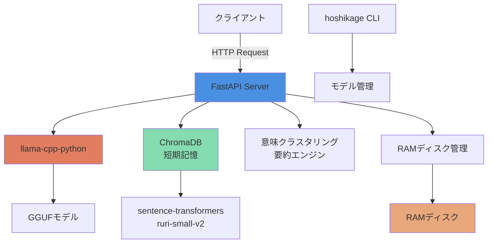

# 星影 - Hoshikage

**ローカル高速推論 & OpenAI互換API提供システム**

[](https://github.com/yourusername/hoshikage)
[](LICENSE)
[](https://www.python.org/)

---

## 📖 概要

**星影（ほしかげ）** は、GGUFフォーマットの大規模言語モデルをローカル環境で高速に実行し、OpenAI互換のAPIを提供するシステムです。プライバシーを重視し、外部へのデータ送信を最小限に抑えつつ、高品質な対話型AI体験を提供します。

「**静かなる知性**」という設計思想のもと、必要な時にのみリソースを活用し、非アクティブ時には自動的にメモリを解放します。

---

## ✨ 特徴

### 🚀 高速推論
- **llama.cpp**: 最適化されたC++エンジンによる高速推論
- **GPU加速**: CUDA対応で推論速度を大幅に向上
- **RAMディスク活用**: モデルをRAMディスクにマウントして起動時間を50%以上短縮

### 🔌 OpenAI互換API
- **完全互換**: 既存のOpenAIクライアントライブラリがそのまま使用可能
- **ストリーミング対応**: リアルタイムで応答を逐次送信
- **複数モデル対応**: 複数のGGUFモデルを登録・切り替え可能

### 🧠 高度な会話管理
- **ChromaDB短期記憶**: 会話履歴をベクトルデータベースに保存
- **意味クラスタリング要約**: K-Meansクラスタリングで長い会話を賢く要約
- **文脈理解**: 過去の会話を参照して自然な対話を実現

### 💡 リソース効率化（静かなる知性）
- **自動モデルアンロード**: 5分間非アクティブ時に自動でメモリ解放
- **セマフォ制御**: VRAM枯渇を防止してシステムクラッシュを回避
- **自動復旧**: リクエスト到着時に自動的にモデルをロード

---

## 🎯 ユースケース

### 開発者向け
- OpenAI APIの代替として、ローカル環境でGGUFモデルを活用
- コスト削減とプライバシー保護を両立
- チャットボット、文章生成、コード生成アプリケーションの開発

### エンドユーザー向け
- 高速で応答性の高いAI体験
- 個人情報が外部に送信されない安心感
- 創作活動や学習支援のサポート

---

## 📋 必要要件

### ハードウェア

| 項目 | 最小要件 | 推奨要件 |
|------|---------|---------|
| CPU | 8コア以上 | 16コア以上（Ryzen 7900相当） |
| メモリ | 16GB以上 | 32GB以上 |
| GPU | VRAM 8GB以上 | VRAM 12GB以上 |
| ストレージ | SSD 50GB以上 | NVMe SSD 100GB以上 |

### ソフトウェア

- **OS**: Linux（Ubuntu 20.04以降推奨）
- **Python**: 3.10以上
- **CUDA**: 11.8以上（GPU使用時）
- **sudo権限**: RAMディスクマウント時に必要

---

## 🚀 クイックスタート

### 1. インストール

```bash
# リポジトリをクローン
git clone https://github.com/yourusername/hoshikage.git
cd hoshikage

# 依存関係をインストール
cd src
pip install -r requirements.txt
```

### 2. 環境変数の設定

`.env.example`をコピーして`.env`ファイルを作成：

```bash
# .env.exampleをコピー
cp .env.example .env

# 必要に応じて編集
nano .env
```

**デフォルト設定:**
```bash
# RAMディスク設定
RAMDISK_PATH=/mnt/temp/hoshikage
RAMDISK_SIZE=12

# タイムアウト設定
IDLE_TIMEOUT_SECONDS=300
GREAT_TIMEOUT=60

# モデル管理
MODEL_MAP_FILE=./src/models/model_map.json
TAG_CACHE_FILE=./src/models/tags_cache.json
TAG_OLLAMA_FILE=./src/models/tags_ollama.json

# ChromaDB設定
CHROMA_PATH=./data/hoshikage_chroma_db
SENTENCE_BERT_MODEL=cl-nagoya/ruri-small-v2
```

### 3. モデルの登録

```bash
# モデルを登録
python hoshikage.py add /path/to/your/model.gguf your-model-name

# 登録済みモデルの確認
python hoshikage.py list
```

### 4. サーバーの起動

```bash
# サーバーを起動
uvicorn main:app --host 0.0.0.0 --port 8000

# または、起動スクリプトを使用
bash start.sh
```

### 5. APIの使用

```bash
# ステータス確認
curl http://localhost:8000/v1/status

# チャット補完
curl -X POST http://localhost:8000/v1/chat/completions \
  -H "Content-Type: application/json" \
  -d '{
    "model": "your-model-name",
    "messages": [{"role": "user", "content": "こんにちは"}],
    "stream": false
  }'
```

---

## 📚 ドキュメント

詳細なドキュメントは`docs/`ディレクトリにあります：

| ドキュメント | 説明 |
|-------------|------|
| [requirements.md](docs/requirements.md) | システム寄りの要件定義書 |
| [要件定義書.md](docs/要件定義書.md) | ユーザー寄りの要件定義書 |
| [system-design.md](docs/system-design.md) | システム設計書 |
| [api-spec.md](docs/api-spec.md) | API仕様書 |
| [UI設計書.md](docs/UI設計書.md) | UI設計書（将来実装） |
| [user-manual.md](docs/user-manual.md) | ユーザーマニュアル |

---

## 🔧 設定

### 環境変数

| 変数名 | 説明 | デフォルト値 |
|--------|------|-------------|
| `RAMDISK_PATH` | RAMディスクのマウントパス | `/mnt/temp/hoshikage` |
| `RAMDISK_SIZE` | RAMディスクのサイズ（GB） | `12` |
| `IDLE_TIMEOUT_SECONDS` | 非アクティブ検出閾値（秒） | `300` |
| `GREAT_TIMEOUT` | RAMディスクアンマウント閾値（分） | `60` |
| `CHROMA_PATH` | ChromaDBデータパス | `./data/hoshikage_chroma_db` |
| `SENTENCE_BERT_MODEL` | 埋め込みモデル名 | `cl-nagoya/ruri-small-v2` |

### モデル管理

```bash
# モデルを追加
python hoshikage.py add <モデルパス> <エイリアス>

# モデルを削除
python hoshikage.py remove <エイリアス>

# モデル一覧を表示
python hoshikage.py list
```

---

## 🎨 使用例

### Python（OpenAIライブラリ）

```python
from openai import OpenAI

# 星影APIを使用するように設定
client = OpenAI(
    base_url="http://localhost:8000/v1",
    api_key="dummy"
)

# チャット補完
response = client.chat.completions.create(
    model="your-model-name",
    messages=[{"role": "user", "content": "こんにちは"}],
    temperature=0.7
)

print(response.choices[0].message.content)
```

### ストリーミング

```python
# ストリーミング応答
stream = client.chat.completions.create(
    model="your-model-name",
    messages=[{"role": "user", "content": "こんにちは"}],
    stream=True
)

for chunk in stream:
    if chunk.choices[0].delta.content:
        print(chunk.choices[0].delta.content, end="", flush=True)
```

---

## 🏗️ アーキテクチャ



---

## 🤝 コントリビューション

コントリビューションを歓迎します！以下の手順でお願いします：

1. このリポジトリをフォーク
2. 新しいブランチを作成（`git checkout -b feature/amazing-feature`）
3. 変更をコミット（`git commit -m 'Add amazing feature'`）
4. ブランチにプッシュ（`git push origin feature/amazing-feature`）
5. プルリクエストを作成

---

## 📝 ライセンス

このプロジェクトは[MITライセンス](LICENSE)の下で公開されています。

---

## 👤 著者

**Tane Channel Technology**

---

## 🙏 謝辞

- [llama.cpp](https://github.com/ggerganov/llama.cpp) - 高速推論エンジン
- [FastAPI](https://fastapi.tiangolo.com/) - 高速Webフレームワーク
- [ChromaDB](https://www.trychroma.com/) - ベクトルデータベース
- [sentence-transformers](https://www.sbert.net/) - 埋め込みモデル

---

## 📞 サポート

質問や問題がある場合は、[Issue](https://github.com/yourusername/hoshikage/issues)を作成してください。

---

**星影 - 暗闇の中で光を放つように、AI技術の可能性を照らす**
