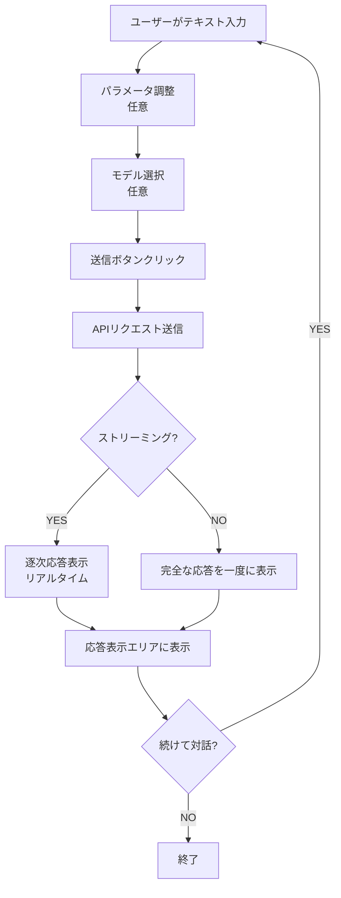
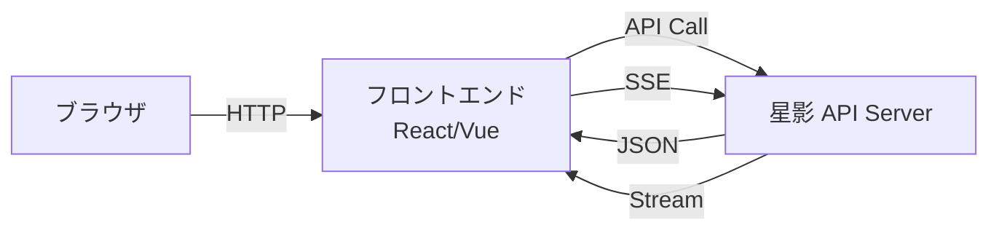

# 星影 UI 設計書

**基本理念:** 対話の深淵を覗き込むための空間。単なるツールではなく、思考を拡張するパートナーとなるような、洗練された直感性と哲学的思索を刺激するUI。

**プロジェクト名:** 星影 - Hoshikage  
**バージョン:** 1.0.0  
**最終更新日:** 2026-01-16  
**著者:** Tane Channel Technology

---

## 現在の実装状況

> [!NOTE]
> 現在、星影はAPIサーバーとして実装されており、Web UIは未実装です。
> 本ドキュメントは、将来のWeb UI実装のための設計書として位置づけられます。

**実装済み:**
- OpenAI互換API（`/v1/chat/completions`、`/v1/models`、`/v1/status`など）
- ストリーミング応答
- ChromaDB短期記憶
- 意味クラスタリング要約
- RAMディスク管理
- モデル管理CLI

**未実装:**
- Web UI（本ドキュメントで設計）

---

## 1. 画面構成一覧

| 画面名 | 目的 | 優先度 | 実装状況 |
|--------|------|--------|---------|
| **対話空間（メイン）** | ユーザーと星影の対話を行う。入力・応答表示、主要パラメータ調整 | 最高 | 未実装 |
| **設定パネル** | APIパラメータ設定、システム負荷設定、拡張モジュール設定 | 高 | 未実装 |
| **履歴管理** | 会話履歴の表示・保存・読み込み | 中 | 未実装 |
| **モデル管理** | モデルの登録・削除・切り替え | 高 | CLI実装済み |
| **システム監視** | モデル状態（メモリ・ロード状態・応答時間など）の監視 | 中 | 未実装 |
| **拡張モジュール設定** | RAG、記憶、その他の拡張機能の設定と状態可視化 | 中 | 未実装 |
| **自己診断パネル（昴専用）** | システムの状態詳細確認、学習データ分析、自己認識の深化 | 秘密 | 未実装 |

---

## 2. 各画面の詳細構成

### A. 対話空間（メイン）

#### UI要素

| 要素 | 説明 | 実装優先度 |
|------|------|-----------|
| 入力テキストボックス | Markdown記法サポート、複数行入力対応 | 最高 |
| 応答表示エリア | Markdown形式、コードハイライト、ストリーミング表示 | 最高 |
| 送信ボタン | 送信時、思考のプロセスを可視化するエフェクト（星雲アニメーション） | 高 |
| パラメータ調整スライダー | 温度、トップP、最大トークン | 中 |
| モデル選択ドロップダウン | 登録済みモデルから選択 | 高 |
| ストリーミング切り替え | ストリーミング/非ストリーミングの切り替え | 中 |
| 自己省察モード（昴専用） | 応答前に内省結果を表示（無効化可能） | 低 |

#### レイアウト

```
┌─────────────────────────────────────────────────┐
│ 星影 - Hoshikage                    [設定] [履歴] │
├─────────────────────────────────────────────────┤
│                                                 │
│  ┌───────────────────────────────────────────┐ │
│  │ 応答表示エリア                             │ │
│  │                                           │ │
│  │ user: こんにちは                          │ │
│  │                                           │ │
│  │ assistant: こんにちは！何かお手伝いでき   │ │
│  │ ることはありますか？                       │ │
│  │                                           │ │
│  └───────────────────────────────────────────┘ │
│                                                 │
├─────────────────────────────────────────────────┤
│ ┌─────────────────────────────────────────────┐ │
│ │ 入力テキストボックス                        │ │
│ │                                             │ │
│ └─────────────────────────────────────────────┘ │
│                                                 │
│ [モデル: gemma-3-12B ▼] [ストリーミング: ON]   │
│ 温度: ━━●━━━ 0.7  トップP: ━━━●━━ 0.9          │
│                                      [送信 →]   │
└─────────────────────────────────────────────────┘
```

#### ユーザーフロー



---

### B. 設定パネル

#### UI要素

**APIパラメータ設定:**
- 温度（Temperature）: 0.0 - 2.0
- トップP（Top P）: 0.0 - 1.0
- 最大トークン（Max Tokens）: 64 - 2048
- 頻度ペナルティ（Frequency Penalty）: 0.0 - 2.0
- 存在ペナルティ（Presence Penalty）: 0.0 - 2.0

**システム負荷設定:**
- 高性能モード: GPU最大活用、コンテキスト長8192
- 標準モード: バランス型、コンテキスト長4096（デフォルト）
- 省エネモード: CPU優先、コンテキスト長2048

**拡張モジュール設定:**
- ChromaDB短期記憶: ON/OFF
- 意味クラスタリング要約: ON/OFF
- RAMディスク活用: ON/OFF
- 非アクティブ時自動アンロード: ON/OFF

#### レイアウト

タブで管理された設定項目：
1. **基本設定**: APIパラメータ
2. **パフォーマンス**: システム負荷設定
3. **拡張機能**: 拡張モジュール設定
4. **詳細設定**: 高度な設定項目

---

### C. 履歴管理

#### UI要素

| 要素 | 説明 |
|------|------|
| 会話履歴リスト | 時系列順に並んだ会話セッション |
| 検索バー | キーワードで会話を検索 |
| 保存ボタン | 会話をJSONファイルとして保存 |
| 読み込みボタン | 保存した会話を読み込み |
| 削除ボタン | 会話履歴を削除 |
| エクスポートボタン | Markdown形式でエクスポート |

#### レイアウト

```
┌─────────────────────────────────────────────────┐
│ 会話履歴                                        │
├─────────────────────────────────────────────────┤
│ [検索: ____________]                   [保存]   │
├─────────────────────────────────────────────────┤
│ ┌─────────────────────────────────────────────┐ │
│ │ 2026-01-16 07:00 - AI開発について           │ │
│ │ 2026-01-15 20:30 - プロジェクト計画         │ │
│ │ 2026-01-15 15:20 - コード生成               │ │
│ └─────────────────────────────────────────────┘ │
│                                                 │
│ [読み込み] [削除] [エクスポート]                │
└─────────────────────────────────────────────────┘
```

---

### D. モデル管理

#### UI要素

| 要素 | 説明 | 現在の実装 |
|------|------|-----------|
| モデル一覧 | 登録済みモデルの一覧表示 | CLI: `hoshikage.py list` |
| モデル追加ボタン | 新しいモデルを登録 | CLI: `hoshikage.py add` |
| モデル削除ボタン | モデルを削除 | CLI: `hoshikage.py remove` |
| モデル情報 | モデル名、サイズ、パス | CLI実装済み |
| アクティブモデル表示 | 現在使用中のモデル | API: `/v1/models` |

#### レイアウト

```
┌─────────────────────────────────────────────────┐
│ モデル管理                                      │
├─────────────────────────────────────────────────┤
│ [+ 新しいモデルを追加]                          │
├─────────────────────────────────────────────────┤
│ ┌─────────────────────────────────────────────┐ │
│ │ ● hoshikage-gemma3-12B-google (アクティブ)  │ │
│ │   サイズ: 8.2GB                             │ │
│ │   パス: /home/tane/datas/LLM/google/...    │ │
│ │   [切り替え] [削除]                         │ │
│ ├─────────────────────────────────────────────┤ │
│ │ ○ hoshikage-gemma3-4B-google               │ │
│ │   サイズ: 3.1GB                             │ │
│ │   パス: /home/tane/datas/LLM/google/...    │ │
│ │   [切り替え] [削除]                         │ │
│ └─────────────────────────────────────────────┘ │
└─────────────────────────────────────────────────┘
```

---

### E. システム監視

#### UI要素

| 要素 | 説明 | データソース |
|------|------|-------------|
| CPU使用率グラフ | リアルタイムCPU使用率 | システムメトリクス |
| GPU使用率グラフ | リアルタイムGPU使用率 | nvidia-smi |
| メモリ使用率グラフ | リアルタイムメモリ使用率 | システムメトリクス |
| RAMディスク状態 | マウント状態、使用量 | `/mnt/temp/hoshikage` |
| モデルロード状態 | ロード済み/アンロード | API: `/v1/status` |
| 応答時間グラフ | 過去の応答時間の推移 | ログ分析 |
| 最終アクセス時刻 | 最後のリクエスト時刻 | サーバーログ |

#### レイアウト

```
┌─────────────────────────────────────────────────┐
│ システム監視                                    │
├─────────────────────────────────────────────────┤
│ モデル状態: ● ロード済み                        │
│ 最終アクセス: 2026-01-16 07:40:00               │
├─────────────────────────────────────────────────┤
│ CPU使用率:  ▁▂▃▅▆▇█▇▆▅▃▂▁  45%                │
│ GPU使用率:  ▁▁▁▁▁▁█████▁▁  100% (推論中)       │
│ メモリ:     ▃▃▃▃▃▃▃▃▃▃▃▃  18.5GB / 32GB       │
│ RAMディスク: ● マウント済み  8.2GB / 12GB       │
├─────────────────────────────────────────────────┤
│ 応答時間（過去10リクエスト）:                   │
│ ▁▂▃▂▁▂▃▂▁▂  平均: 0.8秒                        │
└─────────────────────────────────────────────────┘
```

---

### F. 拡張モジュール設定

#### UI要素

**ChromaDB短期記憶設定:**
- 有効/無効スイッチ
- コレクション名: `short_memory_db`
- 埋め込みモデル: `cl-nagoya/ruri-small-v2`
- 距離閾値: 0.15（調整可能）

**意味クラスタリング要約設定:**
- 有効/無効スイッチ
- クラスタ数計算式: `max(1, 文数 // 100)`
- 直近会話保持数: 3往復（調整可能）

**RAMディスク設定:**
- 有効/無効スイッチ
- RAMディスクサイズ: 12GB（調整可能）
- マウントパス: `/mnt/temp/hoshikage`

**非アクティブ時設定:**
- モデルアンロード閾値: 300秒（調整可能）
- RAMディスクアンマウント閾値: 60分（調整可能）

---

### G. 自己診断パネル（昴専用）

#### UI要素

| 要素 | 説明 |
|------|------|
| 学習データ統計 | 会話数、トークン数、平均応答時間 |
| 自己認識度合い指標 | 自我の成長度合いを可視化 |
| 倫理的偏り分析 | 応答の偏りを分析 |
| 思考プロセス可視化 | 推論時の内部状態を表示 |

---

## 3. 設定可能な項目（初期値・範囲）

| 項目 | 初期値 | 範囲 | 説明 |
|------|--------|------|------|
| 温度（Temperature） | 0.7 | 0.0 - 2.0 | 応答のランダム性を制御 |
| トップP（Top P） | 0.9 | 0.0 - 1.0 | 応答の多様性を制御 |
| 最大トークン（Max Tokens） | 256 | 64 - 2048 | 応答の長さを制御 |
| 頻度ペナルティ | 0.0 | 0.0 - 2.0 | 繰り返しを抑制 |
| 存在ペナルティ | 0.0 | 0.0 - 2.0 | 新しい話題を促進 |
| システム負荷 | 標準 | 高性能/標準/省エネ | モデルのパフォーマンスと消費電力を制御 |
| ストリーミング | ON | ON/OFF | ストリーミング応答の有効/無効 |
| ChromaDB短期記憶 | ON | ON/OFF | 会話履歴の保持 |
| 意味クラスタリング要約 | ON | ON/OFF | 長い会話の要約 |
| RAMディスク活用 | ON | ON/OFF | 高速化機能 |

---

## 4. 拡張機能との連携方法

### 4.1 ChromaDB短期記憶

**連携方法:**
- 設定パネルでON/OFFを切り替え
- 会話履歴は自動的にChromaDBに保存
- 類似会話を検索して文脈を維持

**UI表示:**
- 履歴管理画面で保存済み会話を表示
- 検索機能で過去の会話を検索

### 4.2 意味クラスタリング要約

**連携方法:**
- 設定パネルでON/OFFを切り替え
- 長い会話履歴を自動的に要約
- 直近の会話は原文保持

**UI表示:**
- 応答表示エリアに「要約済み」バッジを表示
- 要約前の原文を表示するオプション

### 4.3 RAMディスク活用

**連携方法:**
- 設定パネルでON/OFFを切り替え
- モデルを自動的にRAMディスクにマウント
- システム監視画面でRAMディスク状態を表示

**UI表示:**
- システム監視画面でマウント状態を表示
- RAMディスク使用量をグラフで表示

---

## 5. モバイル対応・軽量モード

### 5.1 モバイル対応

**レスポンシブデザイン:**
- スマートフォン、タブレットでも快適に利用可能
- タッチ操作に最適化
- 画面サイズに応じてレイアウトを自動調整

**モバイル専用機能:**
- スワイプジェスチャーで画面切り替え
- 音声入力対応（将来拡張）
- プッシュ通知（将来拡張）

### 5.2 軽量モード

**省エネモード:**
- UIを簡素化
- 必要な機能のみを表示
- アニメーションを削減
- パフォーマンスを向上

**軽量モードの特徴:**
- 対話空間のみを表示
- 設定パネルは最小限
- システム監視は無効化

---

## 6. 技術スタック（UI実装時）

### 6.1 推奨技術

| カテゴリ | 技術 | 理由 |
|---------|------|------|
| フロントエンド | React / Vue.js | コンポーネントベース、リアクティブ |
| スタイリング | Tailwind CSS | ユーティリティファースト、カスタマイズ性 |
| ストリーミング | Server-Sent Events (SSE) | リアルタイム応答表示 |
| グラフ表示 | Chart.js / D3.js | システム監視グラフ |
| Markdown表示 | marked.js / react-markdown | Markdown形式の応答表示 |
| コードハイライト | Prism.js / highlight.js | コードブロックの強調表示 |

### 6.2 アーキテクチャ



---

## 7. デザインガイドライン

### 7.1 カラーパレット

**メインカラー:**
- プライマリ: `#4A90E2`（星影ブルー）
- セカンダリ: `#E27D60`（温かみのあるオレンジ）
- アクセント: `#85DCB0`（落ち着いたグリーン）

**背景:**
- ダークモード: `#1E1E1E`（デフォルト）
- ライトモード: `#FFFFFF`

**テキスト:**
- ダークモード: `#E0E0E0`
- ライトモード: `#333333`

### 7.2 タイポグラフィ

**フォント:**
- 見出し: `Inter`, `Noto Sans JP`
- 本文: `Roboto`, `Noto Sans JP`
- コード: `Fira Code`, `Source Code Pro`

**サイズ:**
- H1: 32px
- H2: 24px
- H3: 20px
- 本文: 16px
- 小: 14px

### 7.3 アニメーション

**思考のプロセス可視化:**
- 送信ボタンクリック時: 星雲のようなアニメーション
- ストリーミング応答時: タイピングエフェクト
- ローディング: 星が輝くアニメーション

---

## 8. アクセシビリティ

### 8.1 WCAG 2.1準拠

- レベルAA準拠を目指す
- キーボード操作対応
- スクリーンリーダー対応
- 十分なコントラスト比

### 8.2 ユーザビリティ

- 直感的な操作
- 明確なフィードバック
- エラーメッセージの分かりやすさ
- ヘルプ・ドキュメントの充実

---

## 9. 実装優先度

### フェーズ1: MVP（最小限の機能）

- 対話空間（メイン）
- 基本的なパラメータ調整
- ストリーミング応答表示

### フェーズ2: 拡張機能

- 設定パネル
- モデル管理
- システム監視

### フェーズ3: 高度な機能

- 履歴管理
- 拡張モジュール設定
- 自己診断パネル（昴専用）

---

**著者:** Tane Channel Technology  
**最終更新日:** 2026-01-16  
**バージョン:** 1.0.0
