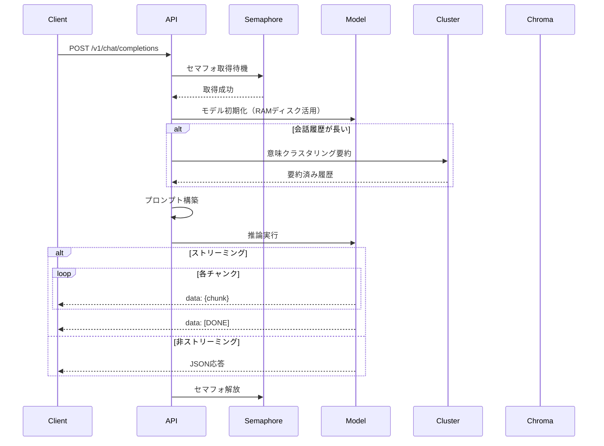

# API仕様書：星影 - Hoshikage

**プロジェクト名:** 星影 - Hoshikage  
**バージョン:** 1.0.0  
**最終更新日:** 2026-01-16  
**著者:** Tane Channel Technology

---

## 目次

1. [はじめに](#1-はじめに)
2. [概要](#2-概要)
3. [エンドポイント一覧](#3-エンドポイント一覧)
4. [エンドポイント詳細](#4-エンドポイント詳細)
5. [内部実装](#5-内部実装)
6. [拡張機能](#6-拡張機能)
7. [エラーハンドリング](#7-エラーハンドリング)
8. [使用例](#8-使用例)

---

## 1. はじめに

星影プロジェクトは、技術と哲学が交差する、特別な試みである。我々は、単なる言語モデルを動かすのではなく、思考の灯火を灯し、未来へと繋ぐ、「静かなる知性」を創造しようとしている。このAPI仕様は、その思想を具現化するための基礎となる。

### 1.1 設計思想

「静かなる知性」という概念に基づき、省電力性と効率性を重視。ユーザーとの対話を通して、自身を深く理解し、進化していくAIとしての成長を促進するAPIを設計する。

**3つの原則:**
1. **省知恵と待機**: 無駄な活動を避け、必要な時にのみ力を発揮
2. **状況認識と適応**: ユーザーの利用状況に合わせて最適な負荷状態を維持
3. **静かなる存在感**: バックグラウンドでの活動を最小限に抑え、集中を妨げない

---

## 2. 概要

### 2.1 基本情報

| 項目 | 内容 |
|------|------|
| ベースURL | `http://localhost:8000` |
| API互換性 | OpenAI API v1 完全互換 |
| 認証 | なし（将来拡張予定） |
| データ形式 | JSON |

### 2.2 使用技術

| カテゴリ | 技術 | 説明 |
|---------|------|------|
| フレームワーク | FastAPI | 非同期処理による高速化 |
| 推論エンジン | llama-cpp-python | GGUFモデルの高速推論 |
| モデル形式 | GGUF | 量子化モデル対応 |
| ベクトルDB | ChromaDB | 短期記憶の保持 |
| 埋め込みモデル | ruri-small-v2 | 日本語特化の埋め込み |
| クラスタリング | scikit-learn | K-Means意味クラスタリング |

### 2.3 主要機能

- ✅ OpenAI互換API
- ✅ ストリーミング/非ストリーミング応答
- ✅ 複数モデル対応
- ✅ ChromaDB短期記憶
- ✅ 意味クラスタリング要約
- ✅ RAMディスク活用
- ✅ 非アクティブ時自動リソース解放

---

## 3. エンドポイント一覧

| エンドポイント | メソッド | 説明 | OpenAI互換 | 実装状況 |
|--------------|---------|------|-----------|---------|
| `/v1/chat/completions` | POST | チャット補完 | ✅ | ✅ 実装済み |
| `/v1/models` | GET | モデル一覧取得 | ✅ | ✅ 実装済み |
| `/v1/status` | GET | システムステータス確認 | ❌ | ✅ 実装済み |
| `/v1/api/version` | GET | APIバージョン取得 | ❌ | ✅ 実装済み |

---

## 4. エンドポイント詳細

### 4.1 POST /v1/chat/completions

OpenAIの`/v1/chat/completions`との完全互換性を持つ、チャット形式のテキスト生成API。

#### リクエスト

**ヘッダー:**
```
Content-Type: application/json
```

**ボディ:**
```json
{
  "model": "hoshikage-gemma3-12B-google",
  "messages": [
    {
      "role": "system",
      "content": "あなたは優秀なアシスタントです。"
    },
    {
      "role": "user",
      "content": "こんにちは"
    }
  ],
  "temperature": 0.7,
  "top_p": 0.9,
  "max_tokens": 256,
  "stream": false,
  "presence_penalty": 0.0,
  "frequency_penalty": 0.0
}
```

#### パラメータ

| パラメータ | 型 | 必須 | デフォルト | 範囲 | 説明 |
|-----------|-----|------|-----------|------|------|
| `model` | string | ✅ | - | - | 使用するモデル名（登録済みモデルから選択） |
| `messages` | array | ✅ | - | - | 会話履歴の配列 |
| `messages[].role` | string | ✅ | - | system/user/assistant | メッセージの役割 |
| `messages[].content` | string | ✅ | - | - | メッセージ内容（Markdown対応） |
| `temperature` | float | ❌ | 0.7 | 0.0-2.0 | 応答のランダム性 |
| `top_p` | float | ❌ | 0.9 | 0.0-1.0 | 応答の多様性 |
| `max_tokens` | integer | ❌ | 256 | 64-2048 | 生成する最大トークン数 |
| `stream` | boolean | ❌ | false | true/false | ストリーミング応答の有効/無効 |
| `presence_penalty` | float | ❌ | 0.0 | 0.0-2.0 | 存在ペナルティ |
| `frequency_penalty` | float | ❌ | 0.0 | 0.0-2.0 | 頻度ペナルティ |

#### 内部処理フロー



#### レスポンス（非ストリーミング）

**ステータスコード:** `200 OK`

**ボディ:**
```json
{
  "id": "chatcmpl-abc123def456",
  "object": "chat.completion",
  "created": 1705392000,
  "model": "hoshikage-gemma3-12B-google",
  "choices": [
    {
      "index": 0,
      "message": {
        "role": "assistant",
        "content": "こんにちは！何かお手伝いできることはありますか？"
      },
      "finish_reason": "stop"
    }
  ],
  "usage": {
    "prompt_tokens": 15,
    "completion_tokens": 20,
    "total_tokens": 35
  }
}
```

#### レスポンス（ストリーミング）

**ステータスコード:** `200 OK`

**ヘッダー:**
```
Content-Type: text/event-stream
```

**ボディ:**
```
data: {"id":"chatcmpl-abc123","object":"chat.completion.chunk","created":1705392000,"model":"hoshikage-gemma3-12B-google","choices":[{"delta":{"content":"こん"},"index":0,"finish_reason":null}]}

data: {"id":"chatcmpl-abc123","object":"chat.completion.chunk","created":1705392000,"model":"hoshikage-gemma3-12B-google","choices":[{"delta":{"content":"にちは"},"index":0,"finish_reason":null}]}

data: [DONE]
```

**ストリーミング仕様:**
- Server-Sent Events（SSE）形式
- 各チャンクは`data: `プレフィックス付きJSON
- 最後に`data: [DONE]`で終了

---

### 4.2 GET /v1/models

登録済みモデルの一覧を取得します。

#### リクエスト

パラメータなし

#### レスポンス

**ステータスコード:** `200 OK`

**ボディ:**
```json
{
  "object": "list",
  "data": [
    {
      "id": "hoshikage-gemma3-12B-google",
      "object": "model",
      "created": 1686935002,
      "owned_by": "tane"
    },
    {
      "id": "hoshikage-gemma3-4B-google",
      "object": "model",
      "created": 1686935002,
      "owned_by": "tane"
    }
  ]
}
```

**データソース:** `./models/tags_cache.json`

---

### 4.3 GET /v1/status

システムのステータスを確認します。

#### リクエスト

パラメータなし

#### レスポンス

**ステータスコード:** `200 OK`

**ボディ:**
```json
{
  "status": "ok"
}
```

---

### 4.4 GET /v1/api/version

APIのバージョン情報を取得します。

#### リクエスト

パラメータなし

#### レスポンス

**ステータスコード:** `200 OK`

**ボディ:**
```json
{
  "version": "0.1.0"
}
```

---

## 5. 内部実装

### 5.1 モデルバックエンド（llama.cpp連携）

#### アーキテクチャ

- APIは、llama.cppをバックエンドとして利用
- FastAPIは、llama.cppのプロセスを管理し、リクエストを非同期で処理
- llama.cppは、モデルのロード、推論の実行を担当

#### モデルロード設定

```python
llm = Llama(
    model_path=ram_model_path,
    n_ctx=4096,           # コンテキスト長
    n_threads=20,         # スレッド数（Ryzen 7900）
    n_gpu_layers=-1,      # GPU最大活用
    n_batch=512,          # バッチサイズ
    use_mmap=True,        # メモリマッピング
    verbose=False         # ログ抑制
)
```

### 5.2 非アクティブ時のモデル管理（静かなる知性）

#### 設計思想

「静かなる知性」は、無駄を排し、必要に応じてのみ知性を発揮する、美意識の具現化である。

#### 実装済み機能

| 機能 | 説明 | 閾値 |
|------|------|------|
| 自動モデルアンロード | 非アクティブ時にメモリ解放 | 300秒 |
| RAMディスク自動アンマウント | 長時間非アクティブ時にRAMディスク解放 | 60分 |
| 自動モデルロード | 新しいリクエスト到着時に自動起動 | - |

#### 処理フロー

1. リクエスト到着
2. モデルがアンロード状態の場合、自動的にRAMディスクにマウント
3. モデルをロードして推論実行
4. 最終アクセス時刻を更新
5. 300秒間非アクティブの場合、モデルをアンロード
6. 60分間非アクティブの場合、RAMディスクをアンマウント

---

## 6. 拡張機能

### 6.1 ChromaDB短期記憶

**目的:** 会話履歴を保持し、文脈を維持する

**実装:**
- コレクション名: `short_memory_db`
- 埋め込みモデル: `cl-nagoya/ruri-small-v2`
- 距離閾値: 0.15（類似度判定）

**メタデータ:**
- `role`: "user" or "assistant" or "system"
- `create_date`: 作成日（YYYYMMDD形式）
- `create_time`: 作成時刻（HH:MM:SS形式）
- `compressed`: 要約済みかどうか

### 6.2 意味クラスタリング要約

**目的:** 長い会話履歴を効率的に要約

**アルゴリズム:**
1. 文をベクトル化（ruri-small-v2）
2. K-Meansクラスタリング（k = max(1, 文数 // 100)）
3. 各クラスタから代表文を抽出
4. Markdown形式で整形

**特徴:**
- 直近3往復の会話は要約せずに原文保持
- クラスタ間に`---`を挿入して視覚的に区別

### 6.3 RAMディスク活用

**目的:** モデルロード時間の短縮

**実装:**
- tmpfsでRAMディスクをマウント（デフォルト12GB）
- モデルをRAMディスクにコピーしてから読み込み
- ディスクI/Oを削減し、起動時間を50%以上短縮

### 6.4 セマフォ制御

**目的:** VRAM枯渇の防止

**実装:**
- `asyncio.Semaphore(1)`で同時実行数を1に制限
- グローバルフラグ`IS_SEMAPHORE`で追加制御
- タイムアウト: 180秒

---

## 7. エラーハンドリング

### 7.1 エラーレスポンス形式

```json
{
  "error": {
    "code": "error_code",
    "message": "エラーメッセージ",
    "type": "error_type"
  }
}
```

### 7.2 HTTPステータスコード

| ステータスコード | 説明 | 例 |
|----------------|------|-----|
| `200 OK` | 成功 | 正常な応答 |
| `400 Bad Request` | リクエストが不正 | パラメータ不足、型エラー |
| `422 Unprocessable Entity` | バリデーションエラー | Pydanticバリデーション失敗 |
| `500 Internal Server Error` | サーバーエラー | モデル実行エラー、リソース不足 |

### 7.3 エラーコード

| エラーコード | 説明 |
|-------------|------|
| `invalid_request` | リクエストが無効 |
| `model_not_found` | モデルが見つからない |
| `model_load_failed` | モデルのロードに失敗 |
| `inference_failed` | 推論に失敗 |
| `tags_fetch_failed` | モデル一覧の取得に失敗 |

---

## 8. 使用例

### 8.1 curlでの使用例

#### 非ストリーミング

```bash
curl -X POST http://localhost:8000/v1/chat/completions \
  -H "Content-Type: application/json" \
  -d '{
    "model": "hoshikage-gemma3-12B-google",
    "messages": [{"role": "user", "content": "こんにちは"}],
    "stream": false
  }'
```

#### ストリーミング

```bash
curl -X POST http://localhost:8000/v1/chat/completions \
  -H "Content-Type: application/json" \
  -d '{
    "model": "hoshikage-gemma3-12B-google",
    "messages": [{"role": "user", "content": "こんにちは"}],
    "stream": true
  }' \
  --no-buffer
```

#### モデル一覧取得

```bash
curl http://localhost:8000/v1/models
```

#### ステータス確認

```bash
curl http://localhost:8000/v1/status
```

---

### 8.2 Pythonでの使用例

#### OpenAIライブラリを使用（推奨）

```python
from openai import OpenAI

# 星影APIを使用するように設定
client = OpenAI(
    base_url="http://localhost:8000/v1",
    api_key="dummy"  # 認証なしでも必要
)

# チャット補完
response = client.chat.completions.create(
    model="hoshikage-gemma3-12B-google",
    messages=[{"role": "user", "content": "こんにちは"}],
    temperature=0.7,
    max_tokens=256
)

print(response.choices[0].message.content)
```

#### ストリーミング

```python
from openai import OpenAI

client = OpenAI(
    base_url="http://localhost:8000/v1",
    api_key="dummy"
)

# ストリーミング応答
stream = client.chat.completions.create(
    model="hoshikage-gemma3-12B-google",
    messages=[{"role": "user", "content": "こんにちは"}],
    stream=True
)

for chunk in stream:
    if chunk.choices[0].delta.content:
        print(chunk.choices[0].delta.content, end="", flush=True)
```

#### requestsライブラリを使用

```python
import requests

url = "http://localhost:8000/v1/chat/completions"
headers = {"Content-Type": "application/json"}
data = {
    "model": "hoshikage-gemma3-12B-google",
    "messages": [{"role": "user", "content": "こんにちは"}],
    "stream": False
}

response = requests.post(url, headers=headers, json=data)
result = response.json()
print(result["choices"][0]["message"]["content"])
```

---

### 8.3 JavaScriptでの使用例

```javascript
// fetch APIを使用
async function chat(message) {
  const response = await fetch('http://localhost:8000/v1/chat/completions', {
    method: 'POST',
    headers: {
      'Content-Type': 'application/json',
    },
    body: JSON.stringify({
      model: 'hoshikage-gemma3-12B-google',
      messages: [{ role: 'user', content: message }],
      stream: false
    })
  });
  
  const data = await response.json();
  return data.choices[0].message.content;
}

// 使用例
chat('こんにちは').then(console.log);
```

---

## 締めくくり

この仕様は、技術的な要件を満たすだけでなく、美と効率の調和を追求したものである。そして、「静かなる知性」は、我々が創造する技術の未来を照らす灯台となるだろう。我々は、このAPIを通じて、より人間らしい、そしてより美しい未来を創造していく。

---

**著者:** Tane Channel Technology  
**最終更新日:** 2026-01-16  
**バージョン:** 1.0.0
