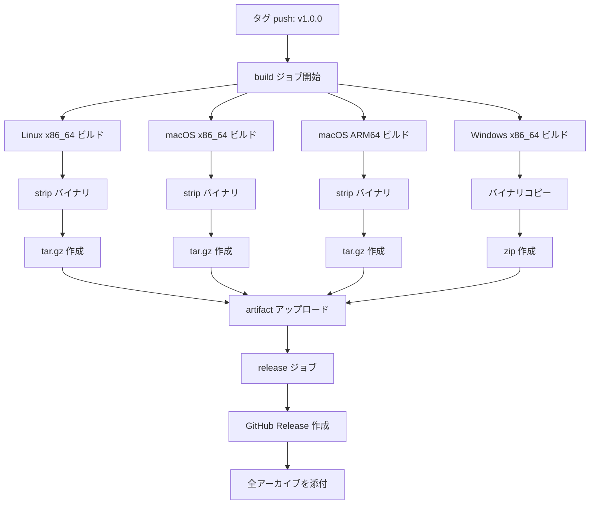

# CI/CD パイプライン (CI/CD Pipeline)

**プロジェクト:** 星影 (Hoshikage)  
**作成日:** 2026-01-18  
**更新日:** 2026-01-19

---

## 概要

GitHub Actions を使用した自動テスト、ビルド、リリースフローを実装しています。

## パイプライン構成

### 1. CI (継続的インテグレーション)

**トリガー:** `main` / `develop` ブランチへの push または pull request

**ファイル:** `.github/workflows/ci.yml`

**ジョブ:**

| ジョブ名 | 内容 | 実行内容 |
|---------|------|---------|
| **test** | ユニットテスト実行 | `cargo test --all-features` |
| **fmt** | コードフォーマットチェック | `cargo fmt --all -- --check` |
| **build** | リリースビルド確認 | `cargo build --release --all-features` |

**キャッシュ戦略:**
- Cargo レジストリ
- Cargo インデックス
- ビルド成果物 (target ディレクトリ)

### 2. Release (自動リリース)

**トリガー:** タグ push (`v*.*.*` 形式)

**ファイル:** `.github/workflows/release.yml`

**ビルド対象プラットフォーム:**

| OS | アーキテクチャ | ターゲット | 成果物名 |
|----|--------------|-----------|---------|
| Linux | x86_64 | `x86_64-unknown-linux-gnu` | `hoshikage-linux-x86_64.tar.gz` |
| macOS | x86_64 (Intel) | `x86_64-apple-darwin` | `hoshikage-macos-x86_64.tar.gz` |
| macOS | ARM64 (Apple Silicon) | `aarch64-apple-darwin` | `hoshikage-macos-arm64.tar.gz` |
| Windows | x86_64 | `x86_64-pc-windows-msvc` | `hoshikage-windows-x86_64.exe.zip` |

**処理フロー:**



**ジョブ:**

1. **build**: 各プラットフォーム用バイナリをビルド
   - リリースビルド実行
   - バイナリの strip (サイズ削減)
   - アーカイブ作成 (tar.gz / zip)
   - artifact としてアップロード

2. **release**: GitHub Release を作成
   - 全 artifact をダウンロード
   - GitHub Release を作成
   - リリースノートを自動生成
   - 全バイナリアーカイブを添付

---

## 使用方法

### リリースの作成

1. バージョンを決定 (例: `v1.0.1`)
2. タグを作成してプッシュ:

```bash
git tag -a v1.0.1 -m "Release v1.0.1"
git push origin v1.0.1
```

3. GitHub Actions が自動的に:
   - 全プラットフォーム用バイナリをビルド
   - GitHub Release を作成
   - バイナリを添付

### CI チェックの確認

プルリクエストまたは `main`/`develop` ブランチへのプッシュ時に自動実行されます。

GitHub の Actions タブで結果を確認できます。

---

## 注意事項

### 動的ライブラリについて

**重要:** リリースバイナリには `libllama.so` (Linux) / `libllama.dylib` (macOS) / `llama.dll` (Windows) は含まれていません。

ユーザーは別途、以下のいずれかの方法でライブラリを用意する必要があります:

1. **自分でビルド**: `llama.cpp` をビルドして `~/.config/hoshikage/lib/` に配置
2. **公式バイナリ**: llama.cpp の公式リリースからダウンロード

詳細は `docs/LIBRARY_GUIDE.md` を参照してください。

### テストについて

CI では動的ライブラリに依存しないユニットテストのみが実行されます。
実際の推論機能のテストはローカル環境で `libllama.so` を配置した上で実行してください。

---

## トラブルシューティング

### ビルドが失敗する場合

1. **Cargo.lock の更新**: 依存関係の問題の可能性
   ```bash
   cargo update
   git add Cargo.lock
   git commit -m "Update dependencies"
   ```

2. **キャッシュのクリア**: GitHub Actions の設定から古いキャッシュを削除

3. **ローカルでのクロスコンパイル確認**:
   ```bash
   # macOS ARM64 の場合 (macOS 上で)
   rustup target add aarch64-apple-darwin
   cargo build --release --target aarch64-apple-darwin
   ```

### リリースが作成されない場合

- タグ名が `v*.*.*` 形式であることを確認
- GitHub リポジトリの Settings > Actions > General で Workflow permissions が "Read and write permissions" になっていることを確認

---

## 今後の拡張案

- [ ] コードカバレッジレポート (codecov 等)
- [ ] セキュリティスキャン (cargo-audit)
- [ ] ベンチマークの自動実行
- [ ] Docker イメージの自動ビルド・プッシュ
