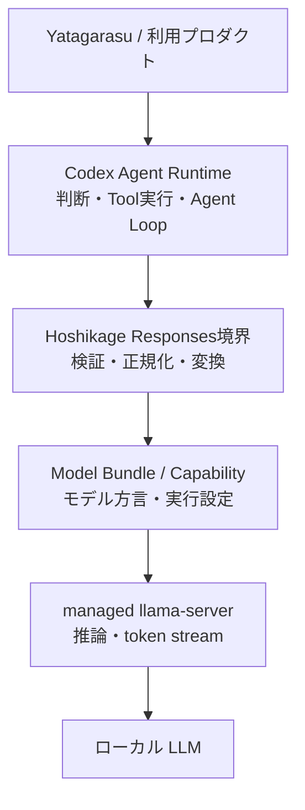

# Hoshikage Codex Agent Compatibility 要件定義書

**プロジェクト名:** Hoshikage Codex Agent Compatibility
**文書種別:** 要件定義書
**版:** 1.2
**作成日:** 2026-07-27
**更新日:** 2026-07-27
**状態:** 要件Fix
**対応ブランチ:** `feature/codex-agent-compatibility`

---

## 1. はじめに

### 1.1 目的

本改訂の目的は、Hoshikage を OpenAI Codex のカスタムモデルプロバイダーとして利用可能にし、Hoshikage 上で動作するローカル LLM を Codex の AI エージェント機能から利用できるようにすることである。

本改訂により、Hoshikage は単なるローカル推論サーバーから、次の役割を持つ基盤へ進化する。

> モデル固有の能力と方言を、外部エージェントが利用できる安定した契約へ変換し、ローカルモデルを実用的な AI 基盤へ接続する境界層

### 1.2 ユーザー価値

- 外部の OpenAI モデル推論 API を使わず、Codex の Agent Loop をローカル LLM で動かせる。
- Codex が持つファイル操作、シェル操作、承認、Sandbox、Skill、MCP 等の機能を活用できる。
- モデルごとの Tool Calling 方言を Hoshikage が吸収するため、利用者は Codex 側の実装を変更せずにモデルを切り替えられる。
- 既存の Chat Completions 利用者と Model Bundle 運用を維持したまま、エージェント用途へ拡張できる。

### 1.3 製品ビジョンとの整合

本改訂は、Hoshikage の「静かなる知性」と次の点で整合する。

- 推論データをローカル環境に留める。
- 必要な時だけモデルと VRAM を利用する。
- llama.cpp とモデル固有差分を Hoshikage 内部へ閉じ込める。
- 利用者には安定した OpenAI 互換インターフェースを提供する。

本改訂は既存レイヤーを置き換えない。`/v1/chat/completions`、Model Bundle、managed `llama-server`、モデルロード・アンロード、VRAM 管理を基礎として、その上に Responses API 互換境界を追加する。

---

## 2. 互換性の定義

### 2.1 互換性名称

初期リリースが提供するものは OpenAI Responses API の完全互換ではなく、以下の二段階の互換性である。

1. **Hoshikage Responses Subset**
   - テキスト生成
   - ストリーミング
   - Function Tool
   - Function Call
   - Function Call Output
   - Codex Agent Loop に必要な入力履歴
2. **Codex Agent Compatibility**
   - 対象 Codex CLI バージョンとの実機テストに合格した状態
   - 通常応答、単一 Tool Call、複数ステップ、ストリーミング、失敗復旧が成立する状態

「OpenAI Responses API 完全互換」とは表記しない。

### 2.2 初期互換対象

- 正式対象: Codex CLI
- 初期検証基準: Codex CLI `0.144.x`
- 参考対象: OpenAI Responses API を利用する一般的な SDK
- 対象外: Codex Desktop、Codex Cloud、Auto Review 等の全機能保証

Codex CLI の更新による破壊的変更を検出できるよう、実機リクエスト Fixture と互換性マトリクスを保持する。

### 2.3 公式仕様上の前提

2026-07-27 時点で確認した前提は以下である。

- Codex のカスタム Provider は `base_url` と `wire_api = "responses"` を設定できる。
- カスタム Provider は予約済み ID `openai`、`ollama`、`lmstudio` を再利用できない。
- Codex `0.134.0` 以降の Profile は `[profiles.<name>]` 形式ではなく、`$CODEX_HOME/<name>.config.toml` の独立ファイルで定義する。
- Provider と Profile はリポジトリ内 `.codex/config.toml` ではなく、ユーザー側 Codex 設定へ置く必要がある。
- Responses API で会話履歴を手動管理する場合、過去の入力と Response Output Item を次の入力へ再投入する。

---

## 3. 責務境界



### 3.1 Codex の責務

- Agent Loop
- Tool Registry
- Tool の選択候補提示
- Tool 実行
- Tool 実行結果の再投入
- 作業継続・終了判断
- ファイル・シェル操作
- 承認、Sandbox、権限制御
- Skill、MCP、その他 Codex 側拡張の実行

### 3.2 Hoshikage の責務

- Responses API リクエストの受信・検証
- Model Bundle の解決
- `llama-server` の起動、監視、停止
- 入力履歴、Tool 定義、Tool Result のモデル向け変換
- モデル出力から Function Call または最終回答への変換
- Responses API JSON および SSE イベント生成
- モデルロード・アンロード、VRAM、プロセス管理
- モデル能力と互換性情報の公開
- 利用者が原因と対処を判断できる診断情報の提供

### 3.3 Hoshikage が担当しないもの

- Tool の実行
- Agent Loop
- Tool 実行可否の承認
- Sandbox 制御
- Tool の副作用管理
- Codex のセッション保存
- MCP サーバー実装

---

## 4. ステークホルダー

| ステークホルダー | 要求 | 失敗と感じる状態 |
|---|---|---|
| Hoshikage 利用者 | 少ない設定で Codex をローカルモデルへ接続したい | 設定例どおりでも起動せず、原因が分からない |
| Codex 利用者 | Tool Loop が途中で壊れず完走してほしい | Tool Call は出るが結果を理解できずループする |
| Model Bundle 管理者 | モデル固有の Tool 方言を Bundle に閉じ込めたい | モデル変更のたびに API 実装を修正する |
| Hoshikage 保守者 | Chat Completions と runtime 管理を壊したくない | Responses 実装が既存 API と密結合する |
| 上位アプリケーション（初期対象: Yatagarasu） | Provider とモデルを選択し、Skill をローカル判断で安全に実行したい | 外部推論へ逸脱する、または複数ステップで停止する |
| LAN 管理者 | 公開時の認証とログ秘匿を保証したい | 認証なしで LAN へ公開され、Tool 結果がログへ残る |

---

## 5. スコープ

### 5.1 対象

- `POST /v1/responses`
- 非ストリームおよび SSE ストリーム
- テキスト応答
- Function Tool 定義
- 単一 Function Call
- Function Call Output の再入力
- 複数ターン・複数ステップの Agent Loop
- Model Bundle 単位の Tool Calling 設定
- Native Tool Calling と Prompt-based JSON Tool Calling
- Codex カスタム Provider 用設定例と診断
- OpenAI 互換エラー
- Capability API
- Bearer Token 認証
- LAN 認証の Token 生成・rotation・revoke
- Codex 接続設定とモデルカタログの出力支援
- LAN 認証を含むユーザーマニュアル
- 互換性 Fixture、契約テスト、Codex 実機テスト
- 上位エージェント統合試験（初期対象: Yatagarasu）

### 5.2 初期対象外

- Hoshikage による Tool 実行
- Hoshikage による Agent Loop
- OpenAI Responses API の完全互換
- Hosted Tools
- Web Search、File Search、Computer Use 等の OpenAI Hosted Tool
- Background Responses
- WebSocket Realtime / Responses
- OpenAI サーバー側状態保存
- `previous_response_id` による状態参照
- 並列 Tool Call の生成保証
- Audio、Video
- Codex Desktop / Cloud / Auto Review の完全互換
- Programmatic Tool Calling、Tool Search、Multi-agent 固有 Item

未知機能を黙って成功扱いにせず、意味を安全に無視できるものと、明示エラーにすべきものを区別する。

---

## 6. 機能要件

### REQ-001 Responses API エンドポイント

**ユーザーストーリー:** Codex 利用者として、Codex の接続先を Hoshikage に変更するだけでローカルモデルを利用したい。

#### 受け入れ条件

1. WHEN JSON リクエストが `POST /v1/responses` に送信された THEN Hoshikage SHALL Responses Subset として処理する。
2. WHEN `stream` が `false` または省略された THEN Hoshikage SHALL 単一 JSON を返す。
3. WHEN `stream` が `true` THEN Hoshikage SHALL `text/event-stream` で SSE を返す。
4. IF Content-Type が JSON でない THEN Hoshikage SHALL OpenAI 互換エラーを返す。
5. Hoshikage SHALL 既存の `/v1/chat/completions` を変更せず維持する。

### REQ-002 リクエスト基本フィールド

**ユーザーストーリー:** Codex クライアントとして、Agent Loop に必要な Responses リクエストを互換 Provider へ送信したい。

#### 受け入れ条件

1. Hoshikage SHALL 最低限 `model`、`input`、`instructions`、`tools`、`tool_choice`、`stream`、`temperature`、`top_p`、`max_output_tokens`、`parallel_tool_calls`、`metadata`、`store`、`reasoning`、`text` を受理する。
2. `model` と `input` は必須とする。ただし Codex 実機 Fixture が省略形を使用する場合は、その実態に合わせて見直す。
3. 未知のトップレベルフィールドは、意味を変えず無視可能な場合に限り受理し、構造化 Warning をログへ残す。
4. 未知フィールドを無視した事実はレスポンス本文へ混入させない。
5. 認識しているが未対応のフィールドが会話意味、状態、Tool 制御を変える場合は `unsupported_parameter` として明示エラーにする。
6. unknown field policy は環境設定 `RESPONSES_UNKNOWN_FIELD_POLICY` で制御でき、`compatible` と `strict` を選択できる。
7. `RESPONSES_UNKNOWN_FIELD_POLICY` の既定値は `compatible` とする。
8. `compatible` でも未知の Input Item、状態制御、Tool 制御を黙って無視しない。
9. 意味を問わずすべて無視する `ignore-all` mode は提供しない。

### REQ-003 Input Item と会話履歴

**ユーザーストーリー:** Codex Agent Runtime として、過去のモデル出力と Tool 結果を再投入し、同じ作業を継続したい。

#### 受け入れ条件

1. `input` は文字列または Input Item 配列として受理する。
2. 最低限 `message`、`function_call`、`function_call_output` を処理する。
3. `message.role` は `user`、`assistant`、`developer`、`system` を処理する。
4. Content は `input_text`、`output_text`、単純文字列を処理する。
5. Hoshikage SHALL Item の受信順序、role、`call_id` の対応関係を保持する。
6. IF `function_call_output` に対応する過去の `function_call` が同一リクエスト履歴内にない THEN Hoshikage SHALL `orphan_function_call_output` を返す。
7. 未知の Input Item Type は履歴欠落を避けるため黙って無視せず、初期版では明示エラーにする。
8. `input_image` は Vision Phase まで明示的な未対応または Bundle 能力エラーとする。

### REQ-004 ステートレス継続

**ユーザーストーリー:** Hoshikage 運用者として、サーバー側会話 DB を持たずに Agent Loop を成立させたい。

#### 受け入れ条件

1. 初期版は `store: false` 相当のステートレス処理を正規経路とする。
2. Codex SHALL 次ターンで過去の入力、Hoshikage が返した Output Item、Function Call Output を再送する。
3. Hoshikage SHALL `previous_response_id` に依存せず、受信リクエストだけでモデル入力を構築する。
4. `previous_response_id` は、`input` に完全履歴があると検証できる場合のみ Warning 付きで無視し、完全履歴を確認できない場合は明示エラーとする。
5. Hoshikage SHALL Response ID をログ相関に利用できるが、その ID を会話状態の永続キーとして扱わない。

### REQ-005 Function Tool 定義

**ユーザーストーリー:** Codex として、利用可能な Tool と引数スキーマをローカルモデルへ提示したい。

#### 受け入れ条件

1. `tools[].type = "function"` を処理する。
2. `name`、`description`、`parameters`、任意の `strict` を受理する。
3. Tool 名の重複、不正な名前、非オブジェクト JSON Schema、過大な Schema を検出する。
4. IF Bundle の Tool Calling mode が `disabled` AND tools が指定された THEN `tool_calling_not_supported` を返す。
5. Hosted Tool または未知の Tool Type は黙って Function Tool に変換しない。
6. Hoshikage SHALL Tool Schema の正規化によって Tool の意味を変更しない。

### REQ-006 Tool Choice

**ユーザーストーリー:** Codex として、モデルに Tool 利用方針を正確に伝えたい。

#### 受け入れ条件

1. 初期版は `auto`、`none`、`required`、特定 Function 指定を処理する。
2. `none` の場合、モデルへ Tool Call を生成させない。
3. `required` に対して最終テキストだけが生成された場合は最大 1 回再生成し、なお違反する場合は明示エラーとする。
4. 未対応の `allowed_tools` 等を別の意味へ縮退させない。
5. Tool Choice 違反を検出した場合、修復・再生成・エラーのいずれを行ったかログで識別できる。

### REQ-007 Function Call 出力

**ユーザーストーリー:** Codex として、モデルの Tool 利用要求を構造化された Output Item として受け取りたい。

#### 受け入れ条件

1. Hoshikage SHALL Tool Call を `type = "function_call"` の Output Item へ変換する。
2. `id`、`call_id`、`name`、JSON 文字列の `arguments`、`status` を返す。
3. Tool 名がリクエストの `tools` に存在することを検証する。
4. `arguments` が JSON として構文的に正しいことを検証する。
5. Bundle が strict validation を要求する場合、arguments を Tool の JSON Schema に対して検証する。
6. Response 内の `id` と `call_id` は一意かつ、ストリーム全体で不変とする。
7. Hoshikage SHALL Tool を実行しない。
8. 初期版でモデルが複数 Function Call を同一 Response に生成した場合、Hoshikage SHALL 単一 Call となるよう最大 1 回再生成する。
9. 再生成後も複数 Function Call が残る場合、Hoshikage SHALL 構造化エラーを返し、Tool の待ち行列処理または代理実行を行わない。
10. Search → Fetch → Summarize のような依存する複数ステップは、Codex が 1 Call ごとに結果を再投入する逐次 Agent Loop として許可する。

### REQ-008 Function Call Output 再入力

**ユーザーストーリー:** Codex として、実行した Tool の結果をモデルへ返し、次の判断を得たい。

#### 受け入れ条件

1. `function_call_output.call_id` を対応する `function_call` へ関連付ける。
2. 文字列の Tool Result をモデルが理解可能な Tool Result 表現へ変換する。
3. Tool 成功、Tool 失敗、Codex による拒否・キャンセルを区別可能な入力表現を設計する。
4. Tool 名と引数は過去の `function_call` から復元し、`function_call_output` 単体に存在すると仮定しない。
5. Tool Result を標準ログへ本文出力しない。
6. Tool Result の切り詰め可否は Bundle ごとに設定でき、既定では切り詰めず context 超過を明示エラーとする。

### REQ-009 非ストリームレスポンス

**ユーザーストーリー:** Responses API クライアントとして、完了状態、出力、使用量を単一 JSON で受け取りたい。

#### 受け入れ条件

1. テキスト応答は `object = "response"`、`status = "completed"`、`output[].type = "message"`、`content[].type = "output_text"` を返す。
2. Tool Call 応答は `output[].type = "function_call"` を返す。
3. `id`、`created_at`、`model`、`output`、`usage` を一貫して返す。
4. upstream が token usage を返さない場合、捏造値を返さず、定義した推定または欠損方針に従う。
5. 途中失敗を `completed` として返さない。

### REQ-010 SSE ストリーム

**ユーザーストーリー:** Codex として、長い推論と Tool Call を待ち切る前に増分イベントを受け取りたい。

#### 受け入れ条件

1. テキスト応答では最低限 `response.created`、`response.in_progress`、`response.output_item.added`、`response.content_part.added`、`response.output_text.delta`、`response.output_text.done`、`response.content_part.done`、`response.output_item.done`、`response.completed` を順序どおり送る。
2. Function Call では最低限 `response.created`、`response.in_progress`、`response.output_item.added`、`response.function_call_arguments.delta`、`response.function_call_arguments.done`、`response.output_item.done`、`response.completed` を順序どおり送る。
3. 各イベントの Response ID、Item ID、Call ID、index、sequence number はイベント間で整合する。
4. 完了前に失敗した場合、成功の `response.completed` を送らず、Responses 互換の failure/error event を送る。
5. SSE の各 event は単独で有効な JSON payload を持つ。
6. 接続切断、upstream 切断、idle timeout を区別して処理する。
7. ストリーム契約は Codex 実機 Fixture と公式 Responses API Event Schema の両方で検証する。
8. Native Tool streamはTextまたはFunction Callへ出力種別が確定するまでoutput eventを送らず、確定後に異種出力へ切り替えない。
9. JSON fallback streamは最終回答またはFunction Callの分類完了までoutputをbufferする。

### REQ-011 Tool Calling Strategy

**ユーザーストーリー:** Model Bundle 管理者として、モデルごとの Tool Calling 能力と方言を宣言したい。

#### 受け入れ条件

1. Bundle ごとに `native`、`json`、`disabled` を設定できる。
2. parser は交換可能な方言アダプターとして扱う。
3. 初期 parser 候補は `llama-server-native`、`qwen`、`llama`、`mistral`、`hermes`、`generic-json` とする。
4. parser 名が不明または Bundle と不整合の場合、サーバー起動時または `doctor` で検出する。
5. API 層は parser 固有 token や chat template を直接解釈しない。
6. Tool Calling の実効 mode、parser、strict、fallback をリクエストログで確認できる。

設定案:

```yaml
tool_calling:
  mode: native
  parser: llama-server-native
  fallback: json
  strict: true
  repair_invalid_json: true
  max_argument_bytes: 65536
```

実際の保存形式は既存 Model Bundle の JSON 構造に合わせ、YAML 導入を前提にしない。

### REQ-012 不正 Tool Call の回復

**ユーザーストーリー:** 利用者として、モデルが不正 JSON を出しても Hoshikage 全体が停止せず、原因を追跡したい。

#### 受け入れ条件

1. 不正 Tool Call により Hoshikage プロセスを panic または異常終了させない。
2. JSON 修復は意味を推測しすぎない決定的な修復に限定する。
3. 修復前後の本文を標準ログへ残さず、修復種別と成否だけを記録する。
4. 再生成を行う場合、回数上限と追加レイテンシを設定する。
5. 回復不能時は `invalid_tool_arguments` または `response_translation_failed` を返す。
6. Native parse fallback と JSON 形式での再生成を別の処理として計測する。

### REQ-013 Capability 公開

**ユーザーストーリー:** 利用者と Codex 統合テストとして、モデルが Responses、Tool、Vision 等へ対応するか事前に知りたい。

#### 受け入れ条件

1. `GET /v1/capabilities` はサーバー全体の対応機能を返す。
2. `GET /v1/models` は既存 OpenAI 互換を維持する。
3. Hoshikage 独自のモデル詳細 API は Bundle ごとの `responses`、`streaming`、`tools`、`vision`、`reasoning`、`tool_calling_mode` を返せる。
4. Capability は明示 Bundle 設定を正とし、自動検出結果は診断情報として区別する。
5. `parallel_tool_calls` は初期版で `false` と公開する。
6. Tool Calling 設定のない既存 Bundle は `disabled` として扱う。
7. `doctor` は model metadata、chat template、llama-server capability から Tool Calling 設定候補を検出し、利用者へ提案する。
8. 検出候補を Bundle へ反映する場合は利用者の明示操作を必要とし、自動書換えしない。
9. Tool 付き request が `disabled` Bundle へ送られた場合、有効化または診断の具体的な操作をエラーで案内する。

### REQ-014 Codex Provider 設定と導入体験

**ユーザーストーリー:** 上位アプリケーション開発者として、Hoshikage が公開する接続情報とモデル能力を使い、利用する Provider とモデルをアプリケーション側で選択したい。

#### 受け入れ条件

1. 現行 Codex 向け設定例は `$CODEX_HOME/yatagarasu-local.config.toml` の独立 Profile ファイルとして提供する。
2. 旧 `[profiles.yatagarasu-local]` 形式を現行設定例として提示しない。
3. Provider ID は予約 ID と異なる `hoshikage` を使用する。
4. `base_url` は既定で `http://127.0.0.1:3030/v1` とする。
5. `wire_api = "responses"` を設定する。
6. 認証なしローカル構成では不要な API key を要求しない。
7. 設定診断は、接続、モデル存在、Responses、streaming、tools の順に原因を切り分ける。
8. Codex 側の `model_context_window`、`model_auto_compact_token_limit`、`tool_output_token_limit` は Model Bundle の実効値と矛盾しないよう構成する。
9. reasoning 非対応 Bundle では `model_reasoning_summary = "none"` 等により、Codex が未対応 reasoning output を期待しない構成を提供する。
10. 対話利用と無人自動実行で、承認方針の異なる Profile を分けられるようにする。
11. Hoshikage SHALL Codex、Yatagarasu、その他上位アプリケーションが利用する Provider またはモデルを自動選択しない。
12. Provider とモデルの最終選択は Yatagarasu 等のアプリケーションレイヤーの責務とする。
13. Hoshikage は登録済み全 Bundle の model ID、context、Tool Calling、reasoning、Vision 等を Codex 用モデルカタログとして出力できる。
14. Codex 接続設定支援は標準出力または明示された出力先への生成に限定し、既存の Codex 設定を自動書換えしない。
15. 利用者は Profile、`-m`、または上位アプリケーション設定から任意の対応 Bundle を選択できる。

現行 Profile 案:

```toml
# ~/.codex/yatagarasu-local.config.toml
model = "yatagarasu-local"
model_provider = "hoshikage"
approval_policy = "on-request"
sandbox_mode = "workspace-write"
model_context_window = 32768
model_auto_compact_token_limit = 24576
tool_output_token_limit = 8192
model_reasoning_summary = "none"

[model_providers.hoshikage]
name = "Hoshikage"
base_url = "http://127.0.0.1:3030/v1"
wire_api = "responses"
requires_openai_auth = false
request_max_retries = 1
stream_max_retries = 1
```

上記 token 値は例であり、設定生成時は対象 Model Bundle の実効 context length に合わせる。無人実行する上位エージェントで `approval_policy = "never"` を使う場合は、一般対話用とは別 Profile とし、対象 workspace と Tool の副作用を限定する。

実行例:

```bash
codex exec --profile yatagarasu-local "Return exactly the word OK."
```

### REQ-015 認証と公開境界

**ユーザーストーリー:** LAN 管理者として、ローカル利用の簡潔さを維持しつつ、外部端末からの利用を保護したい。

#### 受け入れ条件

1. loopback bind では認証なしを許可できる。
2. 非 loopback bind では Bearer Token を必須とする。
3. 認証有効時は `Authorization: Bearer <token>` を定数時間比較等の適切な方法で検証する。
4. Token、Tool 引数、Tool Result、instructions 本文を標準ログへ出力しない。
5. 認証失敗はモデルロードや推論を開始する前に拒否する。
6. CORS の既定値は LAN 公開を無制限に許可しない。
7. `hoshikage token create <NAME>` は CSPRNG を用いた 256 bit 以上の Bearer Token を生成する。
8. Token plaintext は生成時と管理者による`hoshikage token list`実行時に表示でき、Hoshikage 側の管理用recordへ復元可能な形で保存する。
9. 認証情報ファイルは Hoshikage server の標準設定 directory 内へ保存する。Linux・macOSではownerのみ読書き可能なpermission、Windowsでは現在のownerとSYSTEMだけにfull controlを許可する保護ACLを要求する。
10. Token はCodex、Yatagarasu、その他上位アプリケーション等の用途名付きで複数保持できる。
11. Token名は一意とし、`hoshikage token list`はserver machine上の管理者用CLIとして、name、plaintext Token、public ID、作成日時、更新日時を一覧する。
12. `hoshikage token rotate <NAME>` は指定Tokenだけを再発行し、旧Tokenを即時無効化できる。
13. `hoshikage token revoke <NAME>` は指定Tokenだけを無効化できる。
14. あるTokenのrotationまたはrevokeによって、他の用途名付きTokenを無効化しない。
15. Codex および上位アプリケーションはserver側Token fileを直接参照せず、起動元のapplication layerがplaintext Tokenを`HOSHIKAGE_API_KEY`等のprocess環境変数として渡す。
16. Token 未設定の non-loopback bind は起動時に fail-closed とする。
17. LAN 内 HTTP では Token が暗号化されないことをユーザーマニュアルへ明記し、必要に応じて TLS reverse proxy を案内する。

### REQ-016 エラー契約

**ユーザーストーリー:** 利用者と保守者として、失敗原因と修正行動を API とログの両方から判断したい。

#### 受け入れ条件

1. 非ストリームエラーは `error.message`、`error.type`、`error.param`、`error.code` を持つ。
2. 最低限以下を定義する。
   - `model_not_found`
   - `model_load_failed`
   - `invalid_request`
   - `unsupported_parameter`
   - `unsupported_input_item`
   - `orphan_function_call_output`
   - `tool_calling_not_supported`
   - `invalid_tool_schema`
   - `invalid_tool_arguments`
   - `context_length_exceeded`
   - `request_too_large`
   - `generation_failed`
   - `upstream_timeout`
   - `upstream_disconnected`
   - `client_disconnected`
   - `response_translation_failed`
3. 同じ原因はストリーム・非ストリームで同じ error code を使用する。
4. 内部パス、Token、Tool 本文をエラーレスポンスへ漏らさない。
5. エラーごとに再試行可能性を内部分類し、Codex の無限再試行を誘発しない。
6. APIの公開`error.message`は英語で固定し、OS localeまたはCLI言語設定によって変化させない。
7. API clientは`error.message`本文ではなく安定した`error.code`を機械判定に利用できる。

### REQ-017 Context・サイズ制御

**ユーザーストーリー:** ローカルモデル利用者として、巨大な履歴や Tool 結果でプロセスが不安定にならず、何を減らせばよいか知りたい。

#### 受け入れ条件

1. HTTP request body、Tool Schema、Tool arguments、Tool Result、最大出力 token に個別上限を持つ。
2. モデルの実効 context window を考慮し、推論前に可能な範囲で超過を検出する。
3. データを切り詰める場合、切り詰めた事実と元サイズをモデル向け marker およびログメタデータで示す。
4. 意味を損なう可能性がある silent truncation を行わない。
5. `max_output_tokens` は Bundle と runtime の上限を超えない範囲へ検証する。

### REQ-018 同時実行と Backpressure

**ユーザーストーリー:** 利用者として、Codex の再試行や複数操作で VRAM が枯渇せず、待機か失敗かを予測したい。

#### 受け入れ条件

1. 既存の推論同時実行数 1 の方針を維持する。
2. Queue の最大長または待機時間を設定できる。
3. 上限超過時は `server_busy` または適切な 429/503 系エラーを返す。
4. 待機中リクエストの client disconnect を検出し、不要なモデル生成を開始しない。
5. Codex の request retry と Hoshikage の internal retry が増幅しないよう上限を定義する。

### REQ-019 Cancellation・Timeout・プロセス復旧

**ユーザーストーリー:** 利用者として、Codex を中断した時に不要な生成が残らず、llama-server 障害後も次の依頼を続けたい。

#### 受け入れ条件

1. client disconnect または cancellation を検出した場合、可能な限り upstream generation を中止する。
2. request timeout、first-token timeout、stream idle timeout、generation timeout を区別する。
3. `llama-server` 異常終了を検出し、設定した回数だけ再起動する。
4. 同じ Bundle の連続 crash に対して無限再起動しない。
5. 部分出力後の失敗を成功完了として扱わない。
6. 障害後も Hoshikage 管理 API と health endpoint は可能な限り応答を維持する。

### REQ-020 Observability と秘匿

**ユーザーストーリー:** 保守者として、Agent Loop のどこで失敗したかを本文を漏らさず追跡したい。

#### 受け入れ条件

1. request ID、response ID、Bundle、stream、tools 数、Tool Calling mode、parser、`llama-server` PID を記録する。
2. queue wait、model load、TTFT、generation、Tool parse、repair/regeneration、total time を個別に計測する。
3. input/output token、Tool Call 数、再生成回数、エラー分類を記録する。
4. Tool 名は記録可能とし、Tool arguments と Tool Result 本文は既定で記録しない。
5. metadata は許可 key、サイズ、型を制限し、無制限なログ注入を防ぐ。
6. request ID を API エラーとログで相関できる。

### REQ-021 Health・Doctor・自己診断

**ユーザーストーリー:** 利用者として、Codex を起動する前に設定とモデル能力の不足を発見したい。

#### 受け入れ条件

1. `GET /health`、`GET /ready`、`GET /v1/models`、`GET /v1/capabilities` を提供する。
2. `GET /health`はHoshikage processのlivenessだけを表し、モデル未ロードでもprocessが正常なら成功する。
3. `GET /ready`は設定、Model Registry、認証情報、Runtime Coordinatorがrequestを受理可能かを表し、lazy loadされる個別モデルのロード済み状態とは区別する。
4. `GET /ready`がreadyでない場合は503と安全な理由codeを返す。
5. non-loopback bind時の`GET /ready`は他のAPIと同じBearer Token policyに従う。
6. `hoshikage doctor` は Responses endpoint、Bundle Tool mode、parser、runtime 対応、認証設定を診断する。
7. 診断結果は原因だけでなく、次に行う修正を提示する。
8. Codex 接続設定とモデルカタログを標準出力または明示された出力先へ生成できる。
9. `doctor` は生成候補と既存 Codex 設定の不整合を診断できるが、既存設定を自動書換えしない。

### REQ-022 プライバシーと外部通信

**ユーザーストーリー:** ローカル推論利用者として、モデル推論内容が外部 API へ送信されないことを確認したい。

#### 受け入れ条件

1. Hoshikage SHALL 推論 request、instructions、Tool Schema、Tool Result を OpenAI または第三者のモデル API へ転送しない。
2. Hoshikage の Responses 経路はローカル `llama-server` のみを推論 upstream とする。
3. Capability 診断や update check 等が外部通信する場合、推論データを含めず、機能を明示・無効化可能にする。
4. Codex 自身の Web Search、MCP、Connector、その他 Tool による外部通信は Codex の責務であり、Hoshikage の「ローカル推論保証」と区別して文書化する。
5. 受け入れ試験では Hoshikage のモデル推論通信先を監査する。

### REQ-023 互換性 Fixture と回帰テスト

**ユーザーストーリー:** Hoshikage 保守者として、Codex と llama.cpp の更新で互換性が壊れたことをリリース前に知りたい。

#### 受け入れ条件

1. 対象 Codex バージョン、Hoshikage バージョン、llama.cpp build、Bundle/parser の組み合わせを記録する。
2. Codex が実際に送信した request と期待 response event を秘匿・正規化した Fixture として保持する。
3. ID、timestamp 等の非決定値を正規化して契約テストを再現可能にする。
4. 通常応答、Tool Call、Tool Result、複数ステップ、invalid JSON、disconnect を Fixture 化する。
5. `/v1/chat/completions` と既存モデル管理の回帰テストを同時に実行する。
6. Codex 更新時は互換性マトリクスを更新し、未検証バージョンを「対応済み」と表記しない。

### REQ-024 ユーザーマニュアル

**ユーザーストーリー:** LAN 利用者として、認証を弱めずに Hoshikage と上位アプリケーションを設定・運用したい。

#### 受け入れ条件

1. ユーザーマニュアル SHALL loopback 利用と LAN 利用を別手順として説明する。
2. LAN 手順 SHALL bind address、Token 作成、上位アプリケーションへの環境変数設定、接続確認を順に説明する。
3. Token の作成、rotation、revoke、紛失時の復旧、401 error の診断を説明する。
4. Token を shell history、Git、ログ、Model Bundle へ保存しない注意を説明する。
5. LAN 内 HTTP の限界と、必要な場合の TLS reverse proxy 方針を説明する。
6. Codex Profile、Provider、モデルカタログ、`AGENTS.md` の役割の違いを説明する。
7. モデル選択は Yatagarasu 等の上位アプリケーションが行い、Hoshikage は接続情報と能力情報を提供することを説明する。
8. Tool Calling `disabled` の診断と有効化手順を説明する。
9. 最短手順と詳細運用手順を分け、初回利用者が不要な内部実装を理解しなくても接続できる構成にする。
10. CLIの人間向け表示とユーザーマニュアルは英語・日本語を正式対応言語とする。
11. CLIは`--language en|ja`等で言語を明示選択でき、未指定時は環境設定またはOS localeを参照し、判定不能時は英語へfallbackする。
12. CLIのmachine-readable JSONに含むfield名、code、enum値は言語によって変更しない。
13. 日本語版と英語版のマニュアルは同じ機能、警告、手順を扱い、一方だけをリリース時に古い状態へ残さない。
14. Linux、macOS、Windowsを同格の利用環境として扱い、Hoshikage server側の設定場所と、上位application/Codex側の設定・環境変数を混同しない。
15. `hoshikage token list`が管理者用操作としてplaintextを表示することと、端末出力を共有・記録しない注意を説明する。

---

## 7. 非機能要件

### 7.1 アーキテクチャ

- Responses wire type、内部会話 type、Tool dialect、llama-server transport を分離する。
- API 層は Model Bundle のロード実装や parser 固有 token に依存しない。
- Tool parser は Trait 等の明示契約を持つ交換可能なコンポーネントとする。
- Chat Completions と Responses で共有する処理は、wire 形式ではなく内部推論要求レベルで共有する。
- 状態遷移が不正な SSE event を型または builder で生成しにくい構造にする。
- エラーハンドリングは明示し、モデル出力を信頼境界外の入力として扱う。

### 7.2 性能

- モデルロード済み時の Responses 変換追加遅延は p95 で 50ms 未満を目標とする。
- Tool Call parse は 20ms 未満を目標とする。
- JSON repair または再生成を通常経路の性能値へ混在させない。
- queue wait、TTFT、generation を分離して計測する。
- SSE は不要な全量 buffering により TTFT を悪化させない。

### 7.3 信頼性

- 不正なモデル出力で Hoshikage が panic しない。
- client disconnect で生成 task や permit がリークしない。
- SSE は terminal event を最大 1 回だけ送る。
- call ID、item ID、index は 1 Response 内で衝突しない。
- `llama-server` crash loop を抑止する。

### 7.4 セキュリティ

- Hoshikage は Tool を実行しない。
- 非 loopback 公開は fail-closed を既定とする。
- API token、Tool arguments、Tool Result、instructions は既定でログ秘匿する。
- request body と nested JSON に上限を設ける。
- Model Bundle の parser 名や template 指定から任意コードを実行しない。

### 7.5 ユーザビリティ

- 最短導入手順を「Bundle 診断 → Hoshikage 起動 → 上位アプリケーションの Provider・モデル選択 → 接続テスト」の順で提供する。
- エラーは「何が失敗したか」「どの設定を直すか」「再試行してよいか」を示す。
- モデルが Tool Calling 非対応の場合、Codex 実行後ではなく事前診断で分かるようにする。
- 旧 Codex Profile 設定例を残す場合は対象バージョンと legacy 表記を付ける。

### 7.6 後方互換性

- `/v1/chat/completions` の text/stream を維持する。
- 既存 Model Bundle の読み込みを維持する。
- Tool Calling 設定がない既存 Bundle は既定で `disabled` とする。
- 既存 `hoshikage add/rm/list/doctor` を破壊しない。

---

## 8. 受け入れ条件

### AC-001 通常応答

```bash
codex exec --profile yatagarasu-local \
  "Return exactly the word OK."
```

- 標準出力が `OK` となる。
- モデル推論通信は Hoshikage とローカル `llama-server` の間だけで完結する。
- Hoshikage ログで request/response の相関を確認できる。

段階判定:

- Phase 2では、同一内容の`stream:false` requestを`POST /v1/responses`へ直接送り、
  Responses変換とローカル推論経路を検証する。
- Codex CLI `0.144.5`は通常応答でも`stream:true`を送るため、上記CLIコマンドによる
  AC-001最終判定はSSEを実装するPhase 4で行う。

### AC-002 単一 Tool Call

1. Codex が tools 付き request を送信する。
2. Hoshikage が Function Call を返す。
3. Codex が Tool を 1 回実行する。
4. Codex が Function Call Output を再送する。
5. Hoshikage が最終回答を返す。
6. 同じ Tool を不要に再実行しない。

### AC-003 複数ステップ

以下を 1 Agent Loop で完走する。

1. ディレクトリ一覧取得
2. README 読取
3. タイトル抽出
4. 最終回答

各 Call ID と Tool Result の対応をログメタデータで追跡できる。

### AC-004 不正引数

- malformed JSON
- 未定義 Tool 名
- Schema 不一致
- arguments サイズ超過

上記のいずれでも Hoshikage は crash せず、設定どおり修復、再生成、構造化エラーのいずれかとなる。

### AC-005 ストリーミング

- テキスト応答と Function Call の event sequence が契約テストを通過する。
- Codex が両方を解釈できる。
- client disconnect 後に generation と permit が残らない。

### AC-006 Yatagarasu Skill

Yatagarasu の作業ディレクトリで Codex を起動し、ローカルモデルの判断で既存 Skill を実行できる。

読取系検証:

- View
- Recall
- Search
- Fetch

副作用系検証:

- Memorize

読取系の Agent Loop を先に安定させた後、同じ改訂内で副作用系を検証する。Hoshikage は Skill の実行や承認を担当せず、上位エージェントが実行した結果を Function Call Output として扱う。

### AC-007 後方互換

- 既存 Chat Completions 非ストリームが成功する。
- 既存 Chat Completions ストリームが成功する。
- 既存 Model Bundle の登録・一覧・推論が成功する。
- Responses 未使用時のモデルロード・アンロード挙動が変わらない。

### AC-008 認証

- loopback + auth disabled で利用できる。
- auth enabled で正しい Bearer Token のみ成功する。
- 非 loopback + token 未設定は起動時に拒否される。
- Token の create、rotate、revoke が CLI とマニュアルどおり成功する。
- 2つ以上の用途名付きTokenを作成できる。
- rotate 後の旧 Token と revoke 後の対象 Token は拒否される。
- 一方のTokenをrotateまたはrevokeしても他方のTokenは利用できる。
- Token と Tool 本文がログへ残らない。

### AC-009 互換性バージョン

- Codex CLI `0.144.x` の対象 patch 版を記録する。
- request Fixture と SSE Fixture が再現テストを通る。
- 未検証の Codex major/minor 系列を自動的に対応済み扱いしない。

### AC-010 実用 Context

- 対象 Codex version が送信する通常の instructions と代表 Tool Set を含めても、最初の user request が context 超過しない。
- README 読取を含む複数ステップ試験が auto compact または明示した context 内で完走する。
- `doctor` が実用下限未満の Bundle を検出した場合、起動後の不可解な失敗ではなく事前 Warning を出す。

### AC-011 導入マニュアル

- Hoshikage を初めて利用する日本語話者と英語話者が、それぞれ対応言語のユーザーマニュアルだけを使って LAN 認証を有効化できる。
- 検証者が Token を上位アプリケーションへ設定し、`GET /health` と通常 Responses request を成功させられる。
- 検証者が`GET /health`、`GET /ready`、個別モデル状態の意味を区別し、not-ready時の原因codeを確認できる。
- Token rotation 後に上位アプリケーション側の更新箇所を特定できる。
- `AGENTS.md`、Codex Profile、Provider、モデルカタログ、Model Bundle を混同せず設定できる。
- CLIの英語・日本語表示で同じ診断codeと修正行動が得られる。

---

## 9. 段階的リリース案

### Phase 0: 契約観測

- Codex 実 request の安全な capture
- Codex version 固定
- Responses request/response/SSE Fixture
- llama-server native Tool Calling 能力確認
- 最初に使う Model Bundle の選定

### Phase 1: 構造リファクタリング

- Wire非依存のConversation・推論契約
- Model Registry
- Runtime Coordinator・Lease
- managed llama-server Adapter
- Config・認証・Token安全基盤
- 既存Chat characterization test

### Phase 2: 非ストリームText

- `POST /v1/responses`
- input/instructions変換
- output message
- usage/error/timeout
- `/v1/capabilities`
- `/health`と`/ready`
- Toolなし

### Phase 3: 非ストリームTool Loop

- tools/tool_choice
- Native/JSON Strategy
- 単一`function_call`
- `function_call_output`
- 手動履歴再投入
- invalid Tool Call回復

### Phase 4: SSE

- text delta
- function arguments delta
- terminal/error event
- disconnect/cancellation
- Codex CLIによるAC-001最終判定

### Phase 5: 運用完成

- Codex config/catalog
- Capability/Doctor拡張
- Observability/Redaction
- 英語・日本語CLI表示
- 英語・日本語ユーザーマニュアル

### Phase 6: 上位エージェント統合

#### Phase 6A: 読取系

- Yatagarasu を最初の統合対象とする
- 対話用 Profile
- View / Recall / Search / Fetch
- read-only end-to-end test

#### Phase 6B: 副作用系

- 無人実行用 Profile と承認境界
- Memorize 等の書込 Tool
- 副作用の成功・拒否・失敗結果
- write end-to-end test

Hoshikage の Provider 境界は Yatagarasu に限定しない。OpenClaw 等の別上位エージェントとの将来接続を妨げないが、初期互換性保証は Codex CLI 実機試験に基づく。

### Phase 7: 高度機能

- Vision `input_image`
- 並列 Tool Call
- reasoning Item
- stateful Responses
- モデル能力自動検出の高度化

Phase 2の非ストリームText、Phase 3のTool意味変換、Phase 4のSSEを分離する。
これによりWire変換、モデル方言、event sequenceの不具合を別々に検出できる。

---

## 10. レビュー結果

### 10.1 修正した矛盾・曖昧さ

| ID | 元の論点 | レビュー結果 |
|---|---|---|
| RV-001 | `parallel_tool_calls` を逐次実行扱い | Hoshikage は Tool を実行しないため責務矛盾。初期版は「複数 Call を生成しない・capability false」とする案へ修正 |
| RV-002 | `function_call_output` から Tool 名・引数を保持 | Output 単体には存在しない。ステートレス履歴内の過去 `function_call` から復元する要件へ修正 |
| RV-003 | Native parse 失敗時に JSON fallback | parser の切替と再生成が混同されていた。local repair、別 parser、再生成を分離 |
| RV-004 | `previous_response_id` を無視またはエラー | 無視は会話履歴欠落を隠すため危険。方針を明示決定する項目へ変更 |
| RV-005 | Codex Profile を `[profiles.*]` で定義 | Codex 0.134.0 以降では廃止。独立 Profile ファイルへ修正 |
| RV-006 | 外部 OpenAI API 通信なし | Codex の外部 Tool 通信と混同する。Hoshikage のモデル推論 egress 保証へ限定 |
| RV-007 | unknown field を広く無視 | Input Item や状態制御を無視すると履歴破壊になる。トップレベルの安全な unknown と semantic unknown を分離 |
| RV-008 | streaming の正常系列のみ | error、disconnect、timeout、partial output の terminal behavior が不足していたため追加 |
| RV-009 | Tool Result の切り詰め | どこで、何 bytes、どの形式で切るか未定。silent truncation 禁止を追加 |
| RV-010 | `strict: true` | OpenAI strict schema と Hoshikage の parser strict が混同される。Tool schema validation とモデル出力 validation を分離して設計する必要あり |
| RV-011 | Health endpoint | process alive、runtime ready、model loaded の意味が曖昧。liveness/readiness の区別を要件化 |
| RV-012 | Codex retry | Hoshikage 再生成、HTTP retry、Codex retry が増幅する可能性。合計上限の要件を追加 |
| RV-013 | `approval_policy = "never"` を共通 Profile に指定 | 一般利用で無承認実行を既定にすると危険。対話用と自動実行用 Profile の分離を判断事項へ追加 |
| RV-014 | Hoshikage の context 設定だけを定義 | Codex 側の context、auto compact、Tool 出力上限との不整合が起きるため、Profile 整合要件を追加 |

### 10.2 ユーザー視点で不足していた要件

- 現行 Codex Profile の置き場所と旧形式からの移行
- 接続前に失敗を発見する `doctor` 導線
- Tool 非対応モデルを選んだ時の分かりやすい説明
- LAN 公開時の fail-closed
- client disconnect 時の生成停止
- queue 待機と busy response
- 互換対象 Codex バージョンの明示
- Hoshikage のローカル推論保証と Codex Tool の外部通信の区別
- Tool Loop が同じ Tool を繰り返す場合の診断可能性

### 10.3 SE 視点で不足していた要件

- wire type、内部 type、model dialect、runtime transport の責務分離
- stateful/stateless の契約
- request、schema、arguments、result ごとのサイズ上限
- SSE failure state machine
- cancellation と permit cleanup
- crash loop 抑止
- retry amplification 防止
- Fixture の秘匿・正規化
- capability の正情報源
- unknown Item の fail-open/fail-closed 基準
- API 互換と Codex 実機互換の別管理

### 10.4 元要件とのトレーサビリティ

| 元要件 | 本書の対応先 | 状態 |
|---|---|---|
| FR-001 Responses endpoint | REQ-001 | 維持・Content-Type error を追加 |
| FR-002 request fields | REQ-002、REQ-017 | 維持・unknown field 分類と size control を追加 |
| FR-003 Input Item | REQ-003、REQ-004 | 維持・orphan call と state contract を追加 |
| FR-004 Tool 定義 | REQ-005、REQ-006 | 維持・schema validation と tool_choice を分離 |
| FR-005 Function Call | REQ-007 | 維持・strict validation を明確化 |
| FR-006 Function Call Output | REQ-008 | 維持・履歴からの復元へ修正 |
| FR-007 非ストリーム | REQ-009 | 維持・failure status を追加 |
| FR-008 ストリーム | REQ-010 | 維持・error/disconnect terminal contract を追加 |
| FR-009 Bundle Tool 設定 | REQ-011 | 維持・既存 JSON Bundle との整合を追加 |
| FR-010 Capability | REQ-013 | 維持・正情報源を判断事項化 |
| FR-011 Codex Provider | REQ-014 | 現行 Codex Profile 方式へ修正し、上位アプリケーションによる選択責務とモデルカタログ出力を追加 |
| FR-012 API key | REQ-015、REQ-024 | 維持・non-loopback fail-closed、Token ライフサイクル、利用者向け運用手順を追加 |
| FR-013 error | REQ-016 | 維持・state/size/cancellation error を追加 |
| FR-014 fallback | REQ-012 | repair、parser、regeneration を分離 |
| FR-015 observability | REQ-020 | 維持・queue/retry/秘匿を追加 |
| FR-016 health | REQ-013、REQ-021 | 維持・liveness/readiness と doctor を追加 |
| NFR-001 latency | 7.2 性能 | 維持・p95 と再生成分離を追加 |
| NFR-002 availability | 7.3 信頼性、REQ-019 | 維持・crash loop/cancellation を追加 |
| NFR-003 compatibility | 2、7.6、REQ-023 | 互換性名称と version matrix を追加 |
| NFR-004 security | 7.4、REQ-015、REQ-022 | Tool 非実行と推論 egress を分離 |
| NFR-005 extensibility | 7.1、REQ-011 | parser abstraction と内部境界を追加 |
| NFR-006 backward compatibility | 7.6、AC-007 | 維持・具体的回帰試験を追加 |

---

## 11. 確定した意思決定

2026-07-27 の要件レビューで以下を確定した。後続の各節に残す選択肢と推奨理由は、判断過程の記録である。

| ID | 決定 |
|---|---|
| D-001 | 製品表現は Codex 互換、正式保証は Codex CLI 検証済み互換と Responses API 部分互換に分ける |
| D-002 | 完全履歴がある場合のみ `previous_response_id` を無視し、不足時はエラー |
| D-003 | Text → 非ストリーム Tool Loop → SSE |
| D-004 | llama-server nativeを第一経路、JSONを基準 fallback、モデル別 parser を拡張経路 |
| D-005 | 決定的 repair → 別 parser → 再生成 1 回 → エラー |
| D-006 | Bundle 単位で選択し、Agent 用 Bundle は `strict = true` |
| D-007 | `parallel_tool_calls` は受理するが初期版は最大 1 Call。依存する複数ステップは逐次 Agent Loop |
| D-008 | `tool_choice = required` 違反は 1 回再生成し、なお違反ならエラー |
| D-009 | Bundle ごとに切り詰め可否を選択し、既定は切り詰めなし |
| D-010 | default C。`RESPONSES_UNKNOWN_FIELD_POLICY=compatible|strict`、未知 Item は reject、`ignore-all` なし |
| D-011 | non-loopback は Token 必須。CLI で create、rotate、revoke を提供 |
| D-012 | Bundle 設定を正とし、`doctor` が自動検出との差異を警告 |
| D-013 | 未設定の既存 Bundle は `disabled`。`doctor` が候補を提案し、利用者操作で反映 |
| D-014 | Hoshikage は Codex 接続設定を出力支援するが、自動書換え・Provider選択・モデル選択を行わない |
| D-015 | 標準Gemma 4でnativeとgeneric JSONの2 Strategyを検証。Qwen/LFMは補助回帰 |
| D-016 | 同じ改訂内で読取系の後に副作用系 Skill を検証 |
| D-017 | 検証済み Codex minor 系列を明示 |
| D-018 | 通常時の本文ログは禁止。debug capture は明示 opt-in、隔離保存、短期削除 |
| D-019 | 全 Bundle から Codex 用モデルカタログと制限値を生成し、利用者・上位アプリがモデルを選択 |
| D-020 | 対話用 `on-request` と無人実行用 `never` を分離し、Yatagarasu に限定しない |
| D-021 | Codex互換Bundleは16Kを最低保証、32K以上を推奨。8Kは対象外 |
| D-022 | 用途名付き複数Tokenを持ち、管理者listは全情報を表示し、rotate/revokeは対象Tokenだけへ即時適用 |
| D-023 | livenessとは別に認証対象の`GET /ready`を提供 |
| D-024 | API errorは英語固定。CLIとマニュアルは英語・日本語を正式対応 |
| D-025 | Native Tool streamは出力種別確定まで待ち、確定後にstream |
| D-026 | Phase 0実測に基づくsize・queue・timeout既定値を採用 |

### D-001 互換性の公称範囲

**判断:** 「Codex Agent Compatibility」と「Responses API 部分互換」を正式名称にするか。

**推奨:** この二層表記を採用する。

**決定:** 製品上は簡潔に「Codex 互換」と表現できる。正式な保証範囲は「対象 Codex CLI で検証済み」と「Responses API 部分互換」に分ける。

**理由:** Codex が動くことと OpenAI Responses API 全機能互換は同義ではない。過大な互換表明を避けつつ、製品価値を明確にできる。

### D-002 `previous_response_id`

**選択肢:**

- A: 受信時に明示エラー
- B: `input` に完全履歴がある場合のみ warning 付きで無視
- C: Hoshikage が Response 状態を保存

**推奨:** 初期版は B。ただし完全履歴を検証できない場合はエラー。

**理由:** Codex の余分な互換フィールドで失敗しにくくしながら、履歴欠落を黙って受け入れない。C はサーバー状態管理という別プロジェクトになる。

### D-003 Phase 順序

**選択肢:**

- A: 元案どおり Text → SSE → Tool
- B: Text → 非ストリーム Tool Loop → SSE

**推奨:** B。

**理由:** Tool の意味変換と SSE state machine を同時にデバッグせずに済み、Codex 対応の核心を早く検証できる。

### D-004 最初の Native Tool Calling 経路

**選択肢:**

- A: `llama-server` が返す構造化 Tool Call を正規経路にする
- B: Hoshikage が raw text をモデル別 parser で読む
- C: 最初は JSON prompt のみ

**推奨:** A を第一経路、C を基準 fallback、B を拡張 parser とする。

**理由:** llama.cpp が既に正規化できる場合は重複実装を減らせる。一方、モデル差への逃げ道として JSON と parser abstraction は必要。

### D-005 JSON fallback の意味

**選択肢:**

- A: 同じ生成結果を JSON parser で再解釈
- B: JSON-only prompt で 1 回再生成
- C: parse 失敗を即エラー

**推奨:** 決定的 repair → 別 parser → 任意の再生成 1 回 → エラー、の段階制。

**理由:** 品質と可用性を上げつつ、無限再生成と予測不能な待ち時間を防げる。

### D-006 Tool arguments の Schema validation

**選択肢:**

- A: JSON 構文だけ検証
- B: JSON Schema まで常時検証
- C: Bundle の `strict` で選択

**推奨:** C。Agent 用 Bundle は既定 `strict = true`。

**理由:** Codex が実行する前に危険な誤引数を検出したいが、非 strict モデルの互換余地も残せる。

### D-007 並列 Tool Call

**選択肢:**

- A: field は受理し、初期版は最大 1 Call を保証
- B: `parallel_tool_calls = true` をエラー
- C: 初期版から複数 Call を返す

**推奨:** A。capability は `false`。

**決定:** A。依存する複数 Tool は逐次 Agent Loop で処理する。モデルが同一 Response に複数 Call を出した場合は単一 Call へ 1 回再生成し、Hoshikage 自身は実行順の待ち行列を持たない。

**理由:** Hoshikage は実行順序を管理しない。初期版ではモデルへ「最大 1 Call」を強制し、Codex 互換を優先する。

### D-008 `tool_choice = required` 違反

**選択肢:**

- A: 1 回再生成して、なお違反ならエラー
- B: 最終テキストをそのまま成功扱い
- C: 即エラー

**推奨:** A。

**理由:** required の意味を守りつつ、ローカルモデルの一時的な形式逸脱を回復できる。

### D-009 Tool Result の長さ制御

**選択肢:**

- A: Hoshikage は切らず、context 超過をエラー
- B: head/tail を残して自動切り詰め
- C: Bundle ごとに A/B を選択

**推奨:** C、既定 A。

**理由:** Tool Result は Codex 側で既に整理される可能性があり、二重切り詰めは情報を壊す。必要な Bundle だけ明示的に B を使う。

### D-010 Unknown field / Item 方針

**選択肢:**

- A: すべて reject
- B: すべて ignore
- C: トップレベル field は安全性分類、未知 Item は reject

**推奨:** C。

**決定:** C。環境設定 `RESPONSES_UNKNOWN_FIELD_POLICY` の既定を `compatible` とし、`strict` へ変更可能にする。未知 Input Item は常に reject とし、`ignore-all` は提供しない。

Codex CLI `0.144.5` が通常リクエストでも送信する既知の補助 Tool Type
`namespace` と `web_search` は、初期版では次のように扱う。

- `compatible`: warning と観測metadataを残して受理し、ローカルモデルへ渡すTool集合から除外する
- `strict`: `unsupported_tool_type`として明示エラーにする

除外したToolはモデルから選択できない。HoshikageがToolを実行したり、別Toolへ暗黙変換したりしない。
この例外は検証済みCodex minor系列で観測した既知Typeに限定し、その他の未知Tool Typeは常にrejectする。

**理由:** Codex 更新への耐性と会話意味の保全を両立できる。

### D-011 LAN 公開時の認証

**選択肢:**

- A: 非 loopback bind では Token 必須
- B: warning のみ
- C: 常に Token 必須

**推奨:** A。

**決定:** A。Token は Hoshikage CLI で生成・rotation・revoke できるようにし、運用方法をユーザーマニュアルで説明する。

**理由:** ローカル利用を簡単に保ち、LAN 公開の事故は fail-closed で防げる。

### D-012 Capability の正情報源

**選択肢:**

- A: runtime/model から完全自動検出
- B: Bundle 明示設定のみ
- C: Bundle を正とし、`doctor` の自動検出で矛盾を警告

**推奨:** C。

**理由:** Tool Calling 能力はモデル、chat template、llama.cpp build の組み合わせで変わり、完全自動判定は信頼しにくい。

### D-013 Tool Calling 未設定の既存 Bundle

**選択肢:**

- A: `disabled`
- B: `json`
- C: 自動推定

**推奨:** A。

**決定:** A。`doctor` が設定候補を提案し、利用者の明示操作でのみ Bundle へ反映する。

**理由:** 既存 Bundle の挙動を勝手に変えず、Tool 利用時だけ明示設定を要求できる。

### D-014 Codex 接続設定の出力支援

**選択肢:**

- A: 文書だけ提供
- B: `hoshikage codex-config` で Profile を標準出力
- C: `hoshikage codex setup` が `$CODEX_HOME` を直接更新

**推奨:** Phase 1 は B。C は別途明示承認を伴う将来機能。

**決定:** B。ただし Hoshikage が Provider またはモデルを選択する機能ではない。Hoshikage は接続設定とモデルカタログを出力し、採用する Provider とモデルは Yatagarasu 等のアプリケーションレイヤーが決定する。

**理由:** 設定ミスを減らしつつ、ユーザー設定を勝手に書き換えない。

### D-015 初期検証 Model Bundle

**決定:** 標準製品Bundleを`unsloth-gemma4-12b-qat-thinking-off`とし、同じGGUFで
Native主経路とGeneric JSON fallback経路を個別に強制して検証する。

物理モデルを2種類必要とはしない。必要なのは次の2 Strategyの独立した契約検証である。

- `llama-server-native`
- `generic-json`

Qwen3.5-0.8B-Q4をNativeの補助Fixture、LFM2.5-1.2B-Instruct-Q4をGeneric JSON requiredの
補助Fixtureとして残し、異種chat templateに対するAdapter回帰を行う。LFMのauto Tool選択品質は
製品保証へ含めない。

標準運用は`mode = native`、`parser = llama-server-native`、`fallback = json`、
`strict = true`、`repair_invalid_json = true`とする。

**理由:** 標準利用モデルで実際の運用品質を保証しながら、Strategy境界とモデル差の双方を検証できる。
別モデルへのfallbackはmodel reloadを伴い、Agent Loop内の形式回復として重すぎる。

### D-016 上位エージェント統合対象 Skill

**判断:** 初期リリースで必須とする Skill と、副作用を伴う Skill の扱い。

**推奨:** 読取系 `View / Recall / Search / Fetch` を先にし、`Memorize` は別 AC にする。

**決定:** 同じ改訂の Phase 5A で読取系、Phase 5B で Memorize 等の副作用系を検証する。Hoshikage の互換境界は Yatagarasu に限定しない。

**理由:** 読取系で Agent Loop を安定させてから、永続的副作用を持つ操作を検証できる。

### D-017 Codex 対応バージョン方針

**選択肢:**

- A: 常に最新版のみ
- B: 検証済み minor 系列を明示
- C: 最小バージョン以降を一括保証

**推奨:** B。

**決定:** B。検証した Codex CLI の minor 系列と patch 版を互換性マトリクスへ記録する。

**理由:** Codex の wire behavior は更新され得るため、「0.144.x 検証済み」のように事実ベースで表記するのが安全。

### D-018 ログ保持期間と metadata

**決定:** 通常時は本文を記録しない。debug capture は明示 opt-in、隔離された固定保存先、短期削除を必須とする。保持期間、rotation、許可 metadata key の具体値は設計で確定する。

**推奨:** 本文記録は通常ビルドで禁止。debug capture は明示 opt-in、保存先固定、短期削除。

**理由:** Codex の instructions と Tool Result にはソースコード、秘密情報、個人情報が含まれ得る。

### D-019 上位アプリケーション向けモデル情報

**選択肢:**

- A: 利用者が `model_context_window` 等を手動設定
- B: Hoshikage が全 Bundle から Codex 用モデルカタログと制限値を生成
- C: Codex の自動推定に任せる

**推奨:** B。

**決定:** Bを拡張し、Hoshikage は全 Bundle の Codex 用モデルカタログを生成する。モデルの選択権は利用者または上位アプリケーションに残す。

**理由:** Codex の context、auto compact、Tool 出力上限と Hoshikage の実効 context がずれると、長い Agent Loop の途中だけで失敗する。D-014 の設定出力機能で一貫した値を生成するのが最も分かりやすい。

### D-020 Codex の承認方針

**選択肢:**

- A: すべて `approval_policy = "never"`
- B: すべて `on-request`
- C: 対話用 `on-request` と上位エージェントの無人実行用 `never` を分離

**推奨:** C。

**決定:** C。用途名は Yatagarasu 固有にせず、「対話利用」と「無人実行する上位エージェント利用」に分ける。

**理由:** 接続の簡単さと安全性を一つの Profile で両立させようとすると、どちらかが破綻する。自動実行 Profile は `workspace-write`、対象 workspace、利用 Tool を限定して運用する。

### D-021 Codex 用 Bundle の context 下限

**選択肢:**

- A: 8K context から正式対応
- B: 16K を最低候補、32K 以上を推奨
- C: 最低値を設けずモデル依存と表記

**推奨:** B を Phase 0 で実測し、正式値を確定する。

**決定:** B。Codex互換Bundleは16Kを最低保証、32K以上を推奨とする。8Kは互換対象外とする。
Gemma 4 tokenizerで、5 Function Toolを含むCodex初回入力6,871 tokensを実測した。
32KのGPU VRAMとlatencyはPhase 0環境のCUDAドライバ不整合により未検証であり、
互換性マトリクスへ制約として記録する。

**理由:** Codex は user prompt より前に instructions と Tool Schema を投入するため、通常チャットで十分な context でも Agent Loop では不足し得る。32K は実用目標として妥当だが、VRAM と KV cache への影響を測定してから最低保証を決める。

### D-022 Token管理単位

**決定:** 用途名付きTokenを複数保持する。create、list、rotate、revokeはserver machine上の管理者用CLIとする。listは管理に必要なToken plaintextを含む全情報を表示し、rotate/revokeは対象Tokenだけへ即時適用する。

**理由:** Codex、Yatagarasu、将来の上位Agentを同じTokenへ結合すると、1用途の漏洩・rotationが全利用者の停止につながる。用途単位の失効範囲にする。server machineへ管理者としてloginし、明示的にlistを実行した利用者には運用情報を隠さず、file permission・Windows ACL・API/log redactionを秘密情報の境界とする。

### D-023 Readiness endpoint

**決定:** `GET /health`とは別に`GET /ready`を追加する。`/health`はprocess liveness、`/ready`はrequest受付可能性を表し、個別モデルのlazy load状態とは分離する。

**理由:** 「serverは生きているが設定不備で利用できない」と「modelがまだloadされていない」を混同しない。

### D-024 API・CLI・マニュアルの言語

**決定:** APIの公開error messageとcodeは英語で安定させる。CLIの人間向け表示とユーザーマニュアルは英語・日本語を正式対応とする。machine-readable CLI出力は言語非依存とする。

**理由:** API互換性と海外利用を保ちながら、日本語利用者の導入・障害対応品質を落とさない。翻訳は内部errorそのものではなく表示境界で行う。

### D-025 Native Tool stream

**決定:** Native Tool streamはTextかFunction Callかが確定するまで外部output eventを待ち、確定後にstreamする。確定後に異種出力が混在した場合は成功扱いせずfailureとする。JSON fallbackは全体分類完了までbufferする。

**理由:** TTFTを可能な限り維持しながら、送信済みTextをFunction Callへ変更する不正なResponses遷移を防ぐ。

### D-026 Phase 0 size・queue・timeout既定値

**決定:** Codex CLI `0.144.5`の実測requestと、単一生成・LAN上の少数client利用を前提に、
次を初期既定値とする。

| 対象 | 既定値 |
|---|---:|
| request body | 8 MiB |
| Tool Schema合計 | 1 MiB |
| 単一Tool Schema | 256 KiB |
| Tool数 | 128 |
| Tool arguments | 64 KiB |
| Tool Result | 4 MiB |
| Queue capacity | 4 |
| Queue timeout | 30秒 |
| Request timeout | 900秒 |
| First token timeout | 120秒 |
| Stream idle timeout | 120秒 |
| Generation timeout | 600秒 |

Tool Resultは既定では自動切り詰めせず、上限超過を明示エラーとする。Bundleはglobal上限を
超えない範囲で、Tool argumentsおよびTool Result上限をさらに小さくできる。

**理由:** 実測request bodyは約44KB、Tool Schema全体は約18KBだった。Agent利用に必要な余裕を
確保しつつ、異常な入力、長時間生成、古いqueue要求による資源占有を有限化する。

---

## 12. 前提・制約・リスク

### 12.1 前提

- Codex が Responses API のカスタム Provider を継続提供する。
- Codex が Tool 実行後に必要な履歴を次 request へ再投入する。
- 対象モデルが、Native または JSON prompt のいずれかで Tool Call を生成できる。
- managed `llama-server` が Hoshikage から利用可能である。

### 12.2 制約

- 家庭用 GPU の VRAM を前提とし、推論 concurrency は原則 1。
- モデル品質により Tool 選択と引数品質に差がある。
- llama.cpp の Tool Calling interface は build/version により差がある。
- OpenAI Responses API と Codex wire behavior は将来変更され得る。

### 12.3 主要リスク

| リスク | 影響 | 対策 |
|---|---|---|
| Codex 更新で request/event が変わる | 起動直後に互換性喪失 | Fixture、version matrix、実機 CI |
| モデルが Tool 形式を守らない | Agent Loop 停止・誤実行 | strict validation、repair、再生成上限 |
| Tool Result が context を圧迫 | 最終回答不能 | size policy、事前 token 検査、明示エラー |
| SSE の terminal event 不整合 | Codex が待ち続ける | state machine と sequence contract test |
| retry が多重化 | 長時間待機・重複生成 | retry budget の一元化 |
| LAN 誤公開 | ソース・Tool 結果漏えい | non-loopback fail-closed |
| parser が API 層へ侵入 | モデル追加ごとに改修 | Tool dialect abstraction |
| Responses 実装が既存 Chat API を壊す | 既存利用者へ回帰 | 共通内部 request と回帰テスト |

---

## 13. 要件確定状況

| 項目 | 状態 | 備考 |
|---|---|---|
| 目的・非目的 | PASS | 責務境界を明示 |
| ステークホルダー | PASS | 利用者、Codex、Bundle、保守、LAN、上位アプリケーション |
| 機能・非機能分離 | PASS | 本文で分離 |
| 受け入れ条件 | PASS | AC-001 から AC-011 |
| API 境界 | PASS | 要件上の境界を確定。詳細 Schema は設計成果物とする |
| Compatibility target | PASS | 検証済み minor 系列を明示し、対象 patch 版は Phase 0 で記録 |
| Model target | PARTIAL | 2 Bundle 方針は確定。具体モデルと実測環境は Phase 0 で記録 |
| Tool fallback policy | PASS | D-005 から D-009 で確定 |
| セキュリティ方針 | PASS | 用途名付き複数Token、owner限定管理record、API/log秘匿、用途別承認方針を確定 |
| Codex model limits | PASS | 全 Bundle のモデルカタログ生成と選択責務を確定 |
| 言語方針 | PASS | API英語固定、CLIとマニュアルは英語・日本語を正式対応 |
| 実用 context 下限 | PARTIAL | 候補値と方針は確定。正式保証値は Phase 0 の実測後に記録 |
| 要件Fix | YES | 2026-07-27 に正式要件として確定 |
| 実装開始可能 | NO | システム設計とテスト計画の作成・承認が必要 |

---

## 14. 参照

- OpenAI Codex Manual: Custom model providers / Profiles / Configuration
- OpenAI API: Function calling
  - https://developers.openai.com/api/docs/guides/function-calling
- OpenAI API: Streaming responses
  - https://developers.openai.com/api/docs/guides/streaming-responses
- Hoshikage Model Runtime Revision Requirements
  - `docs/model-runtime-revision-requirements.md`
- Hoshikage Model Runtime Revision System Design
  - `docs/model-runtime-revision-system-design.md`
- Hoshikage Codex Agent Compatibility System Design
  - `docs/codex-agent-compatibility-system-design.md`
