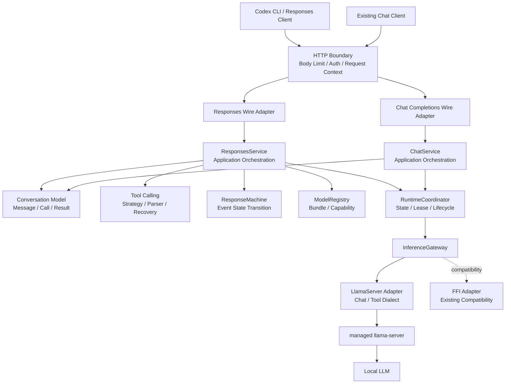
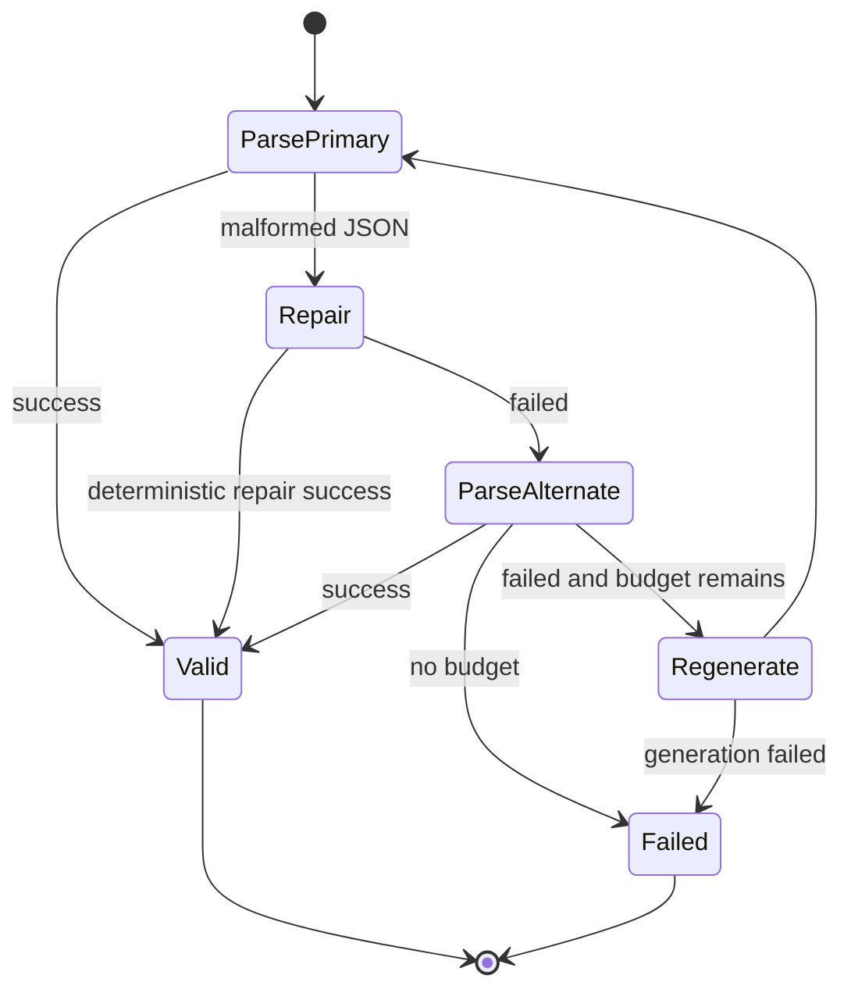
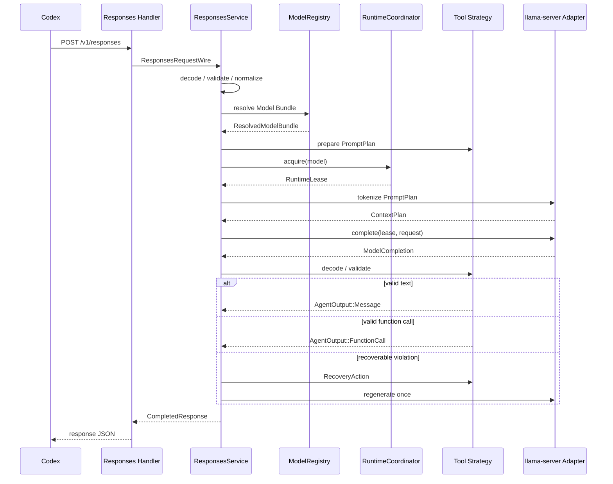

# Hoshikage Codex Agent Compatibility システム設計書

**プロジェクト名:** Hoshikage Codex Agent Compatibility
**文書種別:** システム設計書
**版:** 1.0
**作成日:** 2026-07-27
**確定日:** 2026-07-27
**状態:** システム設計Fix・実装未承認
**対応ブランチ:** `feature/codex-agent-compatibility`
**対応要件:** [codex-agent-compatibility-requirements.md](codex-agent-compatibility-requirements.md)

---

## 1. 設計目的

本設計は、Hoshikage に OpenAI Responses API の必要サブセットを追加し、Codex CLI の Agent Runtime とローカル LLM を接続するための内部構造を定義する。

Hoshikage は Agent にならない。Agent Loop、Tool 実行、承認、Sandbox は Codex または上位アプリケーションが担当する。Hoshikage は次の境界に徹する。

```text
Responses Wire
    ↓
意味を保持した内部会話構造
    ↓
Model Bundle が選択する Tool Calling Strategy
    ↓
managed llama-server
    ↓
モデル出力
    ↓
検証済みの最終回答または Function Call
    ↓
Responses Wire
```

本改訂は既存の Chat Completions、Model Bundle、managed `llama-server`、RAM ディスク、VRAM 管理を置き換えない。既存機能の上へ Responses Handler を直接積み上げるのではなく、Chat と Responses の双方が利用できる内部契約を抽出する。

---

## 2. 設計思想

### 2.1 処理ではなく構造を記述する

本設計では、リクエスト処理を巨大な Handler の手順として記述しない。状態、観測、規則、遷移、適用を別の概念として定義する。

| 概念 | Hoshikage での表現 |
|---|---|
| 状態 | `Conversation`、`RuntimePhase`、`ResponseState` |
| 観測 | `ConversationIndex`、`ModelCapabilityReport`、`RuntimeSnapshot` |
| 規則 | `RequestPolicy`、`ToolCallingStrategy`、`RecoveryPolicy` |
| 遷移 | `ResponseAction -> ResponseEvent`、`RuntimeAction -> RuntimeTransition` |
| 適用 | `ResponsesService`、`RuntimeCoordinator` |

### 2.2 型を契約として使う

文字列で意味を表さない。role、Tool Choice、Tool Calling mode、Response status、Runtime phase、error code は `enum` または検証済み newtype とする。

次を型で区別する。

- 外部から届いた未検証 ID と、検証済み `CallId`
- JSON 値と、Tool Schema に適合した `ToolArguments`
- Wire Input Item と、正規化済み `ConversationItem`
- 生成途中の Tool Call と、実行可能な `FunctionCall`
- 起動中 Runtime と、推論可能な `ReadyState`
- 通常ログへ出せる値と、秘密情報を含む値

### 2.3 変化を値として扱う

SSE event は Handler が順番に書き出す文字列ではなく、`ResponseMachine` が状態と Action から生成する値とする。

```text
ResponseState + ResponseAction
              ↓
     ResponseTransition
              ↓
ResponseState' + ResponseEvent[]
```

Runtime も同様に、モデルロードや停止を散在した `if` で制御せず、許可された状態遷移として定義する。純粋な状態値はOS process、socket、permit等の資源を直接所有せず、遷移が返す`RuntimeEffect`をApplication層が実行する。

### 2.4 Main と Handler を賢くしない

Axum Handler の責務は次だけとする。

1. HTTP request を Wire DTO として受け取る
2. request context を生成する
3. Application Service を呼ぶ
4. JSON または SSE response へ変換する

Tool解析、Bundle選択、Runtime起動、retry、SSE順序制御を Handler に置かない。

### 2.5 実在する変化軸だけを抽象化する

Trait は将来予想のために増やさない。初期設計で交換可能な契約とするのは、実際に複数実装が存在する次の境界である。

- `InferenceGateway`: managed `llama-server` と既存 FFI
- `ToolCallingStrategy`: native、JSON、disabled
- `ToolCallParser`: llama-server native、モデル別 parser、generic JSON
- `TokenStore`: 実ファイルとテスト用 in-memory

Wire DTO変換や単純な値検証は、不要なTraitを作らず純粋関数または具象型で実装する。

---

## 3. 現行構造の評価

### 3.1 維持する強い構造

現行Hoshikageには次の再利用可能な構造がある。

- `ModelConfig` によるモデル別設定
- managed `llama-server` を第一経路とする方針
- `RuntimeBackend` Trait による FFI 分離
- `LlamaServerCommandSpec` による起動コマンドの値化
- `ThinkingController` と `ThinkingStreamFilter`
- `RuntimeCapabilityReport`
- RAM ディスクBundleの原子的なmaterialize
- `Semaphore` による推論concurrency 1
- `Drop` による子プロセス停止

これらは破棄せず、責務の所有先を明確化して再配置する。

2026-07-27の基準線:

- `cargo test`: 100 passed、0 failed、1 ignored
- ignored: 実runtime bundleを必要とするcapability probe
- build warning: llama.cpp header未検出のためchecked-in FFI bindingを使用

以後のPhaseで失敗、ignored増加、未実行testがある場合は必ず報告する。

### 3.2 解消する構造上の問題

| 現状 | 問題 | 設計対応 |
|---|---|---|
| `RuntimeBackend::format_chat_prompt` が `api::ChatMessage` を受ける | Runtime層がHTTP DTOへ依存 | `Conversation`または`ModelRequest`へ変更 |
| `ModelManager` がRegistry、保存、Runtime、RAMディスク、排他、推論を所有 | 変更理由が集中 | `ModelRegistry`、`BundleResolver`、`RuntimeCoordinator`へ分割 |
| managed Chat が upstream body を組み立ててそのまま中継 | llama-server方言がAPI層へ露出 | `LlamaServerRequestAdapter`で隔離 |
| `ManagedRequestGuard` と `ensure_managed_llama_server` が分離 | 準備後からguard取得前に別モデルへ切替可能 | 推論中保持する`RuntimeLease`へ統合 |
| `HoshikageError` の多くが `String` | code、param、retry可否を後から復元できない | 境界別の構造化errorへ分割 |
| Config parse失敗時に既定値へ戻る箇所がある | 設定ミスが潜伏 | `RawConfig -> ValidatedConfig`へ変更 |
| Chat streaming がdetached taskとunbounded channelを使う | disconnect後の生成・送信継続リスク | 所有権がresponse bodyへ連動するstreamへ変更 |
| Response event系列を表す構造がない | terminal event重複・欠落の危険 | `ResponseMachine`を追加 |

### 3.3 リファクタリングの原則

- Wire互換を変更しない小さな段階で進める。
- 先にcharacterization testを追加し、既存挙動を固定する。
- `ModelManager`は一度に削除せず、移行中のFacadeとして残す。
- 新しいResponses経路を旧Chat DTOへ依存させない。
- Chat経路はResponses完成後ではなく、共通内部契約が安定した段階で移行する。

---

## 4. 全体アーキテクチャ



### 4.1 レイヤー責務

| レイヤー | 責務 | 依存してよい対象 |
|---|---|---|
| HTTP/Wire | Axum、JSON、SSE、OpenAI互換形式 | Application、Wire serializer |
| Application | use caseの組み立て、deadline、retry budget | Domain、Registry、Runtime port |
| Domain | 会話、Tool、出力、状態遷移、validation | 標準ライブラリ、serde_jsonの値 |
| Model | Bundle設定、能力、解決済みモデル | Domain |
| Runtime | process状態、lease、ロード・解放 | Model、Inference port |
| Adapter | llama-server/FFI固有形式 | Domain、Runtime port、外部library |
| Infrastructure | Config、Token Store、Clock、Log | 各公開契約 |

### 4.2 依存ルール

次の依存を禁止する。

- DomainからAxum、reqwest、FFIへの依存
- RuntimeからResponsesまたはChat DTOへの依存
- Tool parserからAxum Responseへの依存
- API Handlerから`LlamaServerProcess`への直接操作
- Model Bundleから任意コードの動的ロード
- HoshikageからCodex Tool実行への依存

---

## 5. モジュール構成

初期実装では単一crateを維持する。crate分割はコンパイル境界が必要になった時点で判断し、先にディレクトリとvisibilityで依存方向を表現する。

```text
src/
  api/
    mod.rs
    error.rs
    middleware.rs
    chat/
      mod.rs
      wire.rs
      handler.rs
    responses/
      mod.rs
      wire.rs
      handler.rs
      sse_wire.rs

  application/
    mod.rs
    responses_service.rs
    chat_service.rs
    execution_context.rs

  conversation/
    mod.rs
    item.rs
    message.rs
    tool.rs
    index.rs
    validation.rs

  tool_calling/
    mod.rs
    strategy.rs
    native.rs
    json.rs
    parser.rs
    recovery.rs
    schema.rs

  response_machine/
    mod.rs
    state.rs
    action.rs
    event.rs
    identity.rs

  model/
    mod.rs
    bundle.rs
    registry.rs
    capabilities.rs
    resolver.rs
    manager.rs              # 移行中Facade

  runtime/
    mod.rs
    coordinator.rs
    state.rs
    lease.rs
    ramdisk.rs
    health.rs

  inference/
    mod.rs
    contract.rs
    gateway.rs
    llama_server/
      mod.rs
      client.rs
      request_adapter.rs
      response_adapter.rs
      process.rs
    ffi/
      mod.rs
      backend.rs

  security/
    mod.rs
    policy.rs
    middleware.rs
    token.rs
    token_store.rs

  observability/
    mod.rs
    request_context.rs
    metrics.rs
    redaction.rs
```

`api/chat.rs`、`model/manager.rs`、`inference/runtime_backend.rs`は段階的に上記構造へ移す。ファイル移動自体を目的にせず、依存方向を変える単位で実施する。

Router stateも`Arc<ModelManager>`単体から、use caseごとの入口を持つ`AppState`へ移行する。

```rust
pub struct AppState {
    pub responses: Arc<ResponsesService>,
    pub chat: Arc<ChatService>,
    pub models: Arc<ModelQueryService>,
    pub auth: Arc<AuthService>,
}
```

Handlerは`AppState`から必要なserviceだけを参照し、RegistryやRuntimeを直接操作しない。

---

## 6. 内部会話モデル

### 6.1 識別子

```rust
#[derive(Debug, Clone, PartialEq, Eq, Hash)]
pub struct ModelId(String);

#[derive(Debug, Clone, PartialEq, Eq, Hash)]
pub struct ResponseId(String);

#[derive(Debug, Clone, PartialEq, Eq, Hash)]
pub struct OutputItemId(String);

#[derive(Debug, Clone, PartialEq, Eq, Hash)]
pub struct CallId(String);

#[derive(Debug, Clone, PartialEq, Eq, Hash)]
pub struct ToolName(String);
```

各newtypeはconstructorで長さ、文字種、空文字を検証する。Wireから受け取る値は必ずconstructorを通す。

### 6.2 会話Item

```rust
#[derive(Clone)]
pub struct Conversation {
    items: Vec<ConversationItem>,
}

#[derive(Clone)]
pub enum ConversationItem {
    Message(Message),
    FunctionCall(FunctionCall),
    FunctionCallOutput(FunctionCallOutput),
}

#[derive(Debug, Clone, Copy, PartialEq, Eq)]
pub enum Role {
    System,
    Developer,
    User,
    Assistant,
}

#[derive(Clone)]
pub struct Message {
    pub role: Role,
    pub content: Vec<ContentPart>,
}

#[derive(Clone)]
pub enum ContentPart {
    Text(String),
    Image(ImageInput),
}
```

初期版ではResponses経路の`Image`を能力エラーとし、型だけをChat/Visionとの共通化に利用する。

### 6.3 Function CallとResult

```rust
#[derive(Clone)]
pub struct FunctionCall {
    pub call_id: CallId,
    pub name: ToolName,
    pub arguments: ToolArguments,
}

#[derive(Clone)]
pub struct ToolArguments {
    canonical_json: String,
    value: serde_json::Value,
}

#[derive(Clone)]
pub struct FunctionCallOutput {
    pub call_id: CallId,
    pub outcome: ToolOutcome,
}

#[derive(Clone)]
pub enum ToolOutcome {
    Success(String),
    Failure(String),
    Rejected(String),
    Cancelled(String),
}
```

`ToolArguments`は構文的に有効なJSONだけを生成できる。strict Bundleでは、さらに`ValidatedToolArguments`へ変換してからResponse出力へ進む。

`Conversation`、`Message`、`FunctionCall`、`FunctionCallOutput`は秘匿本文を推移的に所有するため、通常の`Debug`をderiveしない。診断には本文を除いた`ConversationSummary`と`ToolPayloadSummary`だけを使う。

Responses WireがTool結果のstatusを明示する場合は`ToolOutcome`へ対応づける。単純文字列しか持たない場合は本文を改変せず`Success`として保持し、Hoshikageが文字列内容から成功・失敗を推測しない。Codex Fixtureでerror表現が確認できた場合、その構造だけを明示的にconverterへ追加する。

### 6.4 ConversationIndex

`function_call_output`からTool名と引数を復元するため、会話を走査してread-only indexを構築する。

```rust
pub struct ConversationIndex<'a> {
    calls: HashMap<&'a CallId, &'a FunctionCall>,
}

impl Conversation {
    pub fn validate(&self) -> Result<ConversationIndex<'_>, ConversationError>;
}
```

validationは次を保証する。

- `call_id`が重複しない
- Resultより前に対応するCallがある
- 1つのCallへ複数のResultがない
- roleとContentの組み合わせが有効
- Input Item順序が保持される

### 6.5 Tool定義

```rust
pub struct ToolSet {
    tools: Vec<FunctionTool>,
    by_name: HashMap<ToolName, usize>,
}

pub struct FunctionTool {
    pub name: ToolName,
    pub description: Option<String>,
    pub parameters: JsonSchema,
    pub strict: bool,
}

pub enum ToolChoice {
    Auto,
    None,
    Required,
    Function(ToolName),
}
```

`ToolSet::new`は名前重複、Schema root、最大bytes、最大depthを検証する。JSON Schema validationは標準準拠libraryを利用し、独自validatorを実装しない。

### 6.6 正規化推論要求

```rust
pub struct InferenceRequest {
    pub model: ModelId,
    pub instructions: Vec<Message>,
    pub conversation: Conversation,
    pub tools: ToolSet,
    pub tool_choice: ToolChoice,
    pub sampling: SamplingOptions,
    pub output_limit: OutputTokenLimit,
    pub reasoning: ReasoningPolicy,
    pub text: TextPolicy,
}
```

この型にはHTTP field名、Axum型、llama-server field名を含めない。

---

## 7. Request変換とvalidation

### 7.1 変換段階

```text
Raw HTTP Body
    ↓ size limit
ResponsesRequestWire
    ↓ field classification
DecodedResponsesRequest
    ↓ semantic validation
ValidatedResponsesRequest
    ↓ Bundle resolution
ResolvedResponsesRequest
    ↓ Strategy prepare / static size validation
PreparedInferenceRequest + PromptPlan
    ↓ RuntimeLease acquisition
Runtime-backed exact context planning
    ↓
PlannedInferenceRequest
```

各段階を別型にし、未検証requestをRuntimeへ渡せない構造にする。存在しないBundle、不正Tool Schema、明白なbyte上限超過はqueueへ入る前に拒否する。一方、対象Bundleと同じtokenizerを必要とする厳密context判定は、RuntimeLease取得後かつ生成開始前に行う。

### 7.2 Unknown field policy

`RESPONSES_UNKNOWN_FIELD_POLICY`は次の型へ変換する。

```rust
pub enum UnknownFieldPolicy {
    Compatible,
    Strict,
}
```

Wire deserializeは一度`serde_json::Value`としてobject keyを分類してから、既知DTOへ変換する。

| 分類 | compatible | strict |
|---|---|---|
| 既知・対応 | 処理 | 処理 |
| 既知・意味を変えず無視可能 | warning付き受理 | error |
| 既知・会話やTool制御へ影響 | error | error |
| 未知top-level | warning付き受理 | error |
| 未知Input Item / Tool Type | error | error |

`#[serde(deny_unknown_fields)]`だけには依存しない。runtime policyとfield分類を共存させるためである。

### 7.3 `previous_response_id`

初期版はサーバー状態を保存しない。

1. `previous_response_id`がない場合は通常処理する。
2. 存在する場合、現在の`input`だけでCall/Result対応と会話継続が成立するか検証する。
3. 完全履歴が成立する場合はwarning metadataを残して無視する。
4. 履歴不足の場合は`previous_response_not_supported`を返す。

履歴の「完全性」はモデルの意味理解ではなく、構造上必要なCall/Result対応と最低1件の会話Itemで判定する。

### 7.4 Context planning

```rust
pub struct ContextPlan {
    pub input_tokens: u32,
    pub reserved_output_tokens: u32,
    pub context_window: u32,
    pub tool_result_actions: Vec<ToolResultAction>,
}
```

計算式:

```text
normalized instructions
+ normalized conversation
+ tool schema
+ dialect overhead
+ reserved output
<= effective context window
```

Strategyは推論payloadと同時に`PromptPlan`を生成する。Context判定は、会話だけではなくTool Schema、chat template、JSON fallback instructionを含む、実際に送信するrendered promptを対象Runtimeと同じtokenizerで数える。managed `llama-server`では同一templateを適用した結果のtokenize endpointまたは等価なruntime APIを使い、文字数からの推測を正式判定に使わない。

exact preflightを対象buildが提供できない場合は、過小評価しない保守的な上限判定を行い、`ContextPlan.accuracy = Conservative`として診断へ残す。推論後の実usageをpreflight値の代用にはしない。

既定ではTool Resultを切り詰めない。超過時は`context_length_exceeded`を返す。Bundleが明示的にhead/tail policyを持つ場合だけUTF-8境界で切り詰め、モデル入力へ切り詰め情報を追加する。

### 7.5 Optional field mapping

| Responses field | 内部表現・処理 |
|---|---|
| `instructions` | 順序を保持したsystem/developer instruction |
| `temperature` | `SamplingOptions.temperature` |
| `top_p` | `SamplingOptions.top_p` |
| `max_output_tokens` | `OutputTokenLimit`。Bundle/context上限と小さい方 |
| `parallel_tool_calls` | 受理するがupstreamへ常に`false`を渡す |
| `metadata` | key allowlistとsize limitを通した`SafeMetadata` |
| `store` | 受理するが永続化しない。`false`相当 |
| `reasoning` | Bundle capabilityに従う。未対応の必須意味はerror |
| `text.verbosity` | 対応Bundleだけprompt/runtime policyへ反映 |
| `previous_response_id` | 7.3のstateless規則 |

`metadata`の許可keyと最大数はConfigで定義する。値はlog labelに使える短いscalarだけを許可し、任意nested JSONをlogへ展開しない。

---

## 8. Tool Calling設計

### 8.1 Bundle設定

`ModelConfig`へ次を追加する。

```rust
#[derive(Debug, Clone, Serialize, Deserialize)]
pub struct ToolCallingConfig {
    #[serde(default)]
    pub mode: ToolCallingMode,
    #[serde(default)]
    pub parser: Option<ToolParserId>,
    #[serde(default)]
    pub fallback: ToolFallback,
    #[serde(default = "default_true")]
    pub strict: bool,
    #[serde(default = "default_true")]
    pub repair_invalid_json: bool,
    #[serde(default = "default_max_argument_bytes")]
    pub max_argument_bytes: usize,
    #[serde(default)]
    pub result_policy: ToolResultPolicy,
}

#[derive(Debug, Clone, Copy, Serialize, Deserialize)]
#[serde(rename_all = "snake_case")]
pub enum ToolCallingMode {
    Native,
    Json,
    Disabled,
}

impl Default for ToolCallingMode {
    fn default() -> Self {
        Self::Disabled
    }
}

#[derive(Debug, Clone, Copy, Serialize, Deserialize)]
#[serde(rename_all = "snake_case")]
pub enum ToolFallback {
    None,
    Json,
}

impl Default for ToolFallback {
    fn default() -> Self {
        Self::Json
    }
}

#[derive(Debug, Clone, Serialize, Deserialize)]
#[serde(tag = "mode", rename_all = "snake_case")]
pub enum ToolResultPolicy {
    Reject,
    HeadTail {
        max_bytes: usize,
        head_bytes: usize,
        tail_bytes: usize,
    },
}

impl Default for ToolResultPolicy {
    fn default() -> Self {
        Self::Reject
    }
}
```

既存Bundleは`disabled`としてdeserializeされる。ToolなしChatの挙動は変わらない。

`parser`省略時は`native -> llama-server-native`、`json -> generic-json`として解決する。Tool Callingを有効化したBundleは既定でstrict validationと決定的JSON repairを有効にする。

`mode = json`の時は`fallback = json`を再適用しない。`fallback`はNative decode失敗時だけ参照する。既定設定の既存Bundleを保存しても`tool_calling`を自動追記しないよう、Wire保存形式では既定値全体を`skip_serializing_if`相当で省略する。

### 8.2 Strategy契約

```rust
pub trait ToolCallingStrategy: Send + Sync {
    fn prepare(
        &self,
        request: &ResolvedResponsesRequest,
        bundle: &ResolvedModelBundle,
    ) -> Result<PreparedInferenceRequest, ToolCallingError>;

    fn decode(
        &self,
        output: ModelOutput,
        tools: &ToolSet,
    ) -> Result<AgentOutput, ToolCallingError>;

    fn stream_decoder(
        &self,
        tools: &ToolSet,
    ) -> Box<dyn ToolStreamDecoder>;
}

pub trait ToolStreamDecoder: Send {
    fn push(&mut self, delta: ModelDelta)
        -> Result<Vec<ResponseAction>, ToolCallingError>;
    fn finish(self: Box<Self>)
        -> Result<Vec<ResponseAction>, ToolCallingError>;
}

pub enum AgentOutput {
    Message(AssistantMessage),
    FunctionCall(PendingFunctionCall),
}

pub struct PendingFunctionCall {
    pub name: ToolName,
    pub arguments: ToolArguments,
}
```

`ToolCallingStrategy`はToolを実行しない。モデルへ提示する形式とモデル出力の解釈だけを担当する。

`PendingFunctionCall`はまだ`CallId`を持たない。validation完了後に`ResponsesService`がResponse identityとして`CallId`を割り当て、`FunctionCall`またはSSE eventへ変換する。

### 8.3 Native Strategy

Native経路はmanaged `llama-server`の`/v1/chat/completions`へFunction Toolを渡す。

ResponsesからChatへの変換:

| 内部構造 | llama-server Chat形式 |
|---|---|
| system/developer instruction | system/developer message。template非対応時は順序を保ってsystemへ正規化 |
| user/assistant message | message |
| `FunctionCall` | assistant messageの`tool_calls[]` |
| `FunctionCallOutput` | role=`tool`、`tool_call_id`付きmessage |
| `ToolSet` | `tools[].function` |
| `ToolChoice` | upstream対応値へ変換 |

Hoshikageが外部へ返す`CallId`はHoshikageが生成する。upstream固有IDをそのまま公開しない。次requestではCodexが返した`CallId`からChat履歴を再構築する。

llama-serverのargumentsがJSON文字列またはJSON objectのどちらで返っても、adapterで`ToolArguments`へ正規化する。これは既知のupstream差異を境界で吸収するためである。

Native streamにも`OutputClassificationGate`を置く。構造化Tool deltaを受けた時点でFunction Call、text deltaを受けた時点でTextへ確定し、確定前にはResponses output eventを送らない。確定後に異なる種類が混在した場合は、両方を成功扱いせず`response_translation_failed`でstreamを失敗終了する。

Tool名が複数chunkへ分割されるupstreamに備え、decoder内部では`FunctionCallDraft { name, arguments }`を構築する。外部の`BeginFunctionCall`はTool名が検証できるまで発行しない。arguments bytes上限は完了後だけでなくchunk追加ごとに検査し、上限を超えた時点で生成を中止する。

### 8.4 JSON Strategy

JSON経路はTool定義を含む専用instructionを追加し、出力を次のdiscriminated unionへ制約する。

```json
{
  "type": "function_call",
  "name": "read_file",
  "arguments": {
    "path": "README.md"
  }
}
```

```json
{
  "type": "final",
  "content": "回答本文"
}
```

可能なruntimeではJSON Schema grammarを併用する。promptだけでJSON遵守を期待しない。

JSON StrategyではFunction Callか最終回答かを確定するまで出力を分類する必要がある。初期版のstreamは分類完了まで境界内でbufferし、その後に正しいResponses event系列を送る。誤った`output_text.delta`を先に送ってからFunction Callへ変更することは禁止する。

### 8.5 Disabled Strategy

Toolなしrequestは通常text推論として処理する。`tools`が存在するrequestはRuntime起動前に`tool_calling_not_supported`で拒否する。

### 8.6 Parser Registry

```rust
pub struct ToolParserRegistry {
    parsers: HashMap<ToolParserId, Arc<dyn ToolCallParser>>,
}

pub trait ToolCallParser: Send + Sync {
    fn parse(&self, output: &str) -> Result<ParsedToolOutput, ToolParseError>;
}
```

初期parser:

- `llama-server-native`
- `generic-json`
- `qwen`
- `llama`
- `mistral`
- `hermes`

Phase 0では`llama-server-native`と`generic-json`を必須実装とし、モデル別parserは対象Bundleでnative adapterが吸収できないことをFixtureで確認してから実装する。IDは先に予約しても、未実装parserをeffective capabilityへ含めない。

設定値から任意libraryやscriptをロードしない。未知parser IDは起動時または`doctor`でerrorにする。

### 8.7 Recovery state machine



1 Responseが持つsemantic regeneration budgetは合計1回とする。次の違反は同じbudgetを共有する。

- Native parse失敗
- JSON parse失敗
- `tool_choice = required`なのに最終text
- 同一Responseに複数Tool Call
- strict Schema不一致

原因ごとに1回ずつ再生成しない。retry増幅を防ぐためである。

### 8.8 単一Tool Call制約

初期版では`AgentOutput`が表現できるFunction Callは1件だけとする。upstreamが複数Callを返した場合は`MultipleToolCalls`としてRecoveryへ渡す。

HoshikageはCallを順番待ちさせず、実行もしない。依存する複数ToolはCodexが次requestを送る逐次Agent Loopとして成立する。

---

## 9. Runtimeライフサイクル設計

### 9.1 ModelManagerの分割

現行`ModelManager`の責務を次へ分ける。

| 新コンポーネント | 責務 |
|---|---|
| `ModelRegistry` | Bundle一覧、取得、追加、削除、永続化 |
| `BundleResolver` | 相対path、RAMディスク、実効runtime設定の解決 |
| `RuntimeCoordinator` | 子プロセス、ロード状態、排他、idle停止、復旧 |
| `InferenceGateway` | 正規化Model Requestの実行 |
| `ModelManager` | 移行期間中のFacade。新コンポーネントへ委譲 |

### 9.2 Runtime Phaseと資源所有

```rust
pub enum RuntimePhase {
    Cold,
    Starting(StartingState),
    Ready(ReadyState),
    Failed(FailedState),
}

pub struct ReadyState {
    pub generation: RuntimeGeneration,
    pub model: ModelId,
    pub endpoint: RuntimeEndpoint,
    pub loaded: LoadedRuntimeInfo,
    pub active_request: Option<RequestId>,
    pub last_access: Instant,
}

struct RuntimeResources {
    process: Option<LlamaServerProcess>,
    materialized_bundle: Option<MaterializedBundle>,
}
```

`RuntimeGeneration`は再起動ごとに変わるIDとする。古いendpointやstreamが、新しいprocessの状態を誤って更新することを防ぐ。

`RuntimePhase`は比較・検証可能な状態値であり、process handleやpermitを所有しない。`RuntimeResources`はCoordinatorだけが所有し、状態遷移が生成したEffectの実行結果によって更新する。状態値をcloneしただけでOS資源の所有権が複製されたように見える構造を作らない。

### 9.3 Runtime Action

```rust
pub enum RuntimeAction {
    Start { model: ModelId },
    MarkReady { generation: RuntimeGeneration },
    Acquire { request: RequestId },
    Release { request: RequestId },
    MarkUnhealthy { generation: RuntimeGeneration, reason: RuntimeFailure },
    Stop { reason: StopReason },
}

pub struct RuntimeTransition {
    pub next: RuntimePhase,
    pub effects: Vec<RuntimeEffect>,
}

pub enum RuntimeEffect {
    Spawn { generation: RuntimeGeneration, model: ModelId },
    WaitUntilReady { generation: RuntimeGeneration },
    StopProcess { generation: RuntimeGeneration },
    ReleaseMaterializedBundle { generation: RuntimeGeneration },
}
```

許可する主要遷移:

| 現在 | Action | 次状態 |
|---|---|---|
| Cold | Start | Starting |
| Starting | MarkReady | Ready/idle |
| Starting | MarkUnhealthy | Failed |
| Ready/idle | Acquire | Ready/active |
| Ready/active | Release | Ready/idle |
| Ready/idle | Stop | Cold |
| Ready/active | Stop | error。通常停止しない |
| Ready | MarkUnhealthy | Failed |
| Failed | Start | Starting |

`transition(current, action) -> RuntimeTransition`は副作用を行わない。不正遷移は`RuntimeTransitionError`とし、黙って状態を修正しない。Effect失敗時はgenerationを照合して`MarkUnhealthy`を適用し、状態と実資源が食い違った場合はreconciliationを実行して安全側の`Failed`または`Cold`へ収束させる。

### 9.4 RuntimeLease

```rust
pub struct RuntimeLease {
    request_id: RequestId,
    generation: RuntimeGeneration,
    endpoint: RuntimeEndpoint,
    coordinator: Arc<RuntimeCoordinatorInner>,
    _execution_permit: OwnedSemaphorePermit,
}

pub struct QueueTicket {
    _admission_permit: OwnedSemaphorePermit,
}
```

`ResponsesService`はBundleをqueue前に`ResolvedRuntimeSpec`へ解決し、`RuntimeCoordinator::acquire(spec)`を呼ぶ。Coordinatorは次を1操作として行う。

1. bounded admission queueのslotを`QueueTicket`として取得
2. queue timeout付きでexecution permitを取得
3. execution permit取得後に`QueueTicket`をdropしてadmission slotを返す
4. 必要なら旧Runtimeを停止
5. 対象モデルでRuntimeを起動
6. health check完了
7. `Acquire` transition
8. `RuntimeLease`を返す

`RuntimeCoordinator`は`admission: Semaphore<queue_capacity>`と`execution: Semaphore<1>`を分ける。admissionが満杯なら新規requestを`server_busy`で拒否し、無制限にwaiterを増やさない。

queue待機中にclient cancellationまたはrequest deadlineを検出した場合は`QueueTicket`をdropし、Runtimeを起動しない。

Leaseは最終JSONの受信完了またはSSE bodyのdropまで保持する。正常系は`RuntimeLease::finish()`で`Release`を明示し、`Drop`はdisconnect、panic、早期return時のfallbackとして同じreleaseを冪等に行う。Drop内では非同期処理やprocess停止を行わず、短時間の同期状態更新だけを行う。permitはrelease状態更新後に返るfield順序とする。

これにより、次を構造的に防ぐ。

- 推論開始直前の別モデルへの切替
- stream中のidle unload
- client disconnect後のactive request残留
- request終了前のpermit返却

### 9.5 Idle monitor

Idle monitorは直接processを停止しない。

1. `Semaphore::try_acquire_owned`を試す
2. 取得できない場合はactive request中として何もしない
3. 取得できた場合だけ`RuntimeAction::Stop`を適用
4. VRAM解放後、grace timeoutでRAMディスクcacheを解放

Runtime状態とRAMディスクcache状態は別にする。VRAM解放とcache削除は異なる遷移である。

### 9.6 Crash recovery

upstream接続失敗またはprocess終了を検出した場合、Leaseの`generation`と現在のgenerationが一致する時だけ`MarkUnhealthy`を適用する。

同一request内のprocess再起動は初期版では最大1回とし、Tool semantic regenerationとは別budgetで管理する。ただし、生成開始後に部分出力を返したstreamは自動再実行しない。重複Tool Callや重複textを防ぐため、`upstream_disconnected`で終了する。

再起動回数はrequest単位だけでなくBundle単位の`CrashBudget`でも制限する。設定時間窓内の連続crashが閾値を超えたBundleは`Failed { retry_after }`へ移し、指数backoff中のrequestを即座に`model_load_failed`として拒否する。成功したhealth checkと一定時間の安定稼働だけがcrash counterをresetする。管理API、`/health`、`doctor`はcircuit open中も応答する。

---

## 10. 推論契約とllama-server Adapter

### 10.1 Backend非依存契約

```rust
pub struct ModelRequest {
    pub conversation: ModelConversation,
    pub tools: ModelToolSet,
    pub tool_choice: ToolChoice,
    pub sampling: SamplingOptions,
    pub max_output_tokens: u32,
    pub stream: bool,
}

pub enum ModelOutput {
    Completed(ModelCompletion),
    Stream(LeasedModelStream),
}

pub enum ModelCompletion {
    Text { content: String, usage: TokenUsage },
    ToolCall { call: RawModelToolCall, usage: TokenUsage },
}

pub enum TokenUsage {
    Measured {
        input_tokens: u32,
        output_tokens: u32,
    },
    Estimated {
        input_tokens: u32,
        output_tokens: u32,
    },
}

pub enum ModelDelta {
    Text(String),
    ToolCallStarted { index: usize },
    ToolName(String),
    ToolArguments(String),
    ToolCallFinished,
    Usage(TokenUsage),
    Finished(ModelFinishReason),
}
```

`InferenceGateway`はモデルをロードしない。必ず`RuntimeLease`を受け取り、そのLeaseが表すRuntimeに対して推論する。

```rust
#[async_trait]
pub trait InferenceGateway: Send + Sync {
    async fn complete(
        &self,
        lease: &RuntimeLease,
        request: ModelRequest,
    ) -> Result<ModelCompletion, InferenceError>;

    async fn stream(
        &self,
        lease: RuntimeLease,
        request: ModelRequest,
    ) -> Result<LeasedModelStream, InferenceError>;
}
```

`LeasedModelStream`はupstream byte stream、incremental decoder、`RuntimeLease`を同じ所有単位にする。detached taskへLeaseを移さず、body dropがupstream connectionとLeaseの両方を解放する。HTTP clientはAdapterが共有し、requestごとに生成しない。

upstreamがusageを返さない場合は、7.4のrendered promptと生成済みoutputを同じtokenizerで数え、`TokenUsage::Estimated`とする。0や空値を捏造しない。Wire契約上estimated区分を表現できない場合も、内部logへ`usage_source = estimated`を残す。tokenizer自体が利用不能な場合のWire表現はPhase 0 Fixtureで確定し、成功値を偽造しない。

### 10.2 Managed llama-server

初期Codex互換の正規経路はmanaged `llama-server`とする。

- Hoshikage外部: `/v1/responses`
- Hoshikage内部upstream: `/v1/chat/completions`
- Tool Calling: `--jinja`とBundleのchat template
- parallel: upstreamへ`parallel_tool_calls = false`
- reasoning: Bundle設定に従う
- Hoshikage自身のTool実行: 常に無効

現在のllama.cpp masterはResponses互換routeも公開しているが、Hoshikageの初期内部upstreamには採用しない。既存HoshikageがChat upstreamを運用済みであり、Function Callingのtemplate・Tool field・stream差異を明示的に観測できるためである。

将来、対象llama-server buildのResponses routeがHoshikageの内部契約を満たすことをFixtureで確認できた場合は、`LlamaServerResponsesAdapter`を追加できる。ただし外部Responseの単純pass-throughにはせず、必ず`ModelDelta`と`ResponseMachine`を経由する。

`llama-server --tools`と`--agent`は起動optionへ追加しない。これはllama-server自身にファイル操作等を許可する別機能であり、Hoshikageの責務境界に反する。

### 10.3 Upstream DTO隔離

`LlamaServerChatRequest`と`LlamaServerChatResponse`は`inference/llama_server`配下だけで公開する。DomainやApplicationから参照しない。

upstream差異として最低限次を正規化する。

- `arguments`がstringまたはobject
- `content`がnullまたは空文字
- `tool_calls`とfinish reasonの不整合
- usage/timingsの欠損
- reasoning contentの有無
- SSE chunk境界でUTF-8またはJSONが分割される状態

### 10.4 FFI Backend

FFIは既存Chat text互換経路として維持する。初期Codex Agent Compatibilityの正式対象には含めない。

理由:

- Tool-aware chat templateと構造化Tool出力はllama-serverの方が追従性が高い
- native生成の中断がmanaged processより難しい
- Vision、MTP、Draft modelの第一経路がすでにmanagedである

FFIをResponses textへ接続する場合も、同じ`ModelRequest`と`ModelCompletion::Text`を実装する。Tool capabilityは`false`と公開する。

---

## 11. 非ストリームResponse

### 11.1 実行フロー



### 11.2 完了Response生成

`CompletedResponse`はtextまたはFunction Callを型で分ける。

```rust
pub enum CompletedOutput {
    Message(CompletedMessage),
    FunctionCall(CompletedFunctionCall),
}

pub struct CompletedResponse {
    pub identity: ResponseIdentity,
    pub model: ModelId,
    pub output: CompletedOutput,
    pub usage: TokenUsage,
}
```

Wire serializerがOpenAI形式の`object`、`status`、`content`、`annotations`を追加する。Domain型に`"response"`等の定数文字列を持たせない。

---

## 12. SSE Response state machine

### 12.1 状態

```rust
pub enum ResponseState {
    New,
    InProgress(InProgressResponse),
    Completed(CompletedResponseState),
    Failed(FailedResponseState),
}

pub struct InProgressResponse {
    pub identity: ResponseIdentity,
    pub sequence: SequenceNumber,
    pub output: OutputState,
}

pub enum OutputState {
    None,
    Text(TextOutputState),
    FunctionCall(FunctionCallOutputState),
}

pub struct CompletedResponseState {
    pub identity: ResponseIdentity,
    pub final_sequence: SequenceNumber,
    pub usage: TokenUsage,
}

pub struct FailedResponseState {
    pub identity: ResponseIdentity,
    pub final_sequence: SequenceNumber,
    pub failure: ResponseFailure,
}
```

`Completed`と`Failed`はterminal stateであり、以後のActionを拒否する。terminal stateにもidentityと最終sequenceを保持し、`response.failed`生成時や監査時に途中状態へ戻らない。

### 12.2 Action

```rust
pub enum ResponseAction {
    Start,
    BeginText,
    AppendText(String),
    FinishText,
    BeginFunctionCall { name: ToolName },
    AppendArguments(String),
    FinishFunctionCall { arguments: ToolArguments },
    Complete { usage: TokenUsage },
    Fail(ResponseFailure),
}
```

### 12.3 Text event遷移

| Action | 生成event |
|---|---|
| Start | `response.created`、`response.in_progress` |
| BeginText | `response.output_item.added`、`response.content_part.added` |
| AppendText | `response.output_text.delta` |
| FinishText | `response.output_text.done`、`response.content_part.done`、`response.output_item.done` |
| Complete | `response.completed` |

### 12.4 Function Call event遷移

| Action | 生成event |
|---|---|
| Start | `response.created`、`response.in_progress` |
| BeginFunctionCall | `response.output_item.added` |
| AppendArguments | `response.function_call_arguments.delta` |
| FinishFunctionCall | `response.function_call_arguments.done`、`response.output_item.done` |
| Complete | `response.completed` |

### 12.5 識別子とsequence

```rust
pub struct ResponseIdentity {
    pub response_id: ResponseId,
    pub output_item_id: OutputItemId,
    pub call_id: Option<CallId>,
}
```

- Response開始時にresponse IDを生成する
- Output開始時にitem IDを生成する
- Function Call開始時にcall IDを生成する
- 同じResponse内で変更しない
- sequence numberはevent生成ごとに単調増加する
- 初期値はCodex Fixtureで確定し、state machine testで固定する

### 12.6 Wire serializer

`ResponseMachine`は意味的な`ResponseEvent`を返す。SSEの`event:`、`data:`、JSON field名は`ResponsesSseWire`が変換する。

これにより、状態遷移testはJSON文字列比較ではなくevent型で検証でき、Wire fixture testはserializerだけを検証できる。

IDと時刻は`ResponseIdentityFactory`と`Clock`から受け取り、state machine内部でglobal clockやrandom generatorを直接呼ばない。本番実装は安全な一意IDとUTC epochを供給し、testは決定値を注入する。

### 12.7 Failureとdisconnect

生成前の失敗は通常のHTTP error JSONを返す。`response.created`送信後の失敗は次の規則に従う。

1. 成功の`response.completed`を送らない
2. Error eventと`response.failed`を最大1回送る
3. client disconnectでは送信を試みず、streamとLeaseをdropする
4. partial output後の自動再生成を行わない
5. failure state以降のupstream deltaを破棄する

### 12.8 Backpressure

Axum bodyへ渡すstreamはbounded channelまたはpull-based streamとする。unbounded channelを使わない。

推奨構造:

- reqwest upstream byte streamを直接poll
- chunk decoderが`ModelDelta`を生成
- Strategy decoderが`ResponseAction`を生成
- `ResponseMachine`が`ResponseEvent`を生成
- SSE serializerが1 eventずつyield

detached generation taskを避け、clientがbodyをdropした時に所有するupstream streamと`RuntimeLease`もdropされる構造にする。

---

## 13. Application Service

### 13.1 ResponsesService

```rust
pub struct ResponsesService {
    registry: Arc<ModelRegistry>,
    runtime: Arc<RuntimeCoordinator>,
    gateway: Arc<dyn InferenceGateway>,
    strategies: ToolStrategyRegistry,
    policies: ResponsesPolicies,
}
```

責務:

- 変換段階の接続
- request deadline
- context plan
- BundleとStrategy選択
- RuntimeLease取得
- semantic retry budget
- completionまたはstream executionの所有

責務外:

- JSON field名
- llama-server request field
- Tool実行
- Codex Agent Loop
- Tokenファイル操作

### 13.2 ExecutionContext

```rust
pub struct ExecutionContext {
    pub request_id: RequestId,
    pub response_id: ResponseId,
    pub started_at: Instant,
    pub deadline: Deadline,
    pub retry_budget: RetryBudget,
    pub metadata: SafeMetadata,
}
```

Tool arguments、Tool Result、instructions本文はContextへ入れない。

### 13.3 Retry budget

```rust
pub struct RetryBudget {
    pub transport_restarts: u8,
    pub semantic_regenerations: u8,
}
```

初期値:

- Runtime起動前のtransport restart: 1
- 生成後のtransport retry: 0
- semantic regeneration: 1

Codex側の`request_max_retries = 1`と合わせ、Hoshikage内でHTTP request全体を無制限に再実行しない。

---

## 14. エラー設計

### 14.1 境界別Error

```rust
pub enum ResponsesError {
    Request(RequestError),
    Conversation(ConversationError),
    Tool(ToolCallingError),
    Context(ContextError),
    Model(ModelError),
    Runtime(RuntimeError),
    Inference(InferenceError),
    Translation(TranslationError),
    Timeout(TimeoutError),
}
```

各Errorは最低限次を提供する。

```rust
pub trait ErrorDescriptor {
    fn code(&self) -> &'static str;
    fn param(&self) -> Option<&'static str>;
    fn retry_class(&self) -> RetryClass;
    fn log_class(&self) -> &'static str;
}

pub enum RetryClass {
    Never,
    BeforeGeneration,
    SemanticRegeneration,
    ClientMayRetry,
}
```

HTTP statusとOpenAI error bodyへの変換は`api::error`だけが担当する。Domain ErrorがAxum `StatusCode`を返さない。

### 14.2 Error mapping

| Error | HTTP | code | retry |
|---|---:|---|---|
| model未登録 | 400 | `model_not_found` | Never |
| request構造不正 | 400 | `invalid_request` | Never |
| Tool disabled | 400 | `tool_calling_not_supported` | Never |
| Tool Schema不正 | 400 | `invalid_tool_schema` | Never |
| request履歴内arguments不正 | 400 | `invalid_tool_arguments` | Never |
| model生成arguments回復不能 | 500 | `invalid_tool_arguments` | Never |
| unknown semantic field | 400 | `unsupported_parameter` | Never |
| orphan result | 400 | `orphan_function_call_output` | Never |
| context超過 | 400 | `context_length_exceeded` | Never |
| queue timeout | 503 | `server_busy` | ClientMayRetry |
| startup失敗 | 500 | `model_load_failed` | BeforeGeneration |
| model生成失敗 | 500 | `generation_failed` | ClientMayRetry |
| upstream timeout | 504 | `upstream_timeout` | ClientMayRetry |
| upstream切断 | 502 | `upstream_disconnected` | ClientMayRetry |
| Response変換失敗 | 500 | `response_translation_failed` | Never |

要件で定義した公開codeを別の内部error名へ置換しない。内部では詳細なvariantを持ち、Wire境界で上表の安定codeへ集約する。

同じ`invalid_tool_arguments`でも、利用者が送った履歴の不正と、モデルが生成した出力の回復不能を`ErrorOrigin`で区別する。前者はrequest error、後者はprovider側generation failureであり、HTTP statusだけを内部原因の代用にしない。Codex Fixtureで特定statusへの依存が判明した場合はWire mappingだけを変更する。

### 14.3 秘匿

Errorの`Display`へ次を含めない。

- Bearer Token
- Tool arguments本文
- Tool Result本文
- instructions本文
- model prompt全文
- local imageの内容

内部原因は`source()` chainで保持し、公開messageは安全な説明へ変換する。

### 14.4 Error messageと言語境界

Domain Errorは自然言語本文ではなく、安定した`ErrorCode`、`MessageKey`、安全なformat引数を返す。

```rust
pub struct PublicErrorDescriptor {
    pub code: ErrorCode,
    pub message_key: MessageKey,
    pub safe_args: ErrorMessageArgs,
}
```

- Responses API: `MessageKey`を英語の固定`error.message`へ変換
- CLI human output: `Localizer`が英語または日本語へ変換
- CLI JSON: code、message_key、構造化fieldを言語非依存で出力
- log: code、message_key、safe fieldだけを記録

APIは`Accept-Language`やOS localeでmessageを変えない。翻訳漏れ時は英語へfallbackし、error codeは常に同一とする。

---

## 15. Config設計

### 15.1 構造

単一の平坦な`Config`を次の論理構造へ正規化する。

```rust
pub struct Config {
    pub server: ServerConfig,
    pub runtime: RuntimeConfig,
    pub inference: InferenceDefaults,
    pub responses: ResponsesConfig,
    pub auth: AuthConfig,
    pub logging: LoggingConfig,
}

pub struct ResponsesConfig {
    pub unknown_field_policy: UnknownFieldPolicy,
    pub max_body_bytes: usize,
    pub max_input_items: usize,
    pub max_tools: usize,
    pub max_tool_schema_bytes: usize,
    pub queue_capacity: usize,
    pub queue_timeout: Duration,
    pub request_timeout: Duration,
    pub first_token_timeout: Duration,
    pub stream_idle_timeout: Duration,
    pub generation_timeout: Duration,
}
```

既存環境変数名は維持する。load時は次の段階を通す。

```text
Environment / .env
    ↓
RawConfig
    ↓ parse
ParsedConfig
    ↓ cross-field validation
Config
```

不正な数値を既定値へ黙って戻さない。`PORT=abc`等は起動時`ConfigError`とする。有効な既存設定の意味は変えない。

### 15.2 Responses環境変数

| Key | Default | 意味 |
|---|---|---|
| `RESPONSES_UNKNOWN_FIELD_POLICY` | `compatible` | top-level unknown field |
| `HOSHIKAGE_MAX_REQUEST_BYTES` | 設計時固定値 | HTTP body上限 |
| `HOSHIKAGE_RESPONSES_QUEUE_CAPACITY` | 設計時固定値 | 待機request上限 |
| `HOSHIKAGE_RESPONSES_QUEUE_TIMEOUT_MS` | 設計時固定値 | permit待ち |
| `HOSHIKAGE_RESPONSES_TIMEOUT_SECS` | 設計時固定値 | request全体deadline |
| `HOSHIKAGE_FIRST_TOKEN_TIMEOUT_SECS` | 設計時固定値 | upstream受付から最初のdeltaまで |
| `HOSHIKAGE_STREAM_IDLE_TIMEOUT_SECS` | 設計時固定値 | delta間の最大無通信時間 |
| `HOSHIKAGE_GENERATION_TIMEOUT_SECS` | 設計時固定値 | 1回の生成上限 |
| `HOSHIKAGE_AUTH_TOKEN_FILE` | 標準config directory | Token verifier保存先 |
| `HOSHIKAGE_DEBUG_CAPTURE` | `off` | 隔離debug capture |

具体的なsizeとtimeout既定値はPhase 0 Fixtureと実機測定後に確定する。未確定値を実装者が独断で埋めない。

---

## 16. 認証と公開境界

### 16.1 AuthPolicy

```rust
pub enum AuthPolicy {
    LoopbackOpen,
    BearerRequired,
}
```

起動時にbind addressからpolicyを決定する。

- loopback bind: `LoopbackOpen`を許可
- non-loopback bind: Token verifierがなければ起動失敗
- wildcard bind: non-loopback扱い
- hostname: 解決結果にnon-loopbackが含まれ得る場合はBearer必須

requestごとにbind addressを再解釈しない。

### 16.2 Token形式

```text
hsk_<public token id>_<base64url 32 random bytes>
```

- OS CSPRNGを使用
- 256 bit以上
- prefixとpublic token IDは識別用で秘密強度に含めない
- public token IDもCSPRNG由来の128 bit値とし、secretとは独立生成
- plaintextはcreate/rotate時に1回だけ表示
- Hoshikageはdigestだけを保存

Tokenが十分なentropyを持つため、server側verifierはsalt付きpassword hashではなくSHA-256等の固定長digestでよい。比較にはconstant-time比較を使用する。Token値を`Debug`表示しない`SecretToken`型で包み、不要になったbufferはzeroizeする。

### 16.3 TokenStore

```rust
#[async_trait]
pub trait TokenStore: Send + Sync {
    async fn load(&self) -> Result<TokenVerifierSet, TokenStoreError>;
    async fn create(&self, record: TokenVerifierRecord)
        -> Result<(), TokenStoreError>;
    async fn rotate(&self, name: &TokenName, record: TokenVerifierRecord)
        -> Result<(), TokenStoreError>;
    async fn revoke(&self, name: &TokenName)
        -> Result<(), TokenStoreError>;
    async fn list(&self) -> Result<Vec<TokenMetadata>, TokenStoreError>;
}
```

実ファイルはtemporary file作成、permission設定、fsync、renameの順で原子的に更新する。Unixは`0600`を要求する。Windowsは標準config directoryへ保存し、利用可能なACL APIで現在利用者とSYSTEM以外の書込み権限を検査する。安全性を検証できない保存先では警告だけで続行せず、明示的なoverrideなしにはTokenを作成・利用しない。マニュアル確認を唯一の防護にしない。

Token名は`[a-z0-9][a-z0-9._-]{0,63}`の検証済み`TokenName`とし、一意にする。Codex、Yatagarasu、その他上位アプリケーションごとに用途名付きTokenを作成できる。listはname、public ID、作成・更新日時だけを返し、secretやdigestを返さない。

rotateは指定名の新verifier保存成功後に、そのTokenの旧verifierだけを即時無効化する。revokeも指定Tokenだけへ適用し、他Tokenへ影響させない。初期版ではgrace periodを設けない。未知public IDの場合もdummy digestとのconstant-time比較を行い、存在有無を比較時間から推測しにくくする。

認証middlewareは起動時に読み込んだverifierを無期限cacheしない。各requestでpermission検証済みToken fileの原子的snapshotを取得し、ファイルが小さい初期版では安全性を優先して全体を読む。CLIのcreate/rotate/revokeはtemporary fileのfsyncとrenameが完了してから成功を返すため、その後のrequestは必ず新snapshotを使う。読取、構文、permission検証に失敗した場合は旧cacheへ戻らずfail-closedとする。Phase 0で認証I/Oを計測し、将来cacheする場合もfile generationを照合して同じ可視性契約を維持する。

### 16.4 Middleware順序

```text
Request ID
  ↓
Configured CORS / preflight
  ↓
Body size limit
  ↓
Authentication
  ↓
Content-Type
  ↓
JSON decode
  ↓
Handler
```

認証失敗時はBundle解決、Runtime起動、request bodyの業務ログ出力を行わない。

### 16.5 llama-server公開境界

managed `llama-server`は常にloopbackへbindし、外部LANへ公開しない。外部認証はHoshikageだけが担当する。

`llama-server --tools`、`--agent`、任意file accessを有効化しない。Vision local fileはHoshikageが明示的に許可したpathをdata URLへ変換する既存方針を維持する。

### 16.6 CORS

- loopback既定ではlocalhost originだけを許可する
- non-loopbackでwildcard originを既定にしない
- LAN browser clientが必要な場合は明示allowlistを設定する
- Authorization headerを許可するoriginを限定する
- CLI、SDK、Codexのserver-to-server通信はCORSへ依存しない

---

## 17. Capability設計

### 17.1 三種類のCapability

```rust
pub struct ModelCapabilityReport {
    pub declared: DeclaredCapabilities,
    pub observed: ObservedCapabilities,
    pub effective: EffectiveCapabilities,
    pub diagnostics: Vec<CapabilityDiagnostic>,
}
```

| 種別 | 意味 |
|---|---|
| declared | Bundleが明示した設定。正情報源 |
| observed | metadata、template、runtime probeから得た事実 |
| effective | 現在のruntimeと設定で実際に公開する能力 |

ObservedがDeclaredを自動上書きしない。`doctor`が差異と設定候補を示す。

### 17.2 Effective capability規則

```text
responses =
    wire adapter available
    AND runtime supports text inference

tools =
    responses
    AND tool_calling.mode != disabled
    AND configured parser exists
    AND required chat template/runtime feature is available

streaming =
    responses
    AND runtime stream available

parallel_tool_calls = false
```

JSON modeでstreamをbufferする場合もResponses SSE契約を返せるため`streaming=true`とする。ただしdiagnosticへ`buffered_tool_classification`を記録する。

### 17.3 API

- `GET /health`: Hoshikage processのliveness
- `GET /ready`: request受付可能性
- `GET /v1/status`: 既存statusとRuntime snapshot
- `GET /v1/models`: 既存OpenAI互換一覧
- `GET /v1/hoshikage/models`: Bundle詳細
- `GET /v1/capabilities`: server全体のResponses能力
- `GET /v1/hoshikage/models/:name`: declared/observed/effective capability

`/health`はモデル未ロードでも200を返す。`/ready`はValidated Config、Model Registry、認証snapshot、Runtime Coordinatorがrequest受付可能なら200、それ以外は503と安全なreason codeを返す。lazy loadされる個別モデルが未ロードであることだけでは503にしない。個別Bundleの利用可否はmodel capabilityで区別する。

non-loopback bindの`/ready`は通常APIと同じBearer認証を要求する。`/health`の公開範囲は既存運用を維持するが、秘密情報やBundle名を返さない。

---

## 18. Observability

### 18.1 Request span

requestごとに次をspan fieldとして保持する。

- request ID
- response ID
- model ID
- stream有無
- tools数
- Tool Calling mode/parser
- Runtime generation/PID
- queue wait
- model load時間
- first token latency
- generation時間
- parse/repair時間
- input/output tokens
- retry分類と回数
- terminal status/error class

### 18.2 本文秘匿

次の型は`Debug`をderiveしない。

- `SecretToken`
- `ToolArguments`
- `ToolOutcome`
- `Instructions`
- raw prompt

必要な場合は`Redacted<T>`または安全なsummaryを返す。

```rust
pub struct ToolPayloadSummary {
    pub bytes: usize,
    pub json_valid: bool,
    pub schema_valid: Option<bool>,
    pub truncated: bool,
}
```

### 18.3 Debug capture

通常ログから本文capture機能を分離する。

- 明示opt-in
- 起動時warning
- 保存先固定
- directory permission検証
- request単位の短期ファイル
- TokenとAuthorization headerは常に除外
- 既定保持上限は24時間
- directory全体の既定上限は100 MiB
- 起動時とcapture完了時に期限・容量超過分を古い順に削除
- 単一captureにもResponses request上限と独立した上限を適用

debug captureがoffの場合、本文を復元できる情報を残さない。

metadataのlog許可listは既定で空とし、明示設定されたkeyだけを記録する。最大8 key、key 64 bytes、scalar value 256 bytesを上限候補とし、Phase 0 Fixtureで過不足を確認する。許可外metadataは推論へ不要なら保持せず、本文captureへも自動保存しない。

### 18.4 Performance budget

| 区間 | 目標 | 測定点 |
|---|---:|---|
| Responses変換全体 | p95 50ms未満 | HTTP受信からupstream送信、およびupstream完了からWire完了 |
| Tool parse | p95 20ms未満 | parser開始からvalidated output |
| queue wait | 別計測 | permit待機 |
| model load | 別計測 | process startからhealth ready |
| TTFT | 別計測 | request受信から最初のtext/tool delta |
| JSON fallback buffer | 別計測 | generation開始から出力分類完了 |

JSON repair、semantic regeneration、model load、queue waitを通常の変換性能へ混在させない。

### 18.5 追加dependency方針

標準化された処理は実績あるcrateを使い、独自実装を避ける。

| 用途 | 方針 |
|---|---|
| JSON Schema validation | `jsonschema`系crateを採用 |
| constant-time比較 | `subtle`等を採用 |
| secret zeroize | `zeroize`を採用 |
| token digest | `sha2`を採用 |
| upstream SSE decode | 実績あるSSE parser crateを採用 |
| property test | dev-dependencyとして`proptest`を検討 |

採用versionは実装Phase開始時にRust MSRV、既存dependency、licenseを確認して固定する。SSE framing、JSON Schema、暗号学的比較をad hoc parserで実装しない。

---

## 19. CLIと導入支援

### 19.1 認証

```bash
hoshikage auth token create --name codex-desktop
hoshikage auth token list
hoshikage auth token rotate --name codex-desktop
hoshikage auth token revoke --name codex-desktop
```

CLIはToken plaintextをJSON logやtracingへ渡さない。`--json`を将来追加する場合もplaintextを含む出力の危険を明示する。

### 19.2 CLI言語

人間向けCLI表示は英語・日本語を正式対応する。

```bash
hoshikage doctor --language en
hoshikage doctor --language ja
```

選択順序:

1. command line `--language en|ja`
2. `HOSHIKAGE_LANG`
3. OS locale
4. 英語fallback

CLI Applicationは`MessageKey + SafeArgs`を返し、command処理内で英語・日本語文字列を組み立てない。`--json`のfield名、code、message_key、enum値はlocaleで変えず、automationが表示言語へ依存しないようにする。

### 19.3 Bundle診断

```bash
hoshikage doctor
hoshikage doctor --model <MODEL_ID>
hoshikage doctor --model <MODEL_ID> --json
```

Tool Calling診断:

- Bundle mode/parser
- chat templateのTool対応
- llama-server `--jinja`
- native parser候補
- JSON Schema制約能力
- argument size
- effective context
- capability矛盾

候補設定を表示しても自動書換えしない。

### 19.4 Codex設定出力

```bash
hoshikage codex-config --model <MODEL_ID>
hoshikage codex-config --model <MODEL_ID> --mode unattended
hoshikage codex-model-catalog --json
```

出力だけを行い、`$CODEX_HOME`を直接更新しない。

- interactive: `approval_policy = "on-request"`
- unattended: `approval_policy = "never"`
- 両方ともmodel、context、auto compact、Tool出力上限をBundleから生成
- Provider IDは`hoshikage`
- LAN認証Profileは`env_key = "HOSHIKAGE_API_KEY"`を出力
- Provider/モデルの採用判断は利用者または上位アプリケーション

### 19.5 ユーザーマニュアル

既存日本語[ユーザーマニュアル](user-manual.md)を維持し、英語版`user-manual.en.md`を追加する。両文書の先頭から相互に切り替えられるようにし、次を同じ章構造で提供する。

- loopback最短手順
- LAN + Token手順
- create/rotate/revoke/紛失復旧
- 401診断
- HTTPとTLS reverse proxy
- Codex Provider/Profile/モデルカタログ/`AGENTS.md`の違い
- Tool Calling disabled診断
- 対話用と無人用Profileの分離
- 用途名付きTokenの作成・一覧・個別rotation/revoke
- `/health`、`/ready`、モデル状態の違い

日本語版と英語版は一方を機械翻訳生成物として放置せず、同じ安全警告、command、設定key、troubleshooting codeを持つことをrelease checklistで照合する。commandやcode blockは共通sourceから検証し、翻訳対象本文と機械契約を分離する。

---

## 20. 後方互換と移行設計

### 20.1 Chat Completions

外部wireは維持する。

- path
- request field
- response JSON
- SSE chunk
- 既存Vision入力
- fallback header

内部移行は次の順に行う。

1. 現行Chatのcharacterization fixtureを追加
2. `ChatMessage`から`Conversation`へのconverterを追加
3. managed upstream DTOを`LlamaServerRequestAdapter`へ移す
4. Chat Handlerを`ChatService`へ委譲
5. 旧prompt/FFI経路を同じ内部契約へ接続

### 20.2 ModelConfig

Tool Calling fieldはすべて`serde(default)`を持つ。既存`model_map.json`を読み込めることをfixtureで固定する。

保存時に旧BundleへTool Callingを自動追加して書換えない。利用者が明示更新した時だけ新fieldを保存する。

### 20.3 ModelManager Facade

移行中は既存public methodを残し、内部で新コンポーネントへ委譲する。

```rust
impl ModelManager {
    pub async fn get_model(...) { self.registry.get(...).await }
    pub async fn generate(...) { self.inference_service.generate(...).await }
}
```

全call siteが移行し、回帰testが通ったPhaseでFacadeを縮小する。巨大な一括置換を行わない。

### 20.4 API error

Chatの既存error bodyを不用意にResponses形式へ統一しない。共通Domain Errorから、Chat Error WireとResponses Error Wireへ別々に変換する。

---

## 21. テスト設計

### 21.1 TDD順序

各Phaseで次を守る。

1. 失敗する契約test
2. 最小実装
3. test成功
4. 構造改善
5. unit/integration/実行確認

### 21.2 Unit test

純粋構造を優先する。

- ID/newtype validation
- Input Item変換
- ConversationIndex
- orphan/duplicate Call
- Tool Schema validation
- Unknown field分類
- Tool Choice変換
- Native arguments string/object正規化
- deterministic JSON repair
- Recovery budget
- multiple Call拒否
- Context Plan
- ResponseMachine全遷移
- terminal event最大1回
- RuntimePhase不正遷移
- RuntimeEffect失敗後のreconciliation
- QueueTicket cancellation
- RuntimeLease明示finishとDrop fallbackの冪等性
- CrashBudgetとcircuit reset条件
- Token verifier constant-time path
- TokenName/public ID validation
- 複数Tokenの個別rotate/revoke
- MessageKeyの英語・日本語変換と英語fallback
- CLI JSONのlocale非依存性

### 21.3 Property test

`proptest`等を採用する場合、次を検証する。

- 任意Action列でterminal後にeventが生成されない
- sequence numberが単調増加する
- event内IDが途中で変わらない
- 任意malformed JSONでpanicしない
- UTF-8 Tool Result切り詰めで不正文字列を生成しない

### 21.4 Contract fixture

```text
tests/fixtures/
  codex/0.144.x/
    text-request.json
    tool-request.json
    tool-output-request.json
    expected-text-events.jsonl
    expected-tool-events.jsonl
  llama-server/10075/
    native-text-response.json
    native-tool-response.json
    native-tool-stream.sse
    malformed-arguments.json
```

ID、timestamp、path、本文秘密情報は正規化する。Fixtureに実Tokenを保存しない。

### 21.5 Integration test

GPUなしで動くmock llama-serverを使う。

- text completion
- native Tool Call
- Tool Result再入力
- stream chunk分割
- upstream 500
- startup timeout
- disconnect
- malformed arguments
- arguments object/string差異
- queue timeout
- model switching
- `/health`と`/ready`の状態差

mockは`InferenceGateway`のfakeだけで済ませず、HTTP adapter contractも検証する。

### 21.6 Concurrency test

- stream中に別モデルrequestが来てもRuntimeが切り替わらない
- Lease drop後に次requestが進む
- disconnectでpermitが戻る
- idle monitorがactive Lease中に停止しない
- stale generationのfailureが新Runtimeを停止しない

### 21.7 Security test

- non-loopback + Tokenなし起動失敗
- 複数Token create/list/rotate/revoke
- 対象旧Token拒否と非対象Token継続
- Authorization header非ログ
- Tool本文非ログ
- body size超過をRuntime起動前に拒否
- permission不正Token fileを拒否
- unknown public token IDでもdummy constant-time比較を通る

### 21.8 Regression

毎Phaseで`cargo test`を全実行する。既存100件の成功を基準とし、ignored runtime probeは理由を報告する。

追加で次を実行する。

- Chat非ストリーム
- Chat SSE
- Model add/list/remove
- managed runtime load/unload
- RAM disk materialize/release
- `doctor`

### 21.9 実機E2E

- Codex CLI対象patch版
- llama-server対象build
- Native Bundle
- generic JSON Bundle
- text
- 1 Tool
- 複数step
- stream
- Yatagarasu read-only Skill
- Yatagarasu side-effect Skill

実機E2EはGPU・モデル依存としてunit testから分け、実行環境と結果を記録する。

---

## 22. 実装Phase

### Phase 0: 契約観測

目的: 実装前に外部契約を固定する。

- Codex CLI `0.144.5` request capture
- text/Tool/Tool Result/SSE Fixture
- llama-server build `10075` Chat Tool Calling Fixture
- Native/Generic判定
- args string/object確認
- context overhead測定
- 2つの検証Bundle選定
- size/timeout既定値の確定

完了条件:

- 正規化済みFixtureがrepositoryへ入る
- 未確定の数値設定が決まる
- Codex patch、llama-server build、GPU、Bundleを記録する

### Phase 1: 構造リファクタリング

目的: Wireを追加する前に内部境界を作る。

- `Conversation`
- `ModelRequest` / `ModelCompletion`
- `ModelRegistry`
- `RuntimePhase` / `RuntimeTransition`
- `RuntimeCoordinator`
- `RuntimeLease`
- managed llama-server Adapter
- Config validation
- AuthPolicy、TokenStore、Token CLIの安全基盤
- Chat characterization test

完了条件:

- 既存Chat挙動を維持
- RuntimeBackendが`api::ChatMessage`へ依存しない
- stream中のRuntime切替をConcurrency testで防止
- non-loopback + Tokenなしで起動できない
- 2つの用途名付きTokenを独立管理できる
- 全回帰test成功

### Phase 2: 非ストリームText

- Responses Wire DTO
- unknown field policy
- request normalization
- text completion
- usage/error
- `/v1/capabilities`
- `/ready`

完了条件:

- AC-001
- Responses変換p95計測
- Chat回帰成功

### Phase 3: 非ストリームTool Loop

- ToolSet/ToolChoice
- Native Strategy
- JSON Strategy
- Function Call
- Function Call Output
- Recovery
- Context Plan

完了条件:

- AC-002、AC-003、AC-004
- 1 Response最大1Call
- ToolをHoshikageが実行していないことをtest

### Phase 4: SSE

- `ResponseMachine`
- text event
- Function Call event
- failure event
- disconnect/cancellation
- bounded stream

完了条件:

- AC-005
- terminal event最大1回
- disconnect後にLease/permitが残らない

### Phase 5: 運用完成

- Codex config/catalog
- Capability/Doctor拡張
- Observability/Redaction
- 英語・日本語CLI表示
- 英語・日本語ユーザーマニュアル

完了条件:

- AC-008、AC-011
- 日本語話者・英語話者によるLAN初回手順検証

### Phase 6: Agent統合

#### Phase 6A: 読取系

- View
- Recall
- Search
- Fetch

#### Phase 6B: 副作用系

- Memorize
- unattended Profile
- workspace/approval制約

完了条件:

- AC-006
- Hoshikage境界にSkill固有実装が入っていない

### Phase 7: 高度機能

- Responses `input_image`
- parallel Tool Call
- reasoning Item
- stateful Responses
- parser/capability自動検出高度化

Phase 7は本設計の初期実装対象外である。

---

## 23. 要件トレーサビリティ

| 要件 | 設計箇所 |
|---|---|
| REQ-001 Responses endpoint | 4、5、11 |
| REQ-002 request field | 6、7 |
| REQ-003 Input Item | 6.2、6.4 |
| REQ-004 stateless継続 | 7.3 |
| REQ-005 Function Tool | 6.5、8 |
| REQ-006 Tool Choice | 6.5、8.2、8.7 |
| REQ-007 Function Call | 6.3、8.3、11 |
| REQ-008 Function Call Output | 6.3、6.4、8.3 |
| REQ-009 非ストリーム | 11 |
| REQ-010 SSE | 12 |
| REQ-011 Tool Strategy | 8.1から8.6 |
| REQ-012 不正Tool回復 | 8.7、13.3 |
| REQ-013 Capability | 17 |
| REQ-014 Codex設定 | 19.4 |
| REQ-015 認証 | 16、19.1 |
| REQ-016 Error | 14 |
| REQ-017 Context/size | 7.4、15 |
| REQ-018 concurrency | 9.4、12.8、21.6 |
| REQ-019 cancellation/recovery | 9.6、12.7、12.8 |
| REQ-020 observability | 18 |
| REQ-021 Health/Doctor | 17.3、19.3 |
| REQ-022 privacy/egress | 16.5、18.2 |
| REQ-023 Fixture/regression | 21.4から21.9 |
| REQ-024 Manual | 19.2、19.5 |

---

## 24. 設計判断

### SD-001 内部正規形式

**決定:** Chat DTOまたはResponses DTOを内部正規形式にせず、`Conversation`と`InferenceRequest`を新設する。

**理由:** どちらかのWire仕様を中核にすると、他方の意味を失う変換とRuntimeへの依存漏洩が起きる。

### SD-002 managed llama-server連携

**決定:** 初期Codex互換は`/v1/chat/completions`を内部upstreamとして利用し、Responses変換はHoshikageが所有する。

**理由:** Hoshikageが互換性、Tool recovery、Bundle方言、SSE契約を管理できる。llama-server masterがResponses routeを持つ場合でも、そのversion差へ中核を依存させない。

### SD-003 Runtime排他

**決定:** `ensure`とrequest guardを分離せず、推論中保持する`RuntimeLease`へ統合する。

**理由:** stream中のモデル切替、idle unload、permit leakを所有権で防げる。純粋な`RuntimePhase`とOS資源を分離し、遷移はEffectを値として返す。

### SD-004 SSE

**決定:** Event文字列を逐次出力するHandlerではなく、`ResponseMachine`がActionからEventを生成する。

**理由:** terminal、ID、index、sequenceの不変条件を一箇所で検証できる。

### SD-005 JSON mode streaming

**決定:** 初期版は出力種別確定までbufferする。

**理由:** text eventを送信後にFunction Callへ変更する不正遷移を避ける。将来、incremental discriminated-union parserへ置換可能にする。

### SD-006 Tool parser拡張

**決定:** Registryにコンパイル済みparserを登録し、Bundleはparser IDだけを参照する。

**理由:** 拡張可能性を保ちつつ、設定からの任意コード実行を防ぐ。

### SD-007 FFI

**決定:** FFIは既存Chat/text互換として維持し、初期Codex Tool互換の正式対象にしない。

**理由:** Tool-aware template、構造化出力、cancellation、最新モデル機能はmanaged llama-serverを第一経路とする方が保守可能である。

### SD-008 認証

**決定:** 高entropy Tokenのdigestを、用途名とpublic token IDを持つ複数recordとして保存する。rotate/revokeは指定Tokenだけへ即時適用する。

**理由:** Codex、Yatagarasu、将来の上位Agentを個別に失効でき、1用途のrotationで全利用者を停止させない。初期版は小さな原子的file storeとし、Token DBやgrace periodは導入しない。

### SD-009 ModelManager

**決定:** 一括削除せずFacadeとして段階移行する。

**理由:** 既存Chat、CLI、Runtime管理の回帰範囲が大きく、TDDで依存方向を一つずつ変える必要がある。

### SD-010 公開APIと認証の導入順

**決定:** non-loopback fail-closedをPhase 1で成立させ、Responses endpointを公開するPhase 2より先に回帰testする。

**理由:** 認証が未実装の期間にLAN向けResponses endpointだけが利用可能になる移行事故を防ぐ。

### SD-011 Runtime状態と副作用

**決定:** `RuntimePhase + RuntimeAction`は純粋な`RuntimeTransition`を返し、process操作は`RuntimeEffect` executorが行う。

**理由:** 状態判断とOS資源操作を分離し、失敗した副作用をgeneration付きでreconcileできる。

### SD-012 Stream所有権

**決定:** `LeasedModelStream`がupstream streamと`RuntimeLease`を一体で所有し、正常終了は明示`finish`、異常終了はDrop fallbackで解放する。

**理由:** cancellation、早期return、panicのいずれでもpermitとactive stateを残さず、Dropに非同期副作用を持ち込まない。

### SD-013 Readiness

**決定:** `/health`とは別に、request受付可能性を示す認証対象`/ready`を追加する。

**理由:** process liveness、server readiness、個別モデルのload/capabilityを異なる状態として観測できる。

### SD-014 言語境界

**決定:** Responses API errorは英語固定とし、CLI human outputとユーザーマニュアルは英語・日本語を正式対応する。CLI JSONは言語非依存とする。

**理由:** Wire互換性を安定させながら、日本語利用者と海外利用者の双方へ同じ診断品質を提供する。翻訳責務を表示境界へ閉じ込める。

### SD-015 Native stream分類

**決定:** Native streamはTextまたはFunction Callへ確定するまでoutput eventを保留し、確定後に増分送信する。異種混在はfailureとする。

**理由:** JSON modeのような全量bufferを避けつつ、送信済みeventを別種へ変更する不正遷移を防ぐ。

---

## 25. リスクと対策

| リスク | 構造上の対策 |
|---|---|
| Codex wire変更 | Wire FixtureとDomain分離 |
| llama-server Tool形式変更 | Upstream DTOとStrategy Adapter |
| malformed arguments | `ToolArguments` constructorとRecovery |
| SSE順序不正 | `ResponseMachine` |
| stream中モデル切替 | `RuntimeLease` |
| retry増幅 | 共有`RetryBudget` |
| Tool Result context圧迫 | `ContextPlan`と既定reject |
| Token漏洩 | `SecretToken`、Redaction、本文非ログ |
| ModelManager改修の回帰 | Facade移行とcharacterization test |
| 抽象化過多 | 実在する複数実装だけTrait化 |
| parser追加時の安全性 | compile-time registry、任意plugin禁止 |
| JSON mode TTFT悪化 | buffer latency計測、将来incremental parser |
| native出力がtextとTool Callを混在 | `OutputClassificationGate`と失敗終了 |
| llama-server crash loop | Bundle単位`CrashBudget`、backoff、circuit open |
| 状態とprocess資源の不整合 | `RuntimeTransition`、Effect、generation付きreconciliation |
| LAN公開だけ先に有効化 | Auth基盤をResponses endpointより先に導入 |

---

## 26. 鬼レビュー結果

### 26.1 利用者視点

| 発見 | 影響 | 改善 |
|---|---|---|
| 認証がResponses実装より後のPhaseだった | 開発途中のLAN公開で無認証経路が生じる | Auth fail-closedをPhase 1へ移動 |
| `/health`だけではモデル利用可能性を判断できない | processは生存していてもCodex実行が失敗する | 認証対象`/ready`を追加 |
| 単一Tokenは複数アプリのrotate/revokeを一括停止させる | Codex、Yatagarasu、将来の上位Agentを個別管理できない | 用途名付き複数Tokenへ変更 |
| Tool対応streamの待ち方がStrategyごとに不明確 | 「固まった」と誤認、または不正eventを受信する | Nativeはclassification gate、JSONは全分類bufferを明示 |
| API error本文の言語が未定義 | 自動処理と日本語利用者向け説明が混在する | API英語固定、CLI/Manual英日対応 |
| debug captureの削除値が未定 | opt-in後に秘密情報が残り続ける | 24時間・100 MiBの既定値を設計 |

### 26.2 SE視点

| 発見 | 影響 | 改善 |
|---|---|---|
| `RuntimeState`がprocess handleを所有 | 純粋遷移と資源所有が混在 | `RuntimePhase`、`RuntimeResources`、`RuntimeEffect`へ分離 |
| Lease解放をDropだけに依存 | 非同期解放不能、状態更新順が曖昧 | 明示`finish` + 冪等Drop fallback |
| queue waiterの所有型がない | cancellation時にslotが残る危険 | RAII `QueueTicket`を追加 |
| request単位restartしかない | 連続crashで再起動loop | Bundle単位CrashBudgetとcircuit breaker |
| Native streamの出力種別確定規則がない | text送信後にTool Callへ変化し得る | `OutputClassificationGate`を追加 |
| Tool名とargumentsのchunk境界を仮定 | 分割deltaで不正Callを生成 | `FunctionCallDraft`とincremental byte上限 |
| terminal Responseがidentityを失う | failure serializerと監査が途中state依存 | terminal snapshotへidentity/sequenceを保持 |
| 秘匿本文を含む型が`Debug`をderive | 通常ログへ本文が漏れ得る | deriveを禁止しsummary型だけを公開 |
| context計測対象が曖昧 | Tool Schema/template分を過小評価 | rendered `PromptPlan`を同一tokenizerで計測 |
| ModelConfigのdefault保存規則が型にない | 旧Bundleが意図せず書換わる | default blockを保存時省略 |
| Bundle検証とqueue取得の順序が逆 | 不正requestが正当なrequestを待たせる | Bundle/Schema検証をqueue前へ移動 |
| exact context判定がRuntime起動前 | 同一tokenizerを利用できず契約矛盾 | Lease取得後・生成前にtokenize |
| Token verifierを起動時cacheする余地 | rotate後も旧Tokenが通り続ける | request単位の原子的snapshot、失敗時fail-closed |

### 26.3 ユーザー決定結果

2026-07-27の再レビューで次を確定した。

1. 用途名付き複数Tokenを採用する
2. livenessと分離した`GET /ready`を追加する
3. API errorは英語固定、CLIとマニュアルは英語・日本語を正式対応する
4. Native Tool streamは出力種別確定後に増分送信する

要件定義書1.1、設計判断、Security/Contract Fixture計画へ同期済みである。

---

## 27. 設計完了条件

設計Fix前に次を確認する。

- [x] 要件24件が設計へtraceされている
- [x] Codex、Hoshikage、llama-serverの責務が混在していない
- [x] Wire DTOがDomain/Runtimeへ漏れていない
- [x] Tool実行がHoshikageへ入っていない
- [x] RuntimeとResponseの状態遷移が定義されている
- [x] stream中の所有権とcancellationが説明できる
- [x] error code、retry、公開messageの責務が分かれている
- [x] LAN認証のfail-closedが構造化されている
- [x] 既存Chat/Bundle/CLIの移行手順がある
- [x] TDD順序と回帰範囲が定義されている
- [x] Phase 0で確定する実測値が列挙されている
- [x] 利用者・SE鬼レビューの確定事項を反映した
- [x] 鬼レビューで再度開いた4件をユーザーが決定した
- [ ] 実装前にユーザーの設計承認を得る

---

## 28. 参照

- [Codex Agent Compatibility 要件定義書](codex-agent-compatibility-requirements.md)
- [Model Runtime Revision System Design](model-runtime-revision-system-design.md)
- [Hoshikage System Design](system-design.md)
- [OpenAI Function Calling](https://developers.openai.com/api/docs/guides/function-calling)
- [OpenAI Streaming Responses](https://developers.openai.com/api/docs/guides/streaming-responses)
- [llama.cpp Function Calling](https://github.com/ggml-org/llama.cpp/blob/master/docs/function-calling.md)
- [llama.cpp HTTP Server](https://github.com/ggml-org/llama.cpp/blob/master/tools/server/README.md)
