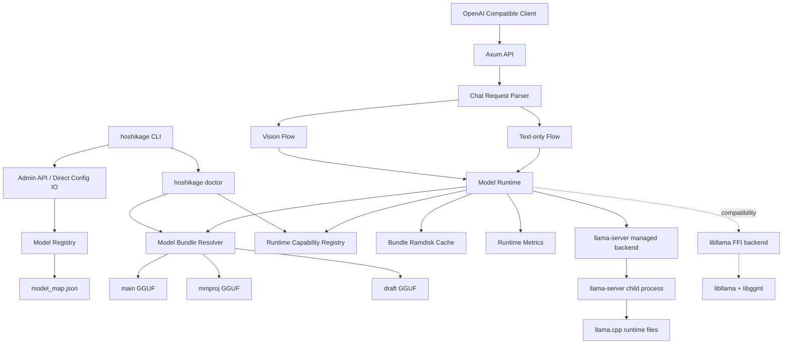
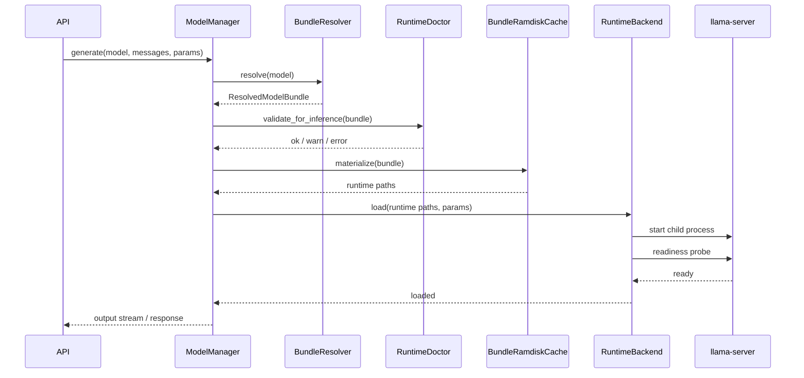

# Hoshikage Model Runtime Revision System Design

**作成日:** 2026-07-21  
**位置づけ:** システム設計  
**対応要件:** `docs/model-runtime-revision-requirements.md`  
**対象:** QAT / MTP / Draft model / Vision / Thinking mode / Model Bundle / Runtime Capability 診断

---

## 1. 設計目的

Hoshikage の推論基盤を、現行の単一 GGUF text-only 実行から、最新の GGUF モデル機能を扱える Model Bundle 型 runtime へ拡張する。

この設計では、次を同時に満たす。

- 既存の `/v1/chat/completions` text-only API を壊さない。
- 既存の `model_map.json` と `hoshikage add/rm/list` を後方互換で維持する。
- メインモデル、Vision projector、Draft model、MTP 設定、GPU offload 設定をモデル単位にまとめる。
- 音声会話 BOT 向けに Thinking mode をモデル単位で無効化できる。
- Linux CUDA の llama.cpp runtime 差し替え運用を前提に、Runtime Capability 診断を組み込む。
- `llama-server` を managed runtime として扱い、最新 llama.cpp 機能の追従リスクを Hoshikage 本体から分離する。
- Vision 不整合は明示エラー、MTP / Draft model 不可は fallback mode に従う。

---

## 2. 現行構造の整理

### 2.1 現行設定

現行 Hoshikage は、設定を二層で扱っている。

| 種別 | 保存先 | 内容 |
|------|--------|------|
| サーバー全体設定 | `~/.config/hoshikage/.env` | port, timeout, `N_CTX`, `N_GPU_LAYERS`, sampling defaults, `HOSHIKAGE_LIB_PATH` |
| モデル設定 | `~/.config/hoshikage/model_map.json` | `path`, `model`, `stop` |

この分離は維持する。`.env` にモデル別設定を集約しない。

### 2.2 現行主要コンポーネント

| コンポーネント | 現行責務 |
|----------------|----------|
| `Config` | `.env` と環境変数の読み込み |
| `ModelManager` | モデル一覧、ロード、RAM ディスク転送、排他制御 |
| `LlamaWrapper` | `libllama` FFI、モデルロード、生成、Diffusion 判定 |
| `LlamaServerManagedBackend` | `llama-server` 子プロセス管理、upstream API 中継、runtime health 監視 |
| `api::chat` | OpenAI 互換 Chat Completions |
| `api::models` | `/v1/models`, `/v1/status` |
| `commands::{add,rm,list}` | CLI から `model_map.json` または admin API を操作 |

---

## 3. 全体アーキテクチャ



設計の中心は、`ModelConfig` を後方互換のある `ModelBundleConfig` に拡張し、`ModelManager` が bundle 単位でロード・診断・解放を扱うことである。

---

## 4. 設計判断

### 4.0 Phase 0 で llama-server managed runtime の実現性を先に検証する

Vision / MTP / Draft model は llama.cpp の version と `llama-server` 起動 option に強く依存する。設計後半で managed runtime が困難だと判明すると手戻りが大きいため、実装 Phase 1 の前に Phase 0 を置く。

Phase 0 では、対象 llama.cpp version の binary / shared library / command line option / OpenAI 互換 API の minimal call flow を確認する。

検証項目:

- `llama-server` / `llama-cli` / 依存 shared library の配置構成
- `llama-server --version` の取得可否
- Hoshikage が必要とする起動 option の検出方法
- Vision projector を `llama-server` 起動時に接続できるか
- MTP を `llama-server` 起動時に有効化できるか
- Draft model を `llama-server` 起動時に有効化できるか
- Thinking off に相当する reasoning budget / chat template kwargs / control token 制御を `llama-server` に渡せるか
- localhost upstream として OpenAI 互換 Chat Completions を中継できるか
- child process の起動、health check、停止、再起動を制御できるか

Phase 0 の完了条件:

- managed `llama-server` 第一で進められる範囲を明文化する。
- `llama-server` で扱えない機能がある場合、対象機能だけ FFI backend に残すか、今回 scope から外すかを決める。
- Phase 1 以降で使う `LlamaServerLaunchRequest` の必須フィールドを確定する。

Phase 0 実施結果:

- `libllama` FFI で MTP / Draft model の生成高速化ループまで直接扱う場合、llama.cpp common の C++ 実装と内部 embedding state に強く依存する。
- 実機検証では MTP context 作成までは進むが、生成高速化ループの安定接続に追加リスクがある。
- 最新モデル機能は `llama-server` が既に持つ起動 option と生成ループを利用する方が追従リスクを下げられる。
- よって本改訂では `llama-server-managed` を第一 runtime とし、FFI backend は既存 text-only 互換または限定的な fallback として残す。

### 4.1 Model Bundle は `model_map.json` に保持する

`.env` はサーバー全体の default を扱う。モデル別の `mmproj`、Draft model、MTP、Thinking mode、`n_ctx`、`n_gpu_layers` は `model_map.json` に保持する。

理由:

- 既存の CLI / admin API / direct file fallback と相性がよい。
- モデルを切り替えるたびに `.env` を書き換える設計を避けられる。
- bundle を読むだけで、そのモデルの実行条件を追跡できる。

`model_map.json` の更新は、admin API と CLI direct fallback のどちらも `ModelRegistry` の原子的保存へ集約する。更新後の完全な JSON を一時ファイルへ書き込み、`fsync` 後に rename する。対象ファイルを先に `truncate` してからロック・再読込してはならない。追加・削除の失敗やプロセス中断が起きても、直前の有効な snapshot を維持する。

### 4.2 `llama-server-managed` を第一 runtime とする

Hoshikage の最新モデル機能は、`llama-server` を Hoshikage が子プロセスとして管理する runtime backend で実行する。

理由:

- Vision / MTP / Draft model は llama.cpp 側の CLI / server 実装が先に追従する。
- Hoshikage 本体が token generation loop や speculative accept loop を再実装しなくてよい。
- native crash が発生しても Hoshikage 本体ではなく child process の再起動で復旧できる。
- runtime 更新時の Hoshikage 側変更を、起動 option と API 中継の調整に限定できる。

`libllama` FFI backend は次の用途で残す。

- 既存 text-only 実行の互換経路
- `llama-server` 未配置環境での限定 fallback
- 軽量な metadata / tokenizer / diagnosis 補助

Hoshikage の OpenAI 互換 API は維持し、外部 client は `llama-server` を直接意識しない。

### 4.3 Vision は text-only とは別入力構造で扱う

`ChatMessage.content: String` をそのまま拡張しない。OpenAI 互換に合わせて、`content` を string または parts array として deserialize する。

内部では、API 互換形式から `MessageContent` に正規化する。

### 4.4 MTP / Draft model は SpeculationConfig として統合する

MTP と Draft model は speculative decoding 系だが、設定と失敗時挙動が異なる。`SpeculationConfig` で統合し、llama.cpp runtime が受け付ける組み合わせに準拠する。

Hoshikage は MTP と Draft model の併用を独自に禁止しない。`llama-server` が受け付ける option 組み合わせを有効とし、受け付けない組み合わせは `doctor` または起動時診断で明示する。

### 4.5 Thinking policy は Model Bundle が宣言する

Thinking mode、reasoning token上限、最終回答として残すtoken量は、モデル、
chat templateおよび利用目的によって異なる。runtime backendの固定値やモデル名による
特殊分岐にせず、`ThinkingConfig`としてModel Bundleへ保存する。

Thinking Onは低レイテンシ化の対象とはしない。ただし、有限なcontextをreasoningだけで
消費して最終回答が空になることは正常完了ではない。`min_final_tokens`は速度制約ではなく、
最終回答を成立させるための予約量として扱う。

### 4.6 上位Provider向けモデルカタログ

Hoshikageはモデル実行Providerであり、Agent Loopやモデル選択ポリシーは上位層が担当する。
そのため、Hoshikageは登録済みBundleを一覧化する二つのAPIを提供する。

| API | 用途 | 内容 |
|---|---|---|
| `GET /v1/models` | OpenAI互換Provider discovery | `data[].id`を中心とした公開カタログ |
| `GET /v1/hoshikage/models` | Hoshikage-aware discovery | context、Tool、Vision、Thinking、reasoning budget等 |

`/v1/models`の`data[].id`はResponses APIの`model`へそのまま渡せる値とする。
`supported_reasoning_levels`は、Hoshikageがrequest単位のreasoning effortを解釈しない限り
空配列を返す。Thinking On Bundleが存在することと、Codexのreasoning effortパラメータを
受け付けることは別の能力であるため、能力を推測して広告してはならない。

上位Proxyは`/v1/models`を起動時または明示refresh時に取得し、公開モデルIDを生成する。
モデルの運用ポリシー（通常ChatでThinking On、バッチでThinking Off等）はProxy側で
モデルIDを選択して実現し、Hoshikageはその選択を上書きしない。

新規Thinking On Bundleの製品既定値は、`max_reasoning_tokens = 32768`、
`min_final_tokens = 8192`とする。この値はGemma 4を含む特定モデルの推奨値ではなく、
登録時に変更可能な運用既定値である。reasoningを固定長で制限したくないBundleは
`max_reasoning_tokens = unlimited`を指定できる。

### 4.6 llama-server option の所有者を分離する

`llama-server`へ渡せる値を一律にglobal設定へ置かず、値の意味で所有者を決める。

| 種別 | 所有者 | 例 |
| --- | --- | --- |
| モデル・Bundle固有 | `model_map.json` | context、GPU offload、thinking、MTP、mmproj、KV cache |
| request固有 | Responses / Chat request | temperature、top_p、最大出力token数 |
| machine / service固有 | Hoshikage環境設定 | listen address、認証、runtime path、log path |
| managed runtime内部 | Hoshikage | 内部port、PID、health check、再起動制御 |

requestで変更可能な値について、Model Bundleはモデル別の既定値を保持できるが、
明示されたrequest値を優先する。

Model Bundleのruntime optionは型付き構造として定義し、登録時、`doctor`、起動時に
検証する。任意文字列の引数配列を標準インターフェースにすると、重複option、
llama.cpp version差異、Hoshikage管理optionの上書きをコンパイル時に防げないため、
主要な拡張方法にはしない。新しいllama-server optionは、型、検証規則、
capability診断、command変換を一組として追加する。

---

## 5. データ設計

### 5.1 `model_map.json` v2

後方互換のため、既存形式も読み込めるようにする。

既存形式:

```json
{
  "model-alias": {
    "path": "/path/to/models",
    "model": "model.gguf",
    "stop": ["</s>"]
  }
}
```

新形式:

```json
{
  "gemma-12b-fast": {
    "base_path": "/models/gemma-12b-fast",
    "main_model": "gemma-12b.gguf",
    "mmproj": "mmproj.gguf",
    "draft_model": null,
    "stop": ["<end_of_turn>"],
    "n_ctx": 8192,
    "n_gpu_layers": -1,
    "vision": true,
    "speculation": {
      "modes": ["mtp"],
      "draft_n_max": 6,
      "fallback": "warn"
    },
    "thinking": {
      "mode": "on",
      "max_reasoning_tokens": null,
      "min_final_tokens": 8192
    },
    "llama_server": {
      "cache_type_k": "q8_0",
      "cache_type_v": "q4_0"
    },
    "chat_template": null
  }
}
```

path 方針:

- 旧形式の `path + model` と同じ考え方を踏襲する。
- 新形式では `base_path` を追加し、`main_model`、`mmproj`、`draft_model` は `base_path` からの相対パスを標準とする。
- `main_model`、`mmproj`、`draft_model` に絶対パスが指定された場合は、その絶対パスを優先する。
- `base_path` が省略された場合は、`MODEL_DIR`、または現行と同じ `models/` を基準に解決する。

### 5.2 Rust 型案

```rust
#[derive(Debug, Clone, Serialize, Deserialize)]
#[serde(untagged)]
pub enum ModelEntry {
    Legacy(LegacyModelConfig),
    Bundle(ModelBundleConfig),
}

#[derive(Debug, Clone, Serialize, Deserialize)]
pub struct LegacyModelConfig {
    pub path: String,
    pub model: String,
    #[serde(default)]
    pub stop: Vec<String>,
}

#[derive(Debug, Clone, Serialize, Deserialize)]
pub struct ModelBundleConfig {
    #[serde(default)]
    pub base_path: Option<PathBuf>,
    pub main_model: PathBuf,
    #[serde(default)]
    pub mmproj: Option<PathBuf>,
    #[serde(default)]
    pub draft_model: Option<PathBuf>,
    #[serde(default)]
    pub stop: Vec<String>,
    #[serde(default)]
    pub n_ctx: Option<u32>,
    #[serde(default)]
    pub n_gpu_layers: Option<i32>,
    #[serde(default)]
    pub vision: bool,
    #[serde(default)]
    pub speculation: SpeculationConfig,
    #[serde(default)]
    pub thinking: ThinkingConfig,
    #[serde(default)]
    pub llama_server: LlamaServerModelConfig,
    #[serde(default)]
    pub chat_template: Option<String>,
}

#[derive(Debug, Clone, Serialize, Deserialize)]
pub struct SpeculationConfig {
    pub modes: Vec<SpeculationMode>,
    pub fallback: FallbackMode,
}

#[derive(Debug, Clone, Serialize, Deserialize)]
#[serde(rename_all = "snake_case")]
pub enum SpeculationMode {
    Mtp,
    DraftModel,
}

#[derive(Debug, Clone, Serialize, Deserialize)]
#[serde(rename_all = "snake_case")]
pub enum FallbackMode {
    Strict,
    Warn,
    Off,
}

#[derive(Debug, Clone, Serialize, Deserialize)]
pub struct ThinkingConfig {
    #[serde(default)]
    pub mode: ThinkingMode,
    #[serde(default)]
    pub max_reasoning_tokens: Option<u32>,
    #[serde(default)]
    pub min_final_tokens: u32,
}

#[derive(Debug, Clone, Serialize, Deserialize)]
#[serde(rename_all = "snake_case")]
pub enum ThinkingMode {
    Auto,
    On,
    Off,
}

#[derive(Debug, Clone, Default, Serialize, Deserialize)]
pub struct LlamaServerModelConfig {
    #[serde(default)]
    pub cache_type_k: Option<KvCacheType>,
    #[serde(default)]
    pub cache_type_v: Option<KvCacheType>,
    #[serde(default)]
    pub threads: Option<u32>,
    #[serde(default)]
    pub threads_batch: Option<u32>,
    #[serde(default)]
    pub batch_size: Option<u32>,
    #[serde(default)]
    pub ubatch_size: Option<u32>,
}
```

`LlamaServerModelConfig`は対応済みoptionの初期集合であり、網羅リストではない。
モデルごとの差異が必要なllama-server optionは、同じ型付き構造へ追加する。
各fieldにはCLIまたはBundle設定入力、値検証、runtime capability診断、
command変換および表示を対応させる。

`LegacyModelConfig` は load 時に `ModelBundleConfig` へ正規化する。

### 5.3 Runtime 型案

```rust
pub struct ResolvedModelBundle {
    pub name: String,
    pub main_model: PathBuf,
    pub mmproj: Option<PathBuf>,
    pub draft_model: Option<PathBuf>,
    pub stop: Vec<String>,
    pub runtime_params: RuntimeModelParams,
    pub capabilities: ModelCapabilities,
}

pub struct RuntimeModelParams {
    pub n_ctx: u32,
    pub n_gpu_layers: i32,
    pub speculation: SpeculationConfig,
    pub thinking: ThinkingConfig,
    pub llama_server: LlamaServerModelConfig,
}

pub struct ModelCapabilities {
    pub vision: bool,
    pub mtp_configured: bool,
    pub draft_model_configured: bool,
}
```

`BundleResolver` は `base_path`、絶対パス、`MODEL_DIR` の優先順位を一箇所で処理する。runtime backend には解決済みの絶対パスだけを渡す。

既存Bundleの読み込み互換を維持するため、`ThinkingConfig::default()` は
`mode = Auto`、`max_reasoning_tokens = None`、`min_final_tokens = 0` とする。
新規登録時に `--thinking-mode on` を指定し、詳細値を省略した場合は登録層が
`max_reasoning_tokens = Some(32768)`、`min_final_tokens = 8192` を保存する。

`None`はunlimitedを表す。requestごとの有効reasoning budgetは次で求める。

```text
generation_capacity =
  min(request.max_output_tokens or context_remaining, context_remaining)

reserve_limited_budget =
  generation_capacity - min(thinking.min_final_tokens, generation_capacity)

effective_reasoning_budget =
  min(thinking.max_reasoning_tokens or unlimited, reserve_limited_budget)
```

`min_final_tokens`は最終回答の最大長ではない。reasoningが早く終了した場合、
未使用のtokenはそのまま最終回答に使用できる。

### 5.4 llama.cpp runtime directory

Hoshikage は llama.cpp runtime を一つの directory として扱う。

標準配置:

```text
~/.config/hoshikage/llama.cpp/
  llama-server
  llama-cli
  libllama.so.0
  libllama-common.so.0
  libggml.so.0
  libggml-base.so.0
  libggml-cpu.so.0
  libggml-cuda.so.0
  libmtmd.so.0
```

探索順:

1. Model Bundle または `.env` の runtime directory override
2. `HOSHIKAGE_LLAMA_CPP_RUNTIME_DIR`
3. `~/.config/hoshikage/llama.cpp`

旧 `~/.config/hoshikage/lib` は自動探索しない。`RuntimeDoctor` が旧配置らしき runtime files を検出した場合は、新標準配置への移行案内を出す。開発時に任意の外部ビルド成果物を使う場合も、明示的な runtime directory override を使う。

`RuntimeDoctor` は、runtime directory ごとに次を確認する。

- `llama-server` が存在し実行可能であること
- `llama-cli` が存在し実行可能であること
- `llama-server --version` が成功すること
- `llama-server` が必要な起動 option を受け付けること
- Linux CUDA では CUDA backend shared library が解決できること

実装で使用する `.env` key:

- `HOSHIKAGE_RUNTIME_BACKEND`: default は `llama-server-managed`。旧 FFI 経路を明示利用する場合のみ `llama-ffi` を指定する。
- `HOSHIKAGE_LLAMA_CPP_RUNTIME_DIR`: llama.cpp runtime directory の override。未指定時は `~/.config/hoshikage/llama.cpp`。
- `HOSHIKAGE_LLAMA_SERVER_HOST`: managed `llama-server` の bind host。default は `127.0.0.1`。
- `HOSHIKAGE_LLAMA_SERVER_PORT`: managed `llama-server` の内部 port。default は `13030`。
- `HOSHIKAGE_LLAMA_SERVER_STARTUP_TIMEOUT_SECS`: health check の起動待ち秒数。default は `120`。
- `HOSHIKAGE_LLAMA_SERVER_SLEEP_IDLE_SECS`: `llama-server` 待機時の idle sleep 秒数。default は未指定で、モデルを保持する。`off` / `disabled` / 空文字で未指定扱いにする。
- `LD_LIBRARY_PATH` など platform 別の library 探索設定が成立していること

Hoshikage は runtime directory を自動生成してもよいが、全 platform の自動ビルドは初期 scope に含めない。

---

## 6. API 設計

### 6.1 Chat message

現行:

```rust
pub struct ChatMessage {
    pub role: String,
    pub content: String,
}
```

改訂案:

```rust
pub struct ChatMessage {
    pub role: String,
    pub content: ChatContent,
}

#[derive(Debug, Clone, Serialize, Deserialize)]
#[serde(untagged)]
pub enum ChatContent {
    Text(String),
    Parts(Vec<ContentPart>),
}

#[derive(Debug, Clone, Serialize, Deserialize)]
#[serde(tag = "type")]
pub enum ContentPart {
    #[serde(rename = "text")]
    Text { text: String },
    #[serde(rename = "image_url")]
    ImageUrl { image_url: ImageUrl },
}

pub struct ImageUrl {
    pub url: String,
    #[serde(default)]
    pub detail: Option<String>,
}
```

Phase 2 実装では、response 互換性を優先し、assistant 応答も同じ `ChatMessage` を使う。ただし `ChatContent::Text` は従来通り JSON 文字列として serialize されるため、既存 client の response parser は維持される。

### 6.2 Vision 入力の正規化

`api::chat` で OpenAI 互換 request を受けた後、次の内部表現へ変換する。

```rust
pub struct NormalizedChatMessage {
    pub role: ChatRole,
    pub parts: Vec<NormalizedContentPart>,
}

pub enum NormalizedContentPart {
    Text { text: String },
    Image { input: ImageInput },
}

pub enum ImageInput {
    Base64DataUrl {
        mime: ImageMime,
        bytes: Vec<u8>,
    },
    LocalFile {
        path: PathBuf,
    },
}
```

message 単位、role、content part の順序は保持する。複数画像を含む request でも、元の OpenAI 互換 message の順序を崩さない。

対応する画像入力:

- `data:image/png;base64,...`
- `data:image/jpeg;base64,...`
- `file:///absolute/path/image.png`
- ローカル絶対パス

API 入力として `ChatContent::Text` / `ChatContent::Parts` を受け付け、画像 part を `NormalizedImageInput` に正規化する。managed `llama-server` backend では、正規化済みの message 構造を OpenAI 互換 request として upstream へ中継する。

安全動作:

- `mmproj` 未設定で画像入力を受けた場合は `vision_not_configured` を返す。
- `mmproj` 設定済みの bundle では、`llama-server` 起動時に projector path を渡す。
- Vision の画像 decode、media chunk 化、embedding decode は `llama-server` / llama.cpp runtime に委譲する。
- 外部 URL は初期実装では `vision_input_error` として拒否する。将来、明示設定で許可する。
- text-only request は従来通り `llama_chat_apply_template` へ渡す。

### 6.3 Status API

既存 `/v1/status` は `{"status":"ok"}` のみである。後方互換のため `status` は維持し、追加フィールドを足す。

```json
{
  "status": "ok",
  "runtime": {
    "loaded_model": "gemma-12b-fast",
    "backend": "llama-server-managed",
    "backend_acceleration": "cuda",
    "managed_process": {
      "pid": 12345,
      "health": "ready",
      "upstream": "http://127.0.0.1:31337"
    },
    "llama_version": "b10091",
    "cuda_available": true,
    "n_gpu_layers": 99,
    "n_ctx": 8192,
    "active_requests": 0
  },
  "capabilities": {
    "vision": true,
    "mtp": "enabled",
    "draft_model": "none",
    "thinking": "off"
  },
  "last_fallback": null,
  "last_metrics": {
    "ttft_ms": 450,
    "prompt_eval_tokens_per_sec": 3000.0,
    "generation_tokens_per_sec": 120.0
  }
}
```

### 6.4 Models API

OpenAI 互換の `/v1/models` は、互換性を優先して `id`, `object`, `created`, `owned_by` の最小構成を維持する。Hoshikage 固有の詳細情報は独自 endpoint に分離する。
API response ではローカルディレクトリ構造やファイル名を公開しないため、モデルファイルは設定状態の boolean として返す。

追加 endpoint:

```text
GET /v1/hoshikage/models
GET /v1/hoshikage/models/:name
```

レスポンス例:

```json
{
  "object": "list",
  "data": [
    {
      "id": "gemma-12b-fast",
      "main_model_configured": true,
      "vision": true,
      "mmproj_configured": true,
      "mtp_configured": true,
      "draft_model_configured": false,
      "thinking": "off",
      "fallback": "warn"
    }
  ]
}
```

---

## 7. Runtime Capability 診断設計

### 7.1 診断コンポーネント

`RuntimeDoctor` を追加する。

```text
commands/doctor.rs
runtime/doctor.rs
runtime/capability.rs
```

責務:

- runtime directory の探索
- `llama-server` の存在確認と実行可否確認
- `llama-cli` の存在確認と実行可否確認
- `llama-server --version` の取得
- 依存 shared library の存在確認
- Hoshikage が使う `llama-server` 起動 option の確認
- CUDA backend の存在確認
- model bundle のファイル存在確認
- Vision / `mmproj` 整合性確認
- Draft model ファイル存在確認
- MTP 設定と runtime 対応の整合性確認
- Thinking off 設定を runtime / chat template に適用できるか

### 7.2 診断結果

```rust
pub struct DiagnosticReport {
    pub summary: DiagnosticSummary,
    pub checks: Vec<DiagnosticCheck>,
}

pub struct DiagnosticCheck {
    pub id: String,
    pub severity: DiagnosticSeverity,
    pub status: DiagnosticStatus,
    pub message: String,
    pub remediation: Option<String>,
}
```

severity:

- `error`: 実行不可
- `warn`: fallback または性能低下
- `info`: 参考情報

### 7.3 診断タイミング

| タイミング | 内容 | 失敗時 |
|------------|------|--------|
| `hoshikage doctor` | 全体診断 | レポート表示 |
| `hoshikage add --check` | 追加対象 bundle 診断 | 登録前に表示 |
| サーバー起動時 | 登録済み bundle の軽量診断 | `WARN` ログ中心 |
| 推論直前 | 実ロードに必要な診断 | API エラーまたは fallback |

---

## 8. Model Runtime 設計

### 8.1 Runtime load flow



### 8.2 `LlamaServerManagedBackend`

現行 `LlamaWrapper::load_model(path, config)` の直呼びを backend 境界へ移し、最新モデル機能の主経路は `llama-server` 子プロセス管理にする。

```rust
pub struct LlamaServerLaunchRequest {
    pub main_model: PathBuf,
    pub mmproj: Option<PathBuf>,
    pub draft_model: Option<PathBuf>,
    pub n_ctx: u32,
    pub n_gpu_layers: i32,
    pub speculation: SpeculationConfig,
    pub thinking: ThinkingConfig,
    pub model_runtime: LlamaServerModelConfig,
    pub host: IpAddr,
    pub port: u16,
    pub runtime_dir: PathBuf,
    pub environment: HashMap<String, String>,
}

pub trait RuntimeBackend {
    fn load(&mut self, req: &LlamaServerLaunchRequest) -> Result<LoadedRuntimeInfo>;
}
```

`LlamaServerManagedBackend` の責務:

- bundle 設定から `llama-server` 起動 command を組み立てる。
- Bundleの型付きruntime設定を、対応する`llama-server` optionへ変換する。
- request入力token数の確定後、Thinking policyからrequest単位のreasoning budgetを計算する。
- runtime directory 内の `llama-server` を起動する。
- child process の pid、port、起動 command preview、health を保持する。
- model switch 時は既存 child process を停止し、新しい child process を起動する。
- 起動後に `/health` または OpenAI 互換 API の軽量 probe で readiness を確認する。
- Chat Completions / streaming request を upstream へ中継する。
- upstream error、child process exit、timeout を Hoshikage の error / fallback / status へ変換する。
- unload 時に child process を graceful shutdown し、必要なら kill する。
- child process が異常終了した場合、即時自動再起動はしない。runtime status を unhealthy とし、次の推論リクエストで必要に応じて再ロード・再起動を試みる。

責務外:

- 画像入力の正規化
- `SpeculationConfig` の fallback 判定
- Thinking mode の policy 判断
- RAM ディスクへの bundle 配置
- OpenAI 互換 API の外部 surface 定義

`RuntimeBackend::load` は、解決済みパスと基本 runtime params を受け取り、ロード結果を返すことに責務を限定する。Vision 入力の正規化、Speculation の fallback 判定、performance metrics 集計は backend 内に持ち込まない。

Phase 6 実装では `LlamaServerManagedBackend` を追加し、既存 `LlamaWrapper` は `LlamaFfiBackend` として互換経路に閉じ込める。`n_ctx` / `n_gpu_layers` は `ModelConfig` の値があれば bundle override として `LlamaServerLaunchRequest` に反映し、未指定なら `.env` / global config の値を使う。`mmproj` / draft model の解決済みパスも `LlamaServerLaunchRequest` に渡す。

### 8.3 SpeculationController

`SpeculationController` は、MTP / Draft model の設定判断と fallback を担当する。`LlamaServerManagedBackend` は controller の判断結果を受けて、実際の `llama-server` 起動 option だけを組み立てる。

責務:

- `SpeculationConfig` と `RuntimeCapability` を照合する。
- `mtp` / `draft_model` / `off` の実効 mode を決める。
- `strict` / `warn` / `off` の fallback 方針を適用する。
- fallback が発生した場合、理由を `FallbackEvent` として返す。
- Draft model のファイル存在や bundle 整合性は `BundleResolver` / `RuntimeDoctor` の結果を参照する。

責務外:

- 画像入力の解析
- runtime binary / shared library の直接診断
- token generation loop
- metrics の永続管理

型案:

```rust
pub struct SpeculationDecision {
    pub effective_modes: Vec<SpeculationMode>,
    pub fallback_event: Option<FallbackEvent>,
}

pub struct FallbackEvent {
    pub requested_modes: Vec<SpeculationMode>,
    pub reason: String,
    pub visible_to_client: bool,
}

pub struct SpeculationController;

impl SpeculationController {
    pub fn decide(
        config: &SpeculationConfig,
        capabilities: &RuntimeCapability,
        bundle: &ResolvedModelBundle,
    ) -> Result<SpeculationDecision>;
}
```

### 8.4 ThinkingController

`ThinkingController` は、Thinking mode、requestごとのreasoning budget、
最終回答予約および出力strippingの適用方針を担当する。

責務:

- `ThinkingConfig` と `RuntimeCapability` を照合する。
- `auto` / `on` / `off` の実効 mode を決める。
- input token数、context上限、requestの最大出力token数から生成可能量を求める。
- `max_reasoning_tokens` と `min_final_tokens` からrequest単位の有効reasoning budgetを求める。
- `on` / `auto`で有効reasoning budgetが有限の場合、managed llama-serverの
  request parameterへ反映する。
- runtimeが有限reasoning budgetを受理できない場合、黙って無視せず診断または
  request errorとして返す。
- `off` の場合、chat template が生成した assistant 先頭の thinking 開始 marker を prompt から除去し、モデルを thought block 生成へ誘導しない。
- `off` の場合、runtime が対応していれば reasoning budget 0 相当の設定を適用する。
- `off` の場合に runtime が対応 option を提供しなければ、警告を記録して prompt / template policy と safety filter で続行する。
- `off` の場合、Gemma 系 chat template に Thinking を有効化する control token を挿入しない。
- 出力に thought block が含まれる場合のみ、safety filter として final answer から除去する。
- Thinking off が完全適用できない場合、診断情報として記録する。

責務外:

- Speculation fallback 判定
- Vision 入力解析
- token generation loop
- モデル名からのThinking policy推測

型案:

```rust
pub struct ThinkingDecision {
    pub effective_mode: ThinkingMode,
    pub strip_thinking: bool,
    pub max_reasoning_tokens: Option<u32>,
    pub min_final_tokens: u32,
    pub launch_budget_tokens: Option<i32>,
    pub diagnostic: Option<String>,
}

pub struct ThinkingController;

impl ThinkingController {
    pub fn decide(
        config: &ThinkingConfig,
        capabilities: &RuntimeCapability,
    ) -> Result<ThinkingDecision>;

    pub fn budget_for_request(
        decision: &ThinkingDecision,
        context_window: u32,
        input_tokens: u32,
        requested_max_output_tokens: Option<u32>,
    ) -> Result<Option<u32>>;

    pub fn apply_prompt_policy_if_needed(
        decision: &ThinkingDecision,
        prompt: &str,
    ) -> String;

    pub fn strip_output_if_needed(
        decision: &ThinkingDecision,
        output: &str,
    ) -> String;
}
```

`strip_thinking` は `off` のとき true とする。ただしこれは主制御ではなく、
prompt policy / managed runtimeでThinkingを生成させない設定を適用した後の
safety filterである。`auto` / `on`でも、過去assistant messageを次turnのcontextへ
戻す際には、GoogleのGemma 4推奨に従ってthought blockを履歴へ混ぜない。

Thinking Offの固定budget 0は起動optionとして適用できる。Thinking On / Autoの
動的budgetは、入力token数が確定した後にrequest bodyへ反映する。起動時に有限budgetを
固定するとrequestごとの最終回答予約量を保証できないため、動的policyを持つBundleでは
process全体へ正数のbudgetを固定しない。

Thinking Offの主制御はthought blockを生成させないprompt / template policyとし、
出力strippingはsafety filterとして扱う。

### 8.5 Runtime backend 抽象

`llama-server-managed` と既存 FFI 互換経路を同じ境界で扱う。

```rust
pub trait RuntimeBackend {
    fn load(&mut self, request: &RuntimeLoadRequest) -> Result<LoadedRuntimeInfo>;
    fn chat(&self, request: NormalizedChatRequest) -> Result<ChatCompletionResponse>;
    fn chat_stream(&self, request: NormalizedChatRequest, sink: StreamSink) -> Result<()>;
    fn unload(&mut self);
    fn status(&self) -> RuntimeBackendStatus;
}
```

初期実装は `LlamaServerManagedBackend` を第一対象とする。`LlamaFfiBackend` は既存互換として残すが、Vision / MTP / Draft model の主実装対象にはしない。

`RuntimeLoadRequest` は backend 非依存の論理要求であり、`LlamaServerManagedBackend` が `LlamaServerLaunchRequest` へ変換する。

```rust
pub enum RuntimeKind {
    LlamaServerManaged,
    LlamaFfi,
}

pub struct RuntimeLoadRequest {
    pub kind: RuntimeKind,
    pub bundle: ResolvedModelBundle,
    pub runtime_params: RuntimeModelParams,
}
```

backend 選択の既定値:

- Vision / MTP / Draft model / Thinking off runtime control が必要な bundle は `llama-server-managed`
- 既存 text-only bundle は設定により `llama-server-managed` または `llama-ffi`
- `llama-server-managed` が指定されている場合、`llama-server` 未配置・起動失敗・異常終了から `llama-ffi` へ自動 fallback しない
- `llama-ffi` は明示的に選択された text-only 互換 backend としてのみ使う

fallback の分類:

- feature fallback: MTP / Draft model が使えない場合に、同じ backend のまま通常推論へ落とす。
- backend fallback: `llama-server-managed` から `llama-ffi` へ実行 backend 自体を切り替える。

本改訂では backend fallback は原則実施しない。`fallback=warn` は feature fallback のみを制御する。

---

## 9. RAM ディスク設計

### 9.1 Bundle cache

現行は `.gguf` を単一ファイルとして RAM ディスクにコピーしている。改訂後は bundle 単位にする。

```text
/dev/shm/hoshikage/
  current/
    main.gguf
    mmproj.gguf
    draft.gguf
    manifest.json
```

### 9.2 コピー方針

- Linux のみ有効。
- `RAMDISK_PATH` が未設定なら SSD 直読み。
- bundle 内の main model、`mmproj`、draft model を対象にする。
- コピー前に合計サイズと空き容量を確認する。
- bundle 配置前に Hoshikage 管理下の RAM ディスク cache を常に空にする。
- `great_timeout` 到達時は bundle directory を削除する。

運用上、古い cache の混在は許可しない。`RAMDISK_PATH/hoshikage` 配下は Hoshikage の管理領域とし、ロード開始時に削除してから配置する。

衝突対策:

- Hoshikage 管理領域以外は削除しない。
- `RAMDISK_PATH/hoshikage.lock` で process lock を取得する。
- コピー先は `current.tmp` とし、全ファイルコピーと manifest 作成が成功した後に `current` へ rename する。
- コピー失敗時は `current.tmp` を削除し、既存 `current` は残さない。
- 別プロセスが lock を保持している場合は明示エラーにする。

この方針なら、通常運用では「常に空にしてから登録」で問題ない。問題になるのは、複数 Hoshikage プロセスを同時起動した場合、コピー中にプロセスが落ちた場合、またはユーザーが同じ管理領域に手動で別ファイルを置いた場合であり、lock と tmp/rename と管理領域限定削除で対処する。

### 9.3 状態管理

現行 `ramdisk_file: Option<PathBuf>` は `ramdisk_bundle: Option<RamdiskBundleState>` に置き換える。

```rust
pub struct RamdiskBundleState {
    pub model_name: String,
    pub dir: PathBuf,
    pub files: Vec<PathBuf>,
    pub total_bytes: u64,
}
```

---

## 10. Speculation 設計

### 10.1 Mode

| mode | 内容 |
|------|------|
| `mtp` | MTP を使う |
| `draft_model` | 別 draft model を使う |

`speculation.modes` が空の場合は通常推論とする。`["mtp", "draft_model"]` のような複数指定は、llama.cpp runtime が対応する場合のみ有効とする。

### 10.2 Fallback

| fallback | 内容 |
|----------|------|
| `strict` | 使えなければエラー |
| `warn` | 警告して通常推論 |
| `off` | 最初から使わない |

### 10.3 Draft token上限

`speculation.draft_n_max`は、1回のspeculative decodingで生成するdraft token数の上限を
Bundleごとに指定する。型は0を表現できない`Option<NonZeroU32>`とし、指定時はmanaged
llama-serverの`--spec-draft-n-max`へ変換する。未指定時は上流runtimeの既定値を使用する。

`draft_n_max`はMTPまたはDraft model modeが有効な場合だけ意味を持つ。CLIと管理APIはmodeなしの
指定を明示エラーにし、値を黙って無視しない。

### 10.4 Fallback 判定

```text
speculation.modes contains mtp
  -> runtime supports MTP?
      yes -> MTP enabled
      no  -> fallback

speculation.modes contains draft_model
  -> draft_model exists?
  -> runtime supports draft?
      yes -> Draft enabled
      no  -> fallback
```

Vision 不整合は fallback しない。

### 10.5 Fallback の通知

fallback が発生した場合、次の全てに記録する。

- 構造化ログまたは通常ログ
- `/v1/status` の `last_fallback`
- `GET /v1/hoshikage/models/:name` の直近診断情報
- `hoshikage doctor --model <name>`
- Chat Completions response header

response header 案:

```text
X-Hoshikage-Fallback: speculation
X-Hoshikage-Fallback-Reason: mtp_not_supported
```

Chat response body の assistant message には混ぜない。通常の Chat UI に本文として表示されることを避けるためである。

Phase 8 後半では、`InferenceState` に直近 fallback を保持し、Chat Completions response header と `/v1/status` に出す。OpenAI 互換の `/v1/models` は従来の最小形を維持し、詳細情報は `/v1/hoshikage/models` と `/v1/hoshikage/models/:name` に分離する。

---

## 11. Performance Metrics 設計

### 11.1 測定点

| 指標 | 測定場所 |
|------|----------|
| TTFT | API request 開始から最初の token/chunk 送信まで |
| prompt eval tokens/sec | llama.cpp eval 統計または Hoshikage 側計測 |
| generation tokens/sec | 生成 token 数 / 生成時間 |
| total tokens/sec | prompt + generation 全体 |
| Vision first response | 画像 decode + projector 処理 + TTFT |
| Thinking off TTFT | Thinking off 設定時の TTFT |

### 11.2 保存場所

`InferenceState` に直近メトリクスを保持する。

```rust
pub struct RuntimeMetrics {
    pub model_name: String,
    pub backend: RuntimeBackendKind,
    pub n_ctx: u32,
    pub n_gpu_layers: i32,
    pub ttft_ms: Option<u64>,
    pub prompt_eval_tokens_per_sec: Option<f32>,
    pub generation_tokens_per_sec: Option<f32>,
    pub total_tokens_per_sec: Option<f32>,
    pub created_at: DateTime<Utc>,
}
```

`/v1/status` とログに出す。

---

## 12. エラー設計

### 12.1 追加エラー種別

```rust
pub enum HoshikageError {
    ModelBundleInvalid(String),
    RuntimeCapabilityError(String),
    VisionInputError(String),
    VisionProjectorMissing(String),
    SpeculationUnavailable(String),
    RamdiskCapacityError(String),
    ThinkingModeError(String),
}
```

### 12.2 API エラー方針

| 状態 | HTTP | code |
|------|------|------|
| Vision 非対応モデルに画像入力 | 400 | `vision_not_supported` |
| `mmproj` 未設定 | 400 | `vision_projector_missing` |
| 画像ファイル読取不可 | 400 | `image_input_error` |
| MTP / Draft strict 失敗 | 500 または 400 | `speculation_unavailable` |
| RAM ディスク容量不足 | 500 | `ramdisk_capacity_error` |
| runtime option 不足 | 500 | `runtime_capability_error` |
| Thinking off 適用不能 | 500 または warn | `thinking_mode_error` |

---

## 13. CLI 設計

### 13.1 既存 CLI

既存:

```bash
hoshikage add <PATH> <LABEL> [STOP_WORDS]...
hoshikage rm <LABEL>
hoshikage list
```

これは維持する。

### 13.2 追加 CLI 案

```bash
hoshikage add /models/main.gguf <LABEL> \
  --mmproj /models/mmproj.gguf \
  --draft /models/draft.gguf \
  --spec-draft-n-max 6 \
  --n-ctx 8192 \
  --n-gpu-layers -1 \
  --vision \
  --speculation mtp \
  --fallback warn \
  --thinking-mode on \
  --max-reasoning-tokens unlimited \
  --min-final-tokens 8192
```

`--speculation` は複数回指定できる。例: `--speculation mtp --speculation draft_model`。併用可否は `llama-server` の対応に準拠し、Hoshikage 側で独自に禁止しない。

内蔵MTPモデルはdrafter fileを指定せず、次のように登録する。

```bash
hoshikage add /models/qwen/main.gguf qwen-mtp \
  --mtp \
  --spec-draft-n-max 6
```

```bash
hoshikage doctor
hoshikage doctor --model gemma-12b-fast
hoshikage add --check /models/main.gguf label
hoshikage list --details
```

`add-bundle` は新設しない。既存 `add` に option を追加し、学習コストを抑える。

Thinking policyは次のCLI optionで登録する。

```text
--thinking-mode <auto|on|off>
--max-reasoning-tokens <N|unlimited>
--min-final-tokens <N>
```

`--thinking-off`は`--thinking-mode off`の後方互換aliasとして維持する。
`--thinking-off`と矛盾するThinking optionを同時指定した場合は明示エラーとする。
省略時は既存互換のため`auto`とする。`on`で詳細値を省略した場合だけ、
製品既定値の32768 / 8192を登録する。

複雑な bundle を手で指定しづらい場合は、設定ファイル読み込みを追加する。

```bash
hoshikage add --bundle-config /path/to/bundle.json
```

`tune-gpu-layers` は今回の初期実装から外し、次フェーズ候補とする。

---

## 14. 実装フェーズ案

### Phase 0: llama-server managed runtime 実現性検証

- 対象 llama.cpp version を固定する。
- 外部 llama.cpp build から `llama-server` / `llama-cli` / shared library / header を取得し、runtime directory override または標準配置で検証する。
- `RuntimeCapabilityReport` を追加する。
- `llama-server` / `llama-cli` / shared library の配置と実行可否を診断する。
- `llama-server --version` を取得する。
- Vision / MTP / Draft model に必要な `llama-server` 起動 option を調査する。
- Thinking off に必要な server option、chat template kwargs、reasoning budget 相当の指定可否を調査する。
- `llama-server` の OpenAI 互換 endpoint と streaming endpoint の互換性を確認する。
- child process 起動、readiness probe、停止、異常終了検知を試作する。
- Phase 1 以降の実装範囲を確定する。

### Phase 1: 設定構造

- 既存 `ModelConfig` を拡張し、bundle fields を保持できるようにする。
- 既存 `path` field は deserialize alias として残し、保存時は `base_path` に寄せる。
- `model_map.json` v1/v2 両対応。
- `hoshikage add` に `--mmproj`, `--mtp-drafter`, `--draft-model`,
  `--thinking-mode`, `--max-reasoning-tokens`, `--min-final-tokens`,
  `--thinking-off`, `--n-ctx`, `--n-gpu-layers` を追加。
- `--mtp-drafter` と `--draft-model` の同時指定は設定エラーにする。
- `hoshikage list --details` で bundle 概要を表示。
- Runtime への bundle 接続は Phase 6 以降で行う。

### Phase 2: Vision API 入力

- `ChatContent` を導入。
- string content 後方互換を維持。
- base64 data URL / local path / `file://` を正規化。
- Vision 非対応時の明示エラー。

### Phase 3: Thinking mode 制御

- `ThinkingConfig` を追加。
- `ThinkingMode::On`、reasoning上限、最終回答予約量を追加。
- `hoshikage add --thinking-mode`, `--max-reasoning-tokens`,
  `--min-final-tokens`, `--thinking-off` を追加。
- `ThinkingController` を追加。
- request単位の有効reasoning budget計算を追加。
- prompt policy と safety filter を実装。
- status / doctor / log に Thinking mode 状態を出す。

### Phase 4: Bundle RAM ディスク

- `RamdiskBundleState` を導入。
- main model + `mmproj` + draft model を bundle 単位にコピー。
- 容量チェックと bundle directory 削除。
- `RAMDISK_PATH/hoshikage/current` に `main.gguf`、`mmproj.gguf`、`drafter.gguf`、`manifest.json` を配置する。
- Phase 4 では cache 配置と main model load path の差し替えまでを行う。`mmproj` / drafter を runtime load へ渡す接続は Runtime backend 拡張フェーズで行う。

### Phase 5: Runtime Capability 診断の UI / CLI 化

- Phase 0 で追加した `RuntimeCapabilityReport` を `hoshikage doctor` に接続する。
- `hoshikage doctor --model <label>` で登録済み model bundle のファイル存在と runtime 整合性を確認する。
- `hoshikage doctor --json` で機械可読レポートを出す。
- `hoshikage add --check` で登録前候補 bundle を診断し、ERROR がある場合は登録しない。
- runtime directory、`llama-server`、`llama-cli`、`llama-server --version` を表示する。
- `llama-server` 起動 command preview を表示する。
- `llama-server` の required option が不足している場合、更新または再ビルドを促す。
- CUDA backend shared library の存在を表示する。

### Phase 6: llama-server managed backend

- `RuntimeBackend` trait と `LlamaServerManagedBackend` を追加。
- `RuntimeLoadRequest` / `LlamaServerLaunchRequest` / `LoadedRuntimeInfo` を追加。
- `n_ctx` / `n_gpu_layers` を bundle override。
- `ModelManager` から `LlamaWrapper` 直呼びを外し、backend trait 経由にする。
- `llama-server` child process の起動、readiness probe、停止、異常終了検知を実装する。
- child process 異常終了時は即時自動再起動せず、status を unhealthy にし、次リクエストで再起動を試みる。
- Hoshikage の Chat Completions request を upstream `llama-server` へ中継する。
- text-only smoke test を managed backend で通す。
- 既存 FFI 経路は `LlamaFfiBackend` として互換用に残す。

### Phase 7: Vision runtime

- `mmproj` load path を `llama-server` 起動 option に接続。
- Vision 入力の正規化結果を upstream request へ変換する。
- Vision smoke test を追加。

### Phase 8: MTP / Draft model

- `SpeculationConfig` を runtime に接続。
- fallback / strict mode を実装。
- MTP / Draft の性能比較ログを追加。
- MTP は `llama-server` の MTP 関連 option として起動 command に反映する。
- Draft model は `llama-server` の draft model 関連 option として起動 command に反映する。
- MTP / Draft model 有効時は `llama-server` の speculative decoding 経路に委譲し、Hoshikage は `--spec-type`、`--model-draft`、draft 側 GPU offload、Flash Attention などの起動 option を組み立てる。
- draft 側 GPU offload は runtime が受け付ける範囲で GPU 全載せ相当にし、GPU offload 経路でロード失敗する場合は `doctor` と fallback 記録に理由を残す。
- 低遅延の単独応答を優先するため、managed `llama-server` は既定で `-np 1` を指定する。複数同時リクエスト向けの slot 拡張は、別途設定項目として将来追加する。
- MTP / Draft model 有効時は、初期値として `--spec-draft-p-min 0.10` を指定する。これは低信頼 draft による無駄な検証を抑えるための保守的な値であり、将来の自動チューニング対象とする。
- 生成 request では、クライアント指定がない場合に Hoshikage の既定 sampling 値を upstream へ渡す。MTP の速度は sampling 値に影響されるため、低レイテンシ用途の推奨運用では `TOP_P=0.95`、`REPEAT_PENALTY=1.0` を使う。
- 全層 GPU offload を狙う bundle では `n_gpu_layers=99` などの明示値を推奨する。`-1` は互換設定として扱えるが、性能検証では runtime の実挙動差を避けるため明示値を用いる。
- MTP と Draft model の併用可否は llama.cpp runtime に準拠する。Hoshikage は独自の禁止ルールを持たず、`llama-server` が受け付ける option 組み合わせを有効とする。
- `SpeculationController` は runtime capability と bundle 設定を照合し、実効 mode と fallback を決める。
- `fallback=warn` では required option 不足または非対応 version の場合に、同じ `llama-server-managed` backend 内で通常推論へ fallback する。
- `llama-server` 自体の未配置・起動失敗・異常終了は backend failure として扱い、`llama-ffi` へ自動 fallback しない。
- `fallback=strict` では `speculation_unavailable` 相当のエラーとして扱う。
- Hoshikage は speculative decoding の token accept loop を再実装しない。accept loop と統計出力は `llama-server` / llama.cpp runtime に委譲する。
- `llama-server` が出力する性能統計を取得できる場合は Hoshikage の metrics に取り込む。

### Phase 9: Status / Metrics

- `RuntimeMetrics` を追加。
- `/v1/status` 拡張。
- managed `llama-server` への中継中は active request count を増やし、通常応答・streaming 応答の終了時に戻す。
- idle timeout は active request count が 0 のときだけ runtime を停止する。
- `--sleep-idle-seconds` は Hoshikage の `IDLE_TIMEOUT` / `GREAT_TIMEOUT` 管理と競合しやすいため、標準では指定しない。VRAM 滞在時間は Hoshikage 側の `IDLE_TIMEOUT`、RAM ディスク滞在時間は `GREAT_TIMEOUT` で管理する。
- `/v1/hoshikage/models` 追加。
- `hoshikage list --details` を追加。

---

## 15. テスト方針

### 15.1 Unit tests

- legacy `model_map.json` deserialize
- bundle `model_map.json` deserialize
- CLI direct add/remove 後も既存 Bundle と有効な JSON snapshot を維持
- legacy -> bundle normalization
- Chat content string / parts deserialize
- data URL parse
- local path parse
- fallback mode decision
- thinking config default
- thought block stripping

### 15.2 Integration tests

- text-only request 互換
- Vision request を text-only model に送って明示エラー
- `mmproj` missing error
- Thinking off request
- thought block stripping
- RAM ディスク bundle copy
- `hoshikage doctor` report generation

### 15.3 Runtime smoke tests

実モデルが必要なため、通常 CI からは分離する。

- text-only generation
- Vision image input
- MTP enabled
- Draft model enabled
- strict fallback error
- warn fallback normal generation
- Thinking off latency smoke test

---

## 16. レビュー観点

GitHub 公開前の確認済み方針:

- `model_map.json` v2 は既存の `base_path` 方針を踏襲する。
- `llama-server-managed` を第一 runtime とし、FFI は互換経路として残す。
- runtime directory は `~/.config/hoshikage/llama.cpp` を標準配置とする。
- Vision の外部 URL は初期実装では拒否する。LAN 内など別端末からの入力は base64 data URL を使う。
- `tune-gpu-layers` は今回範囲外とし、bundle 登録時の `n_gpu_layers` 明示指定を基本にする。
- `/v1/hoshikage/models` は Hoshikage 固有 API として追加する。
- `--thinking-off` は Gemma 系を最低保証対象とし、runtime option で完全保証できない場合は警告して続行する。
