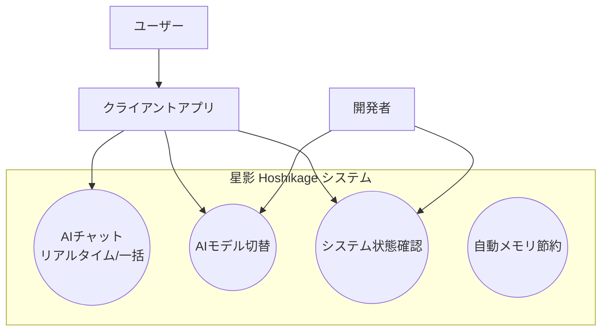

# 要件定義書：星影 (Hoshikage)

**プロジェクト名:** 星影 - Hoshikage  
**バージョン:** 1.0.2  
**作成日:** 2026-01-18  
**著者:** Tane Channel Technology  
**言語:** Rust

---

## 1. はじめに

### 1.1 プロジェクトの目的
「星影（ほしかげ）」は、あなたのローカルPC上で動作する、高速でプライバシーに配慮したAIチャットサーバーです。
OpenAIのAPIと互換性があるため、既存の多くのAIクライアントアプリをそのまま接続して利用できます。
「静なる知性」をコンセプトに掲げ、使っていない時は自動的にメモリを解放し、あなたのPC作業を邪魔しません。

### 1.2 全体像 (ユースケース)

---

## 2. 機能要件 (何ができるのか)

本システムが提供する具体的な機能の一覧です。

### 💬 FT-001: OpenAI互換チャット機能
**優先度: 高**  
OpenAIのChatGPT公式APIと同じ規格（`/v1/chat/completions`）で通信できます。これにより、世の中にある多くのChatGPT対応アプリの接続先を「星影」に変えるだけで、ローカルLLMでの対話が可能になります。文字が１文字ずつ表示される「ストリーミング応答」にも対応しています。

### 🔄 FT-002: モデル管理機能
**優先度: 中**  
複数のAIモデル（GGUF形式）を登録し、使い分けることができます。「賢いけれど重いモデル」と「高速で軽いモデル」を切り替えて使うなどが可能です。
モデルごとの `stop` 指定はデフォルトのストップシーケンスにマージして利用されます。

**管理方法:**
1. **CLIコマンド**: 以下のコマンドでモデルを動的に追加・削除・確認できます（サーバー起動中でも即時反映）。
   - `hoshikage add <PATH> <LABEL> [STOP_WORDS]...`: モデル追加
   - `hoshikage rm <LABEL>`: モデル削除
   - `hoshikage list`: 登録済みモデル一覧表示
2. **自動認識**: `models/` ディレクトリにGGUFファイルを置くだけで、デフォルト設定で自動認識されます（オプション）。
3. **設定ファイル**: `model_map.json` に設定が保存されます。

### 💤 FT-003: "静かなる知性" (自動メモリ解放)
**優先度: 高**  
会話が終わってから一定時間（デフォルト300秒）が経過すると、AIモデルをメモリから自動的にアンロードします。これにより、AIを使っていない間はPCの動作が重くなることを防ぎます。再び話しかけると自動的に再ロードされます。

### 🚦 FT-004: 同時実行の制御
**優先度: 高**  
一般的な家庭用GPU（VRAM）の容量を守るため、同時に処理する会話は「１つ」に制限します。もし複数のリクエストが同時に来ても、順番待ちをさせてクラッシュを防ぎます。

### 🏥 FT-005: ステータス確認
**優先度: 低**  
システムが現在正常に動いているか、どのモデルが読み込まれているかを確認するための機能（`/v1/status`）を提供します。

### 🚀 FT-006: 高速推論エンジン (llama.cpp)
**優先度: 高**  
世界的に定評のある `llama.cpp` という技術を採用し、NVIDIA製GPU（CUDA）を使って可能な限り高速に返事を生成します。
**ライブラリ運用:**
- 動的ライブラリ（`libllama.so`）を使用します。
- ライブラリ配置場所: `~/.config/hoshikage/lib/` を標準とします。ユーザー自身がビルドしたライブラリをここに置くことも可能です。

### 🏎️ FT-007: RAMディスク運用 (ロード時間短縮)
**優先度: 高**  
巨大なモデルロード時間を短縮するため、専用のRAMディスク領域を動的に確保・管理します。
- **機能**:
  - Linuxでは `RAMDISK_PATH` (デフォルト: `/dev/shm`) にモデルファイルをコピーしてロードします（マウント不要）。
  - Windows / Mac は非対応のため、常にSSDから直接ロードします。
- **効果**: SSD読み込みを回避し、ロード時間を50%以上短縮。
- **自動解放**: 長時間（`GREAT_TIMEOUT` デフォルト60分）完全非アクティブな場合、RAMディスク上のコピーを削除し、メモリを返却します。

### 📝 FT-008: ログファイル管理
**優先度: 低**
標準出力だけでなく、ファイルへのログ保存をサポートします。
- **機能**: 環境変数 `LOG_FILE_PATH` を「ファイルパス」として扱い、そのファイルにログを追記します。
- **ローテーション**: 日付単位でローテーションし、`LOG_FILE_PATH.YYYY-MM-DD` の形式で出力します。
- **標準エラー**: `LOG_FILE_PATH` 指定時は標準エラーも同じファイルに出力します。

---

## 3. 品質・性能要件 (どのくらいの性能か)

### 🚄 パフォーマンス (速さ)
- **応答速度**: あなたが話しかけてから、最初の文字が表示されるまで「1秒以内」を目指します（GPU使用時）。
- **生成速度**: RTX 4070クラスのGPUであれば、人間が読むよりも速いスピード（毎秒30文字以上）で文字を生成します。

### 🔒 セキュリティとプライバシー
- **完全ローカル**: 会話の内容がインターネット上の外部サーバーに送信されることは一切ありません。あなたの秘密はPCの中に留まります。

### 💪 信頼性・安定性
- **クラッシュ対策**: もし何かの拍子にAIモデルがエラーを起こしても、システム全体が止まらないように自動復旧を試みます。
- **PCへの配慮**: ゲームや動画編集など、他の重い作業をしている時にVRAMを使いすぎないよう配慮されています。

### 🔌 使いやすさ (互換性)
- **接続の簡単さ**: OpenAI互換なので、既存のライブラリやツールで「ベースURL」と「APIキー（任意）」を変えるだけで繋がります。
- **柔軟な運用**: 推論ライブラリをご自身の環境に合わせてビルドし、入れ替えることが可能です。

---
