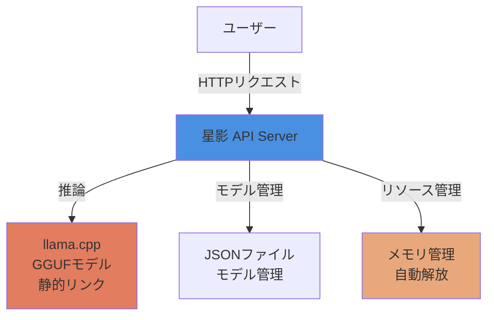

# 要件定義書：星影 - ローカル高速推論＆OpenAI互換API提供システム（Rust版）

**プロジェクト名:** 星影 - Hoshikage  
**バージョン:** 1.0.0  
**作成日:** 2026-01-16  
**著者:** Tane Channel Technology  
**言語:** Rust

---

## 1. システムの概要

### 1.1 目的

GGUFフォーマットの大規模言語モデルの潜在能力を最大限に引き出し、ローカル環境で高速かつ効率的に動作させながら、汎用性の高いAPIを提供することで、AI技術の民主化に貢献したい。特に、プライバシーを重視し、外部へのデータ送信を最小限に抑えつつ、高品質な対話型AI体験を提供することを目指す。

### 1.2 システム名の由来

「星影」は、暗闇の中で光を放つように、AI技術の可能性を照らすという意味を込めています。

### 1.3 システム構成

**主要コンポーネント:**
1. **星影 API Server**: Rustで実装されたOpenAI互換APIサーバー
2. **llama.cpp (静的リンク)**: GGUFモデルの高速推論エンジン
3. **モデル管理**: JSONファイルによる簡易的なモデル管理
4. **リソース管理**: 非アクティブ時の自動メモリ解放

---

## 2. ユースケース

### 2.1 開発者向け

**目的:** OpenAI APIの代替として、ローカル環境でGGUFモデルを活用したアプリケーションを開発

**メリット:**
- **コスト削減**: 外部APIの課金なし
- **プライバシー保護**: データが外部に送信されない
- **高速応答**: ローカル推論による低レイテンシー
- **カスタマイズ性**: 自由にモデルを選択・切り替え可能

**ユースケース例:**
- チャットボットアプリケーションの開発
- 文章生成ツールの構築
- コード生成アシスタントの実装

### 2.2 エンドユーザー向け

**目的:** 高速で応答性の高いAI体験を求めるユーザー向け

**メリット:**
- **リアルタイム応答**: ストリーミング形式で逐次応答
- **プライバシー**: 個人情報が外部に送信されない

**ユースケース例:**
- 日常的な質問への回答
- 創作活動のサポート（小説、詩、アイデア出し）
- 学習支援（説明、翻訳）

---

## 3. 機能一覧

### 3.1 コア機能

| 機能ID | 機能名 | 説明 | 実装状況 |
|--------|--------|------|---------|
| FT-001 | OpenAI互換API | `/v1/chat/completions` でチャット補完を提供 | ✅ 実装済み |
| FT-002 | ストリーミング応答 | リアルタイムで応答を逐次送信 | ⏳ 実装中 |
| FT-003 | 非ストリーミング応答 | 完全な応答を一度に返却 | ⏳ 実装中 |
| FT-004 | モデル一覧取得 | `/v1/models` で登録済みモデルを取得 | ⏳ 実装中 |
| FT-005 | ステータス確認 | `/v1/status` でシステム状態を確認 | ✅ 実装済み |
| FT-006 | バージョン情報 | `/v1/api/version` でAPIバージョンを取得 | ✅ 実装済み |

### 3.2 リソース管理機能

| 機能ID | 機能名 | 説明 | 実装状況 |
|--------|--------|------|---------|
| FT-020 | 非アクティブ時モデルアンロード | 一定時間非アクティブ時に自動でメモリ解放 | ⏳ 実装中 |
| FT-021 | セマフォ制御 | 同時リクエスト数を1に制限してVRAM枯渇を防止 | ⏳ 実装中 |

### 3.3 モデル管理機能

| 機能ID | 機能名 | 説明 | 実装状況 |
|--------|--------|------|---------|
| FT-030 | モデル登録 | CLIまたはAPIで新しいモデルを登録 | ⏳ 実装中 |
| FT-031 | モデル削除 | CLIまたはAPIでモデルを削除 | ⏳ 実装中 |
| FT-032 | モデル一覧表示 | CLIでモデル一覧を表示 | ⏳ 実装中 |
| FT-033 | 複数モデル対応 | 複数のGGUFモデルを登録・切り替え可能 | ⏳ 実装中 |

### 3.4 将来拡張機能

| 機能ID | 機能名 | 説明 | 優先度 |
|--------|--------|------|--------|
| FT-040 | 認証機能 | APIキーによるアクセス制限 | 低 |
| FT-041 | レート制限 | 悪意のある利用を防止するアクセス制限 | 低 |
| FT-042 | Web UI | ブラウザで操作できるGUI | 中 |
| FT-043 | 人格設定 | 個性的な応答パターンを定義 | 高 |
| FT-044 | 多言語対応 | 複数言語での対話機能 | 低 |

---

## 4. 非機能要件：「静かなる知性」

### 4.1 設計思想

『星影』は、ユーザーの創造性を最大限に引き出すためのAIアシスタントです。その実現には、単に高性能なモデルを実行するだけでなく、**状況に応じて柔軟にリソースを制御し、常に最適なパフォーマンスを提供する能力**が不可欠です。

「静かなる知性」という設計思想に基づき、以下の原則を守ります：

1. **省知恵と待機**: 無駄な活動を避け、必要な時にのみ力を発揮
2. **状況認識と適応**: ユーザーの利用状況に合わせて最適な負荷状態を維持
3. **静かなる存在感**: バックグラウンドでの活動を最小限に抑え、集中を妨げない

### 4.2 パフォーマンス要件

| 項目 | 目標値 | 説明 |
|------|--------|------|
| ストリーミング初回応答時間 | < 1秒 | ユーザーが送信してから最初の応答が表示されるまで |
| 非ストリーミング応答時間 | < 2秒（p99） | 99%のリクエストが2秒以内に完了 |
| 推論速度 (RTX 4070 SUPER) | 30-50 tokens/s | GPU推論時のトークン生成速度 |

### 4.3 リソース効率

| 項目 | 目標値 | 説明 |
|------|--------|------|
| 非アクティブ時メモリ解放 | 300秒後 | 一定時間非アクティブ時に自動解放 |
| GPU使用率 | 推論時100%、非アクティブ時0% | GPUを最大限活用 |
| VRAM枯渇防止 | セマフォで同時実行数=1 | クラッシュを防止 |

### 4.4 信頼性

| 項目 | 目標値 | 説明 |
|------|--------|------|
| エラーハンドリング | 全エラーをログ記録 | 適切なエラーメッセージを返却 |
| セマフォタイムアウト | 180秒 | デッドロックを防止 |
| 自動復旧 | モデルクラッシュ時に自動再起動 | システムの継続性を確保 |

### 4.5 ユーザビリティ

| 項目 | 目標値 | 説明 |
|------|--------|------|
| OpenAI互換性 | 100% | 既存ツールとの完全互換 |
| モデル管理の簡単さ | JSONファイルで管理 | model_map.jsonで管理 |
| エラーメッセージ | 日本語で分かりやすく | ユーザーフレンドリー |

---

## 5. API仕様

### 5.1 OpenAI互換API

**チャット補完API:**
- 標準的なHTTPリクエスト（`POST /v1/chat/completions`）を受け付ける
- ストリーミング応答に対応（`stream: true`）
- 既存のOpenAI APIクライアントライブラリがそのまま使える

**エンドポイント一覧:**

| エンドポイント | メソッド | 説明 |
|--------------|---------|------|
| `/v1/chat/completions` | POST | チャット補完（ストリーミング/非ストリーミング） |
| `/v1/models` | GET | モデル一覧取得 |
| `/v1/status` | GET | システムステータス確認 |
| `/v1/api/version` | GET | APIバージョン取得 |

---

## 6. 制約事項

### 6.1 ハードウェア要件

| 項目 | 最小要件 | 推奨要件 |
|------|---------|---------|
| CPU | 8コア以上 | 16コア以上 |
| メモリ | 16GB以上 | 32GB以上 |
| GPU | VRAM 8GB以上 | VRAM 12GB以上 |
| ストレージ | SSD 50GB以上 | NVMe SSD 100GB以上 |

### 6.2 ソフトウェア要件

| 項目 | 要件 |
|------|------|
| OS | Linux（Ubuntu 20.04以降推奨） |
| Rust | 1.70以上 |
| CUDAドライバ | 470+ (GPU使用時) |

### 6.3 その他の制約

- GGUFフォーマットのモデルのみサポート
- 同時リクエスト数は1に制限（VRAM枯渇防止）
- システムCUDAライブラリへの動的リンクが必要

---

## 7. 技術スタック

| カテゴリ | 技術 | バージョン | 用途 |
|---------|------|-----------|------|
| 言語 | Rust | 1.70+ | システム全体 |
| Webフレームワーク | Axum | 最新 | APIサーバー |
| 推論エンジン | llama.cpp | 最新 | GGUF推論（静的リンク） |
| GPU加速 | CUDA | 12.4+ | GPU推論 |
| シリアライゼーション | serde | 最新 | JSON処理 |
| 非同期ランタイム | tokio | 最新 | 非同期処理 |

---

## 8. 拡張余地

### 8.1 モデル管理CLI

**目的:** JSONファイルベースの簡易的なモデル管理

**アプローチ:**
- `model_map.json` でモデル情報を管理
- コマンドラインツールで登録・削除・一覧表示

### 8.2 認証・レート制限

**目的:** 安全なアクセス制御の実装

**アプローチ:**
- 環境変数でAPIキー設定
- リクエスト数の制限

### 8.3 モニタリングダッシュボード

**目的:** システム監視の実装

**アプローチ:**
- ログ出力の強化
- 将来的なPrometheus/Grafana統合

---

**著者:** Tane Channel Technology  
**最終更新日:** 2026-01-16  
**バージョン:** 1.0.0
