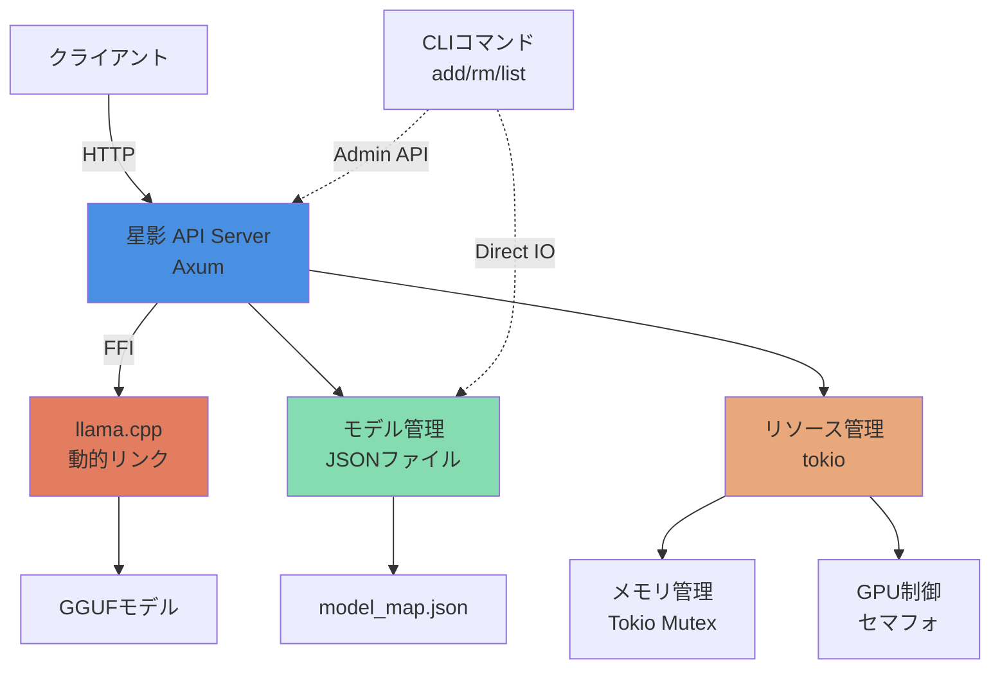

# システム設計書：星影 - Rust版高速ローカル推論サーバー

**バージョン:** 1.0.0  
**作成日:** 2026-01-18  
**言語:** Rust

---

## 1. システム構成

### 1.1 全体アーキテクチャ



### 1.2 コンポーネント説明

| コンポーネント | 説明 | 技術 |
|------------|------|------|
| **APIサーバー** | OpenAI互換APIを提供 | Axum + Tokio |
| **推論エンジン** | GGUFモデルの高速推論 | llama.cpp (動的リンク: libllama.so) |
| **モデル管理** | モデル情報の永続化 | serde_json |
| **リソース管理** | 非同期排他制御 | Tokio RwLock + Mutex + Semaphore |
| **I/O管理** | RAMディスク転送 (/dev/shm) | Std I/O + Tokio fs |

---

## 2. デザインパターン

### 2.1 非同期処理

**パターン:** Tokioベースの非同期処理 + RwLock

**理由:**
- 高速なI/O待機
- 並行処理のサポート
- リソースの効率的な使用

```rust
use tokio::sync::{Mutex, RwLock, Semaphore};

pub struct ModelManager {
    models: Arc<RwLock<HashMap<String, ModelConfig>>>,
    inference: Arc<Mutex<InferenceState>>,
    semaphore: Arc<Semaphore>,
}
```

### 2.2 排他制御

**パターン:** RwLock + Mutex + Semaphore

**理由:**
- モデル排他制御: Mutex（1つのモデルのみロード）
- 同時実行制限: Semaphore（VRAM枯渇防止）

```rust
// モデル一覧参照（並行読み取り）
let models = model_manager.models.read().await;
let config = models.get(&name).cloned();
drop(models);

// 推論実行（セマフォ）
let permit = model_manager.semaphore.acquire().await?;
run_inference(&prompt).await?;
drop(permit);
```

### 2.3 エラーハンドリング

**パターン:** Result型 + thiserror

**理由:**
- コンパイル時のエラーチェック
- 明確なエラーメッセージ
- エラーハンドリングの一元化

```rust
#[derive(Debug, thiserror::Error)]
pub enum HoshikageError {
    #[error("モデルロードに失敗: {0}")]
    ModelLoadFailed(String),
    
    #[error("推論エラー: {0}")]
    InferenceError(String),
    
    #[error("ファイルエラー: {0}")]
    IoError(#[from] std::io::Error),
}

pub type Result<T> = std::result::Result<T, HoshikageError>;

### 2.4 CLI・API連携パターン

**パターン:** ハイブリッド管理 (API first, File fallback with Locks)

**動作フロー:**
1. **初期化**: 起動時およびコマンド実行時、必要なディレクトリ（`~/.config/hoshikage/` 等）が存在しない場合は自動作成する (`mkdir -p`)。
2. **サーバー起動チェック**: ポートチェック等でサーバーの生存確認。
3. **Aliveの場合**: 管理用API ("/admin/models/*") を叩いて指示。リトライ処理（最大3回）を入れて通信エラーを低減。サーバーがメモリ内の設定とJSONファイルを更新。
4. **Deadの場合**: CLIが直接JSONファイルを書き換える。
   - **排他制御**: ファイル書き込み時は `fs2` 等を用いてファイルロックを取得し、同時書き込みによる破壊を防ぐ。

---

## 3. データ構造

### 3.1 設定ファイル

**model_map.json**
```json
{
  "LFM2.5_Q8": {
    "path": "/path/to/models",
    "model": "LFM2.5-1.2B-JP-Q8_0.gguf",
    "stop": ["<|im_end|>", "</s>"]
  }
}
```

`stop` はデフォルトのストップシーケンスにマージされ、重複は除去されます。

### 3.2 内部データ構造

```rust
#[derive(Debug, Serialize, Deserialize)]
pub struct ModelConfig {
    pub path: String,
    pub model: String,
    pub stop: Vec<String>,
}

#[derive(Debug, Serialize, Deserialize)]
pub struct ChatMessage {
    pub role: String,
    pub content: String,
}

#[derive(Debug, Serialize, Deserialize)]
pub struct ChatCompletionRequest {
    pub model: String,
    pub messages: Vec<ChatMessage>,
    pub temperature: Option<f32>,
    pub top_p: Option<f32>,
    pub max_tokens: Option<u32>,
    pub stream: Option<bool>,
}
```

---

## 4. メモリ管理

### 4.1 非アクティブ時の解放

**戦略:**
1. 最終アクセス時間を記録
2. 300秒（設定可能）非アクティブ時に解放
3. Tokioタスクで定期的チェック

```rust
async fn idle_timeout_check(
    llm: Arc<Mutex<Option<Llama>>>,
    idle_duration: Duration,
) {
    let mut interval = tokio::time::interval(Duration::from_secs(30));
    let mut last_access = Arc::new(Mutex::new(SystemTime::now()));
    
    loop {
        interval.tick().await;
        
        let elapsed = {
            let last = *last_access.lock().await;
            SystemTime::now().duration_since(last).unwrap()
        };
        
        if elapsed > idle_duration {
            let mut llm = llm.lock().await;
            if llm.is_some() {
                llm.take(); // モデルを解放
                println!("モデルを解放しました");
            }
        }
    }
}
```

**補足:**
推論ごとにコンテキストを初期化（KVキャッシュのクリアまたは再生成）し、前回の会話状態が次のリクエストに影響しないようにします。

### 4.2 VRAM管理

**戦略:**
- セマフォで同時実行数を1に制限
- モデル切り替え時に解放を保証

### 4.3 RAMディスク活用 (高速ロード)

**戦略 (Linux):**
Linux標準の共有メモリ領域 `/dev/shm` (tmpfs) を活用します。これは全ユーザーから読み書き可能なメモリ領域であるため、`sudo` 権限なしで利用可能です。マウント操作は行いません。

1. **クリーンアップ**: ロード要求時、`RAMDISK_PATH/` 内に *別のモデルファイル* が存在する場合は即座に削除し、メモリ領域を確保する（排他利用）。
2. **コピー**: 対象の `.gguf` ファイルをRAMディスクにコピー。
3. **ロード**: メモリ上のファイルパスを `llama.cpp` に渡してロード。
4. **自動削除 (Great Timeout)**: 
   - 指定時間非アクティブ検出後、コピーしたファイルを削除。
   - これによりメモリがOSに即座に返却されます。

**Windows / Mac:**
標準でユーザー書き込み可能なRAMディスク領域がないため、本機能は無効化（SSDから直接ロード）となります。

---

## 5. パフォーマンス・運用最適化

### 5.1 動的リンク (Dynamic Linking)
- **柔軟性**: ユーザーがシステムのCUDAバージョンに合わせて `libllama.so` を差し替え可能。
- **配置**: `~/.config/hoshikage/lib/` (Linux) または `%APPDATA%\hoshikage\lib` (Windows)。

### 5.2 llama.cpp最適化
- **CUDA加速**: n_gpu_layers=-1でGPUを最大活用
- **Flash Attention**: 推論速度の最適化
- **KV Cache**: コンテキスト管理の効率化

---

## 6. セキュリティ

### 6.1 環境変数管理

`.env`ファイルでの設定管理:
```bash
LD_LIBRARY_PATH=/usr/local/cuda/targets/x86_64-linux/lib
```

### 6.2 コマンドインジェクション対策

Rustの型安全な文字列処理で防除:
```rust
use std::process::Command;

// 正しい方法: 引数リスト化して実行
Command::new("ls")
    .args(["-l", "/dev/shm"])
    .spawn()?;
```

---

## 7. モジュール構成

```
src/
├── main.rs              # エントリーポイント (CLI解析含む)
├── commands/            # CLIコマンド実装
│   ├── mod.rs
│   ├── add.rs
│   ├── rm.rs
│   └── list.rs
├── lib.rs              # ライブラリエクスポート
├── api/                # APIルーティング
│   ├── mod.rs
│   ├── chat.rs          # チャット補完エンドポイント
│   ├── models.rs        # モデル一覧(OpenAI互換)
│   ├── admin.rs         # [New] 管理用API (add/rm)
│   └── status.rs        # ステータス確認エンドポイント
├── inference/           # 推論エンジン
│   ├── mod.rs
│   └── llama_wrapper.rs # llama.cppのFFIラッパー
├── model/              # モデル管理
│   ├── mod.rs
│   └── manager.rs       # モデルマネージャー
└── config/             # 設定管理
    ├── mod.rs
    └── settings.rs       # 設定ファイルの読み込み
```

### 7.1 ログ設計 (Tracing)
- **出力先**: 標準出力 (デフォルト)
- **ファイル出力**: `LOG_FILE_PATH` が設定されている場合、指定パス（例: `~/.config/hoshikage/logs/hoshikage.log`）に追記出力。
- **ローテーション**: 日次ローテーションを行い、ディスク圧迫を防ぐ。
