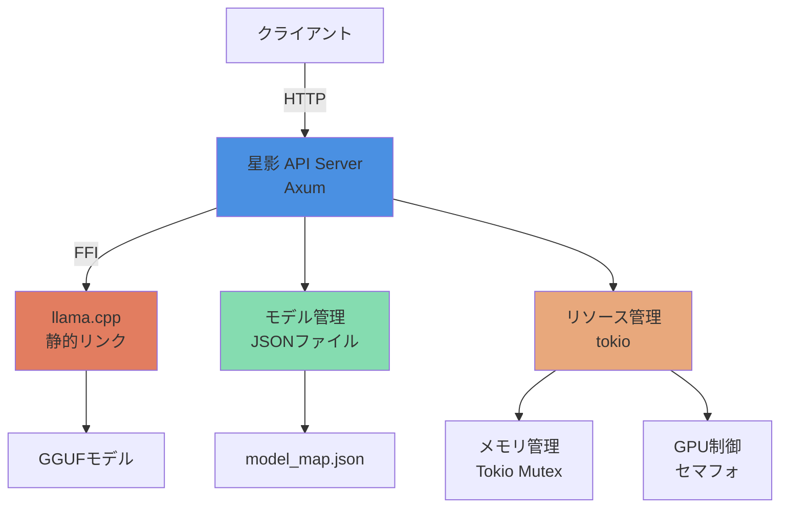

# システム設計書：星影 - Rust版高速ローカル推論サーバー

**バージョン:** 1.0.0  
**作成日:** 2026-01-18  
**言語:** Rust

---

## 1. システム構成

### 1.1 全体アーキテクチャ



### 1.2 コンポーネント説明

| コンポーネント | 説明 | 技術 |
|------------|------|------|
| **APIサーバー** | OpenAI互換APIを提供 | Axum + Tokio |
| **推論エンジン** | GGUFモデルの高速推論 | llama.cpp (静的リンク) |
| **モデル管理** | モデル情報の永続化 | serde_json |
| **リソース管理** | 非同期排他制御 | Tokio Mutex + Semaphore |

---

## 2. デザインパターン

### 2.1 非同期処理

**パターン:** Tokioベースの非同期処理

**理由:**
- 高速なI/O待機
- 並行処理のサポート
- リソースの効率的な使用

```rust
use tokio::sync::Mutex;

pub struct ModelManager {
    llm: Arc<Mutex<Option<Llama>>>,
    semaphore: Arc<Semaphore<1>>,
}
```

### 2.2 排他制御

**パターン:** Mutex + Semaphore

**理由:**
- モデル排他制御: Mutex（1つのモデルのみロード）
- 同時実行制限: Semaphore（VRAM枯渇防止）

```rust
// モデル初期化（排他）
let mut llm_guard = model_manager.llm.lock().await;
if llm_guard.is_none() {
    *llm_guard = Some(load_model(&model_path)?);
}

// 推論実行（セマフォ）
let permit = model_manager.semaphore.acquire().await?;
run_inference(&llm, &prompt).await?;
drop(permit);
```

### 2.3 エラーハンドリング

**パターン:** Result型 + thiserror

**理由:**
- コンパイル時のエラーチェック
- 明確なエラーメッセージ
- エラーハンドリングの一元化

```rust
#[derive(Debug, thiserror::Error)]
pub enum HoshikageError {
    #[error("モデルロードに失敗: {0}")]
    ModelLoadFailed(String),
    
    #[error("推論エラー: {0}")]
    InferenceError(String),
    
    #[error("ファイルエラー: {0}")]
    IoError(#[from] std::io::Error),
}

pub type Result<T> = std::result::Result<T, HoshikageError>;
```

---

## 3. データ構造

### 3.1 設定ファイル

**model_map.json**
```json
{
  "LFM2.5_Q8": {
    "path": "/path/to/models",
    "model": "LFM2.5-1.2B-JP-Q8_0.gguf",
    "stop": ["<|im_end|>", "</s>"]
  }
}
```

### 3.2 内部データ構造

```rust
#[derive(Debug, Serialize, Deserialize)]
pub struct ModelConfig {
    pub path: String,
    pub model: String,
    pub stop: Vec<String>,
}

#[derive(Debug, Serialize, Deserialize)]
pub struct ChatMessage {
    pub role: String,
    pub content: String,
}

#[derive(Debug, Serialize, Deserialize)]
pub struct ChatCompletionRequest {
    pub model: String,
    pub messages: Vec<ChatMessage>,
    pub temperature: Option<f32>,
    pub top_p: Option<f32>,
    pub max_tokens: Option<u32>,
    pub stream: Option<bool>,
}
```

---

## 4. メモリ管理

### 4.1 非アクティブ時の解放

**戦略:**
1. 最終アクセス時間を記録
2. 300秒（設定可能）非アクティブ時に解放
3. Tokioタスクで定期的チェック

```rust
async fn idle_timeout_check(
    llm: Arc<Mutex<Option<Llama>>>,
    idle_duration: Duration,
) {
    let mut interval = tokio::time::interval(Duration::from_secs(30));
    let mut last_access = Arc::new(Mutex::new(SystemTime::now()));
    
    loop {
        interval.tick().await;
        
        let elapsed = {
            let last = *last_access.lock().await;
            SystemTime::now().duration_since(last).unwrap()
        };
        
        if elapsed > idle_duration {
            let mut llm = llm.lock().await;
            if llm.is_some() {
                llm.take(); // モデルを解放
                println!("モデルを解放しました");
            }
        }
    }
}
```

### 4.2 VRAM管理

**戦略:**
- セマフォで同時実行数を1に制限
- モデル切り替え時に解放を保証

---

## 5. パフォーマンス最適化

### 5.1 静的リンクのメリット

- **起動速度**: 共有ライブラリのロード不要
- **バイナリサイズ**: 311KB (非常に小さい)
- **デプロイの簡素化**: libllama.soの配置不要

### 5.2 llama.cpp最適化

- **CUDA加速**: n_gpu_layers=-1でGPUを最大活用
- **Flash Attention**: 推論速度の最適化
- **KV Cache**: コンテキスト管理の効率化

---

## 6. セキュリティ

### 6.1 環境変数管理

`.env`ファイルでの設定管理:
```bash
LD_LIBRARY_PATH=/usr/local/cuda/targets/x86_64-linux/lib
```

### 6.2 コマンドインジェクション対策

Rustの型安全な文字列処理で防除:
```rust
use std::process::Command;

// 正しい方法
Command::new("mount")
    .args(["-t", "tmpfs", "-o", &format!("size={}M", size), mount_point])
    .spawn()?;
```

---

## 7. モジュール構成

```
src/
├── main.rs              # エントリーポイント
├── lib.rs              # ライブラリエクスポート
├── api/                # APIルーティング
│   ├── mod.rs
│   ├── chat.rs          # チャット補完エンドポイント
│   ├── models.rs        # モデル管理エンドポイント
│   └── status.rs        # ステータス確認エンドポイント
├── inference/           # 推論エンジン
│   ├── mod.rs
│   └── llama_wrapper.rs # llama.cppのFFIラッパー
├── model/              # モデル管理
│   ├── mod.rs
│   └── manager.rs       # モデルマネージャー
└── config/             # 設定管理
    ├── mod.rs
    └── settings.rs       # 設定ファイルの読み込み
```

---

**作成日:** 2026-01-18  
**バージョン:** 1.0.0
