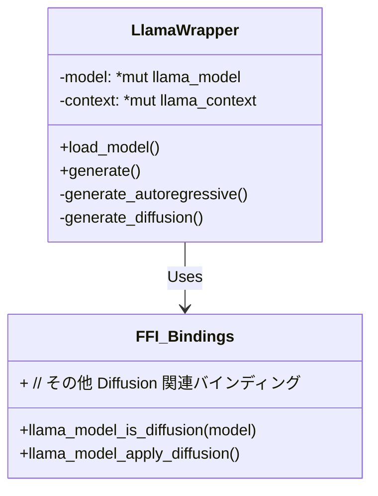

# Hoshikage v1.1.0 システム設計書 (Diffusion 対応)

## 0. 概要
v1.1.0 では、LLaDA や Dream といった Diffusion LLM (DLLMs, 拡散モデルベースのLLM) をサポートします。
実装は `llama.cpp` のサンプルである `diffusion-cli.cpp` のロジックを Rust に移植し、`llama_wrapper.rs` を拡張する形で行います。
API は既存の OpenAI 互換形式を維持しますが、`diffusion_steps` などのパラメータを受け渡せるようにします（`frequency_penalty` 等のマッピング、あるいは `extra_body` の利用を検討）。

## 1. アーキテクチャ更新



## 2. コンポーネント変更点

### 2.1 FFI (`src/ffi.rs`)
以下のバインディングが `bindgen` で生成されているか、または手動定義が必要かを確認します（`llama_model_is_diffusion` は `llama.h` に存在するはず）。
- `llama_model_is_diffusion`
- その他、C++側のヘルパー関数を再利用する場合に必要な関数（基本的には `diffusion-cli.cpp` のロジックを Rust に移植するため、最小限になる見込み）。

### 2.2 推論ロジック (`src/inference/llama_wrapper.rs`)

**新規メソッド**: `generate_diffusion()`
- **入力**: プロンプトトークン, Diffusionパラメータ (`steps`, `algorithm`, `schedule`).
- **プロセス**:
    1. **初期化**:
       - 入力トークンを出力バッファにコピー。
       - 残りの領域を `MASK_TOKEN` で埋める。
       - `llama_sampler_chain` を初期化。
    2. **Diffusion ループ** (`steps` 回):
       - 現在の `output_tokens` で `llama_batch` を作成。
       - `llama_decode()` を実行。
       - `logits` を取得。
       - **サンプリング & 更新**:
         - 信頼度 (Confidence) / エントロピーを計算。
         - 「保持する (Keep)」トークンと「再マスク (Mask)」するトークンを決定。
         - `output_tokens` を更新。
       - (任意) コールバックによる視覚的フィードバック？
    3. **終了処理**:
       - 結果を Detokenize (文字列化) する。

**`generate()` 内の分岐ロジック**:
```rust
if unsafe { llama_model_is_diffusion(self.model) } {
    self.generate_diffusion(...)
} else {
    self.generate_autoregressive(...) // 現在の generate() 内のロジック
}
```

### 2.3 設定 (Configuration)
- `DiffusionParams` 構造体を追加（`InferenceParams` と対になるもの）。
- `Config` を更新し、Diffusion のデフォルト設定を保持できるようにする。

## 3. データフロー (Diffusion)

1. **ユーザーリクエスト**: `POST /v1/chat/completions` (model="llada-8b")
2. **API レイヤー**: リクエストを解析。
3. **LlamaWrapper**:
    - `llada-8b` が Diffusion モデルであることを検知。
    - プロンプトをトークン化: `[Users, Request, ...]`
    - マスクを追加: `[Users, Request, ..., MASK, MASK, ...]` (`max_tokens` まで)
    - **ループ処理**:
        - ノイズの乗ったシーケンスをモデルに入力。
        - モデルが元のトークンを予測。
        - サンプラーが高信頼度のトークンを保持し、低信頼度のものを再マスク。
    - 最終的なテキストを返す。

## 4. リスクと緩和策
- **パフォーマンス**: ステップ数が多い（例: 100）Diffusion 生成は、100回のデコード・パスを必要とします。
    - *緩和策*: `n_gpu_layers` を最大化する。適切なデフォルトステップ数（ドラフト用 20-50、品質用 100+）を推奨する。
- **FFI の安定性**: `llama.cpp` の Diffusion サポートは実験的な段階です。
    - *緩和策*: 動作確認のとれた `llama.cpp` のコミットを使用する（サブモジュールで固定済み）。

## 5. メモリ管理 (静かなる知性)
- `ModelManager` にある既存のメモリオフロード機構（アイドル監視）は、モデルのアーキテクチャに依存せず動作します。
- Diffusion モデルも `LlamaWrapper` が管理する標準的な `llama_model` および `llama_context` ポインタを使用するため、**自動オフロードは修正なしで正常に機能します**。
- **モデルの再初期化について**:
  - Diffusion モデルも通常の `llama_load_model_from_file` や `llama_init_from_model` (または同等の Context 初期化) パスを使用します。
  - そのため、（コールドスタート後の）2回目以降のリクエストでは、メモリ上に常駐している `LlamaWrapper` インスタンス（`InferenceState` 内に保持）が再利用されます。
  - つまり、ARモデル（Llama 3等）と同様に、**再初期化のオーバーヘッドなしで高速に応答可能**です。

## 6. タスクリスト
1. `bindgen` の更新（必要な場合）: `llama_model_is_diffusion` を公開するため。
2. `llama_wrapper.rs` のリファクタリング: ARロジックと Diffusion ロジックの分離。
3. `diffusion-cli.cpp` のロジック移植: マスキング、サンプリングループを Rust で実装。
4. 小規模な DLLM (例: `Dream-7B`) でのテスト。
