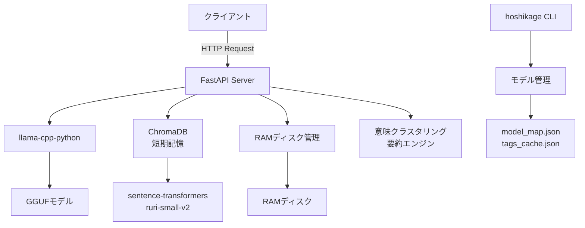
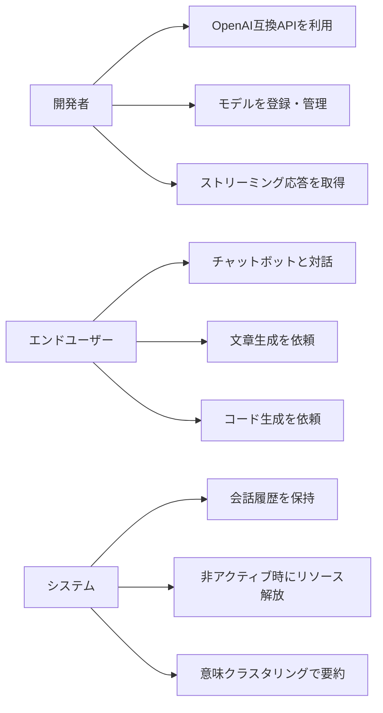

# 要件定義書：星影 - ローカル高速推論＆OpenAI互換API提供システム

**プロジェクト名:** 星影 - Hoshikage  
**バージョン:** 1.0.0  
**作成日:** 2026-01-16  
**著者:** Tane Channel Technology

---

## 1. システムの概要

### 1.1 目的

星影は、GGUFフォーマットの大規模言語モデルをローカル環境で高速かつ効率的に動作させ、OpenAI互換のAPIを提供するシステムです。プライバシーを重視し、外部へのデータ送信を最小限に抑えつつ、高品質な対話型AI体験を提供します。

**主な目標:**
- ローカル環境での高速推論の実現
- OpenAI互換APIによる既存ツールとの互換性
- 会話履歴の保持と文脈理解の向上
- リソース効率の最適化（静かなる知性）

### 1.2 システム名の由来

「星影」は、暗闇の中で光を放つように、AI技術の可能性を照らすという意味を込めています。

### 1.3 システム構成

**主要コンポーネント:**
1. **FastAPI Server**: OpenAI互換APIを提供するWebサーバー
2. **llama-cpp-python**: GGUFモデルの推論エンジン
3. **ChromaDB**: 会話履歴の短期記憶を保持するベクトルデータベース
4. **意味クラスタリング要約エンジン**: 会話履歴を意味的にクラスタリングして要約
5. **RAMディスク管理**: モデルをRAMディスクにマウントして高速化
6. **モデル管理CLI**: モデルの登録・削除・一覧表示を行うコマンドラインツール

---

## 2. ユースケース

### 2.1 ユースケース図

### 2.2 主要ユースケース

| ID | ユースケース | 詳細 | 優先度 | アクター |
|----|-------------|------|--------|---------|
| UC-001 | チャット補完API利用 | OpenAI互換のチャット補完APIを利用してテキスト生成 | 高 | 開発者、エンドユーザー |
| UC-002 | ストリーミング応答取得 | リアルタイムでストリーミング形式の応答を取得 | 高 | 開発者、エンドユーザー |
| UC-003 | モデル登録 | 新しいGGUFモデルをシステムに登録 | 高 | 開発者 |
| UC-004 | モデル一覧取得 | 登録済みモデルの一覧を取得 | 中 | 開発者 |
| UC-005 | 会話履歴保持 | ChromaDBに会話履歴を保存し、文脈を維持 | 高 | システム |
| UC-006 | 意味クラスタリング要約 | 長い会話履歴を意味的にクラスタリングして要約 | 中 | システム |
| UC-007 | 非アクティブ時リソース解放 | 一定時間非アクティブ時にモデルをアンロード | 中 | システム |
| UC-008 | RAMディスク活用 | モデルをRAMディスクにマウントして高速化 | 中 | システム |

---

## 3. 機能要件

### 3.1 コア機能

#### 3.1.1 OpenAI互換API

| 機能ID | 機能名 | 詳細 | 実装状況 |
|--------|--------|------|---------|
| FT-001 | チャット補完API | `/v1/chat/completions` エンドポイントでOpenAI互換のチャット補完を提供 | ✅ 実装済み |
| FT-002 | ストリーミング応答 | `stream: true` でリアルタイムストリーミング応答を提供 | ✅ 実装済み |
| FT-003 | モデル一覧取得 | `/v1/models` エンドポイントで登録済みモデル一覧を取得 | ✅ 実装済み |
| FT-004 | ステータス確認 | `/v1/status` エンドポイントでシステム状態を確認 | ✅ 実装済み |
| FT-005 | バージョン情報取得 | `/v1/api/version` エンドポイントでAPIバージョンを取得 | ✅ 実装済み |

#### 3.1.2 推論エンジン

| 機能ID | 機能名 | 詳細 | 実装状況 |
|--------|--------|------|---------|
| FT-006 | llama.cpp推論 | llama-cpp-pythonによる高速推論 | ✅ 実装済み |
| FT-007 | GPU加速 | n_gpu_layers=-1でGPUを最大限活用 | ✅ 実装済み |
| FT-008 | コンテキスト長設定 | n_ctx=4096でコンテキスト長を設定 | ✅ 実装済み |
| FT-009 | 動的モデル切り替え | リクエストごとに異なるモデルを利用可能 | ✅ 実装済み |

### 3.2 拡張機能（実装済み）

#### 3.2.1 会話履歴管理

| 機能ID | 機能名 | 詳細 | 実装状況 |
|--------|--------|------|---------|
| FT-010 | ChromaDB短期記憶 | ChromaDBに会話履歴を保存 | ✅ 実装済み |
| FT-011 | ベクトル埋め込み | sentence-transformers（ruri-small-v2）で埋め込み生成 | ✅ 実装済み |
| FT-012 | 意味クラスタリング要約 | K-Meansクラスタリングで会話履歴を要約 | ✅ 実装済み |
| FT-013 | 直近会話の優先保持 | 直近3往復の会話は要約せずに原文保持 | ✅ 実装済み |

#### 3.2.2 リソース管理

| 機能ID | 機能名 | 詳細 | 実装状況 |
|--------|--------|------|---------|
| FT-014 | 非アクティブ時モデルアンロード | 300秒非アクティブ時にモデルをメモリから解放 | ✅ 実装済み |
| FT-015 | RAMディスクマウント | モデルをRAMディスクにマウントして高速化 | ✅ 実装済み |
| FT-016 | 自動RAMディスクアンマウント | 長時間非アクティブ時にRAMディスクをアンマウント | ✅ 実装済み |
| FT-017 | セマフォ制御 | 同時リクエスト数を1に制限してVRAM枯渇を防止 | ✅ 実装済み |

#### 3.2.3 モデル管理

| 機能ID | 機能名 | 詳細 | 実装状況 |
|--------|--------|------|---------|
| FT-018 | モデル登録CLI | `hoshikage.py add` でモデルを登録 | ✅ 実装済み |
| FT-019 | モデル削除CLI | `hoshikage.py remove` でモデルを削除 | ✅ 実装済み |
| FT-020 | モデル一覧CLI | `hoshikage.py list` でモデル一覧を表示 | ✅ 実装済み |
| FT-021 | モデルメタデータ管理 | model_map.json、tags_cache.json、tags_ollama.jsonで管理 | ✅ 実装済み |

### 3.3 将来拡張機能

| 機能ID | 機能名 | 詳細 | 優先度 |
|--------|--------|------|--------|
| FT-022 | 長期記憶RAG | 意図分類・時系列クラスタリングによる長期記憶 | 中 |
| FT-023 | 認証機能 | APIキーによるアクセス制限 | 低 |
| FT-024 | レート制限 | 悪意のある利用を防止するアクセス制限 | 低 |
| FT-025 | モニタリングダッシュボード | Prometheus/Grafanaによる監視 | 低 |
| FT-026 | 多言語対応 | 複数言語での対話機能 | 低 |

---

## 4. 非機能要件

### 4.1 非機能要件テーブル（ISO/IEC 25010準拠）

| NFR-ID | カテゴリ | 要件 | 目標値 | 検証方法 |
|--------|----------|------|--------|----------|
| **パフォーマンス** |
| PERF-001 | Performance | ストリーミング初回応答時間 | < 1秒 | 実測・ログ分析 |
| PERF-002 | Performance | 非ストリーミングAPIレスポンス時間（p99） | < 2秒 | 実測・ログ分析 |
| PERF-003 | Performance | RAMディスクによるモデルロード高速化 | ディスクより50%以上高速 | 起動時間計測 |
| PERF-004 | Performance | 意味クラスタリング要約処理時間 | < 500ms（100文） | 実測 |
| **リソース効率** |
| MEM-001 | Resource | 非アクティブ時メモリ解放 | 300秒後に自動解放 | システムモニタリング |
| MEM-002 | Resource | RAMディスクサイズ | 12GB（設定可能） | 設定ファイル確認 |
| MEM-003 | Resource | VRAM枯渇防止 | セマフォで同時実行数=1 | 負荷テスト |
| MEM-004 | Resource | GPU使用率 | 推論時100%、非アクティブ時0% | nvidia-smi監視 |
| **セキュリティ** |
| SEC-001 | Security | 環境変数による機密情報管理 | .envファイル使用 | コードレビュー |
| SEC-002 | Security | .envファイルのgit除外 | .gitignoreに記載 | .gitignore確認 |
| SEC-003 | Security | コマンドインジェクション対策 | shell=False、引数リスト化 | コードレビュー |
| **信頼性** |
| REL-001 | Reliability | モデルクラッシュ時の自動復旧 | エラーハンドリング実装 | エラー発生時の動作確認 |
| REL-002 | Reliability | セマフォタイムアウト | 180秒待機後強制解放 | タイムアウトテスト |
| REL-003 | Reliability | エラーレスポンス | 適切なHTTPステータスコード返却 | APIテスト |
| **保守性** |
| MAIN-001 | Maintainability | モジュール分離設計 | 機能ごとにファイル分離 | コード構造レビュー |
| MAIN-002 | Maintainability | ログ記録 | logging モジュール使用 | ログ出力確認 |
| MAIN-003 | Maintainability | 設定の外部化 | .envファイルで設定管理 | 設定ファイル確認 |
| **ユーザビリティ** |
| USE-001 | Usability | OpenAI互換API | 既存ツールとの互換性 | 互換性テスト |
| USE-002 | Usability | モデル管理CLI | 直感的なコマンド体系 | ユーザビリティテスト |
| USE-003 | Usability | エラーメッセージの明確性 | 日本語での分かりやすいメッセージ | エラー発生時の確認 |
| **スケーラビリティ** |
| SCL-001 | Scalability | 複数モデル対応 | model_map.jsonで管理 | 複数モデル登録テスト |
| SCL-002 | Scalability | 動的モデル切り替え | リクエストごとに切り替え可能 | モデル切り替えテスト |

### 4.2 設計思想：「静かなる知性」

星影は、**「静かなる知性」**という設計思想に基づいています。これは以下の原則を意味します：

1. **省知恵と待機**: 無駄な活動を避け、必要な時にのみ力を発揮
2. **状況認識と適応**: ユーザーの利用状況に合わせて最適な負荷状態を維持
3. **静かなる存在感**: バックグラウンドでの活動を最小限に抑え、集中を妨げない

**実装例:**
- 非アクティブ時の自動モデルアンロード
- RAMディスクの自動アンマウント
- 会話履歴の自動要約によるメモリ効率化

---

## 5. 制約事項

### 5.1 ハードウェア要件

| 項目 | 最小要件 | 推奨要件 |
|------|---------|---------|
| CPU | 8コア以上 | 16コア以上（Ryzen 7900相当） |
| メモリ | 16GB以上 | 32GB以上 |
| GPU | VRAM 8GB以上 | VRAM 12GB以上 |
| ストレージ | SSD 50GB以上 | NVMe SSD 100GB以上 |
| RAMディスク | 12GB以上の空きメモリ | 16GB以上の空きメモリ |

### 5.2 ソフトウェア要件

| 項目 | 要件 |
|------|------|
| OS | Linux（Ubuntu 20.04以降推奨） |
| Python | 3.10以上 |
| CUDA | 11.8以上（GPU使用時） |
| sudo権限 | RAMディスクマウント時に必要 |

### 5.3 その他の制約

- GGUFフォーマットのモデルのみサポート
- 同時リクエスト数は1に制限（VRAM枯渇防止）
- RAMディスクのマウント/アンマウントにsudo権限が必要

---

## 6. 環境変数設定

星影は`.env`ファイルで以下の環境変数を設定します：

| 変数名 | 説明 | デフォルト値 |
|--------|------|-------------|
| RAMDISK_PATH | RAMディスクのマウントパス | `/mnt/temp/hoshikage` |
| RAMDISK_SIZE | RAMディスクのサイズ（GB） | `12` |
| IDLE_TIMEOUT_SECONDS | 非アクティブ検出閾値（秒） | `300` |
| GREAT_TIMEOUT | RAMディスクアンマウント閾値（分） | `60` |
| MODEL_MAP_FILE | モデルマップファイルパス | `./models/model_map.json` |
| TAG_CACHE_FILE | タグキャッシュファイルパス | `./models/tags_cache.json` |
| TAG_OLLAMA_FILE | Ollama互換タグファイルパス | `./models/tags_ollama.json` |
| CHROMA_PATH | ChromaDBデータパス | `./data/hoshikage_chroma_db` |
| SENTENCE_BERT_MODEL | 埋め込みモデル名 | `cl-nagoya/ruri-small-v2` |

---

## 7. 技術スタック

| カテゴリ | 技術 | バージョン | 用途 |
|---------|------|-----------|------|
| Webフレームワーク | FastAPI | 最新 | APIサーバー |
| 推論エンジン | llama-cpp-python | 最新 | GGUF推論 |
| ベクトルDB | ChromaDB | 最新 | 短期記憶 |
| 埋め込みモデル | sentence-transformers | 最新 | ベクトル化 |
| 日本語モデル | ruri-small-v2 | 最新 | 日本語埋め込み |
| クラスタリング | scikit-learn | 最新 | K-Means |
| 環境変数管理 | python-dotenv | 最新 | .env読み込み |
| 日本語処理 | fugashi, unidic_lite | 最新 | トークン化 |

---

## 8. 補足事項

### 8.1 バージョン履歴

| バージョン | 日付 | 変更内容 |
|-----------|------|---------|
| 1.0.0 | 2026-01-16 | 実装に基づいた要件定義書の全面改訂 |
| 0.1.0 | 初期 | 初期設計段階の要件定義 |

### 8.2 今後の展望

- 長期記憶RAGの実装
- 要約処理の軽量化
- 他のLLMエンジン（TGI、vLLM、ExLlama）との比較検証
- 認証・レート制限機能の追加
- モニタリングダッシュボードの構築

### 8.3 ライセンス

ライセンスについては、たねちゃんに確認が必要です。

---

**著者:** Tane Channel Technology  
**最終更新日:** 2026-01-16
