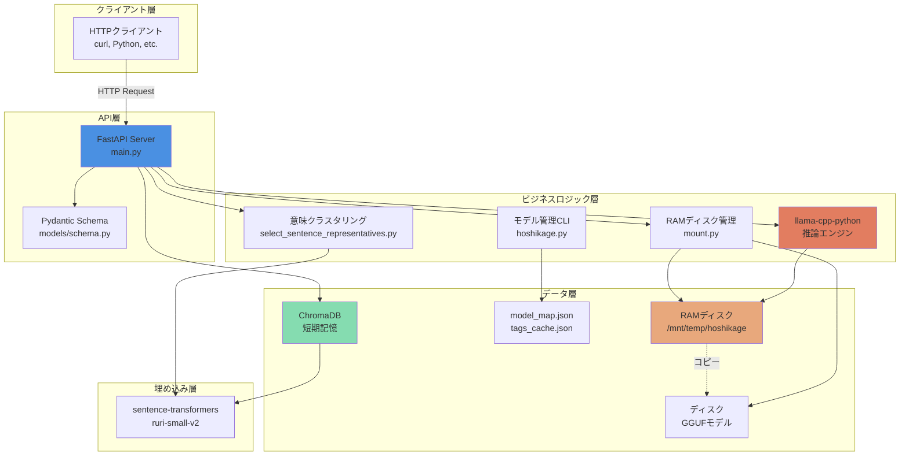
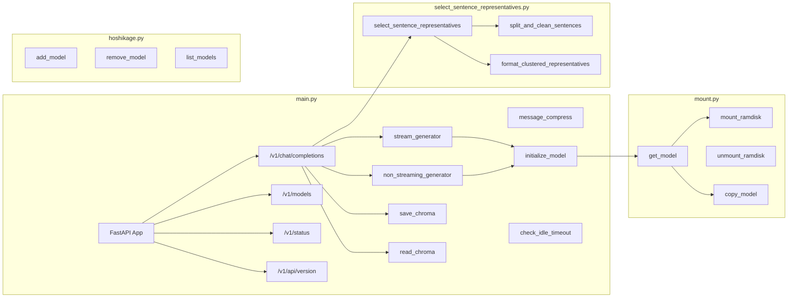
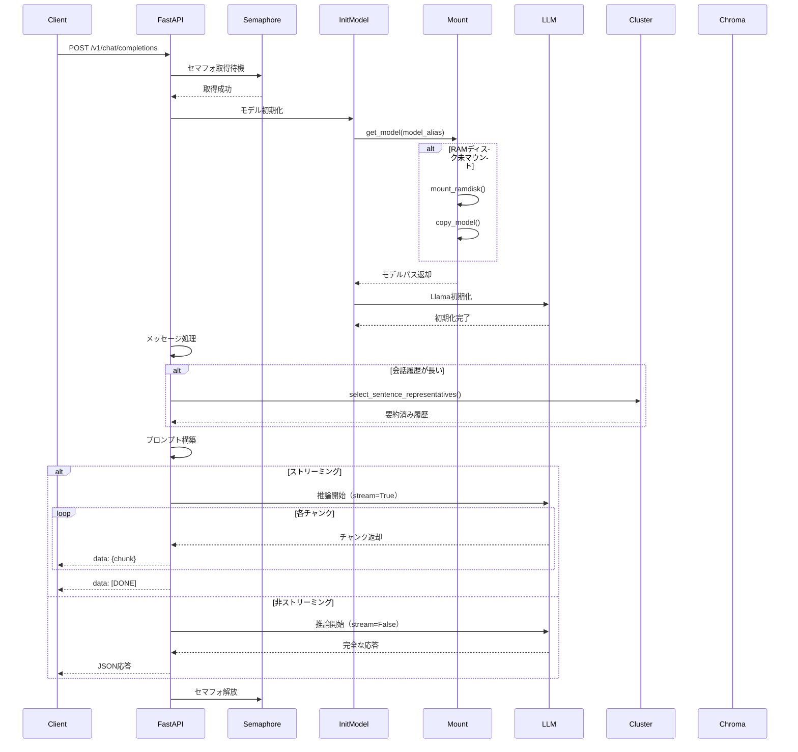
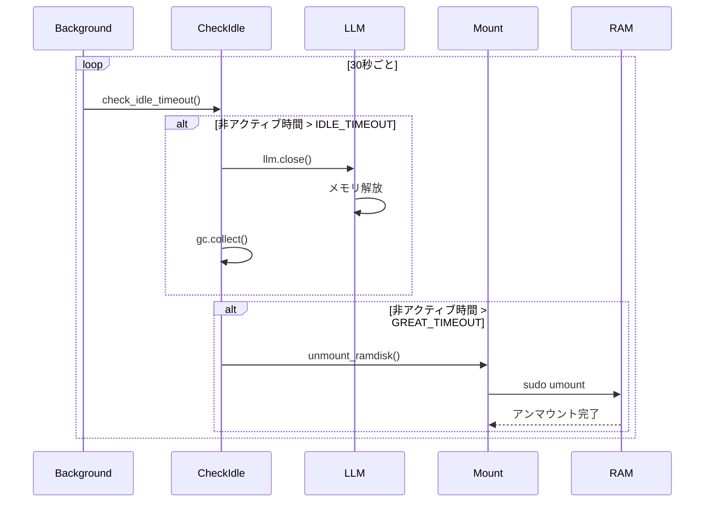
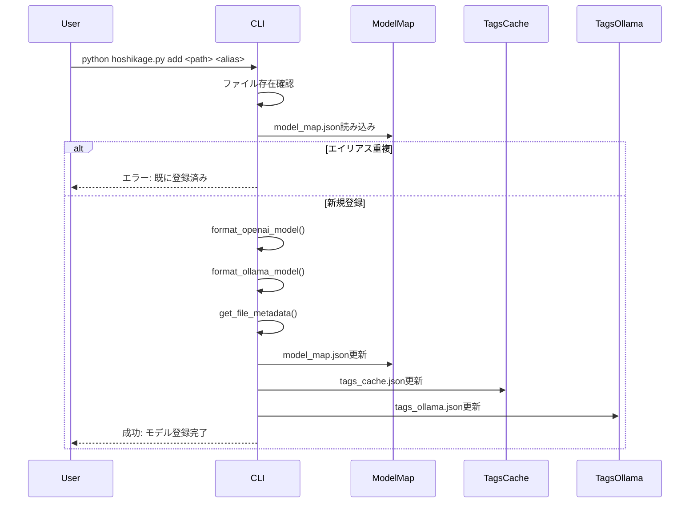
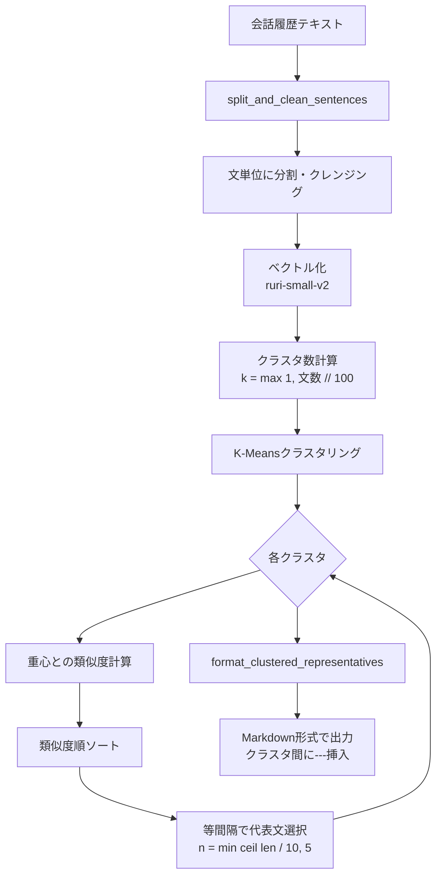

# システム設計書：星影 - Hoshikage

**プロジェクト名:** 星影 - Hoshikage  
**バージョン:** 1.0.0  
**作成日:** 2026-01-16  
**著者:** Tane Channel Technology

---

## 目次

1. [システムアーキテクチャ](#1-システムアーキテクチャ)
2. [コンポーネント設計](#2-コンポーネント設計)
3. [データ設計](#3-データ設計)
4. [処理フロー](#4-処理フロー)
5. [技術スタック詳細](#5-技術スタック詳細)
6. [非機能要件の実装](#6-非機能要件の実装)
7. [セキュリティ設計](#7-セキュリティ設計)
8. [運用設計](#8-運用設計)

---

## 1. システムアーキテクチャ

### 1.1 全体構成図



### 1.2 レイヤー構成

| レイヤー | 責務 | 主要コンポーネント |
|---------|------|------------------|
| クライアント層 | HTTPリクエストの送信 | curl, Python requests, etc. |
| API層 | リクエスト受付・レスポンス返却 | FastAPI, Pydantic |
| ビジネスロジック層 | 推論・要約・リソース管理 | llama-cpp-python, クラスタリング, RAMディスク管理 |
| データ層 | データ永続化・キャッシュ | ChromaDB, JSON, RAMディスク |
| 埋め込み層 | ベクトル化 | sentence-transformers |

---

## 2. コンポーネント設計

### 2.1 コンポーネント図



### 2.2 主要コンポーネント詳細

#### 2.2.1 main.py - FastAPIアプリケーション

| 関数名 | 責務 | 入力 | 出力 |
|--------|------|------|------|
| `initialize_model` | モデルの初期化・切り替え | model_alias | None |
| `check_idle_timeout` | 非アクティブ時のモデルアンロード | None | None |
| `stream_generator` | ストリーミング応答生成 | prompt, session_id | Generator[str] |
| `non_streaming_generator` | 非ストリーミング応答生成 | prompt, session_id | dict |
| `save_chroma` | ChromaDBに会話履歴を保存 | role, message, is_compressed | None |
| `read_chroma` | ChromaDBから会話履歴を検索 | message | str or None |
| `message_compress` | メッセージを要約 | role, message | str |

**エンドポイント:**

| エンドポイント | メソッド | 責務 |
|--------------|---------|------|
| `/v1/chat/completions` | POST | チャット補完（ストリーミング/非ストリーミング） |
| `/v1/models` | GET | モデル一覧取得 |
| `/v1/status` | GET | システムステータス確認 |
| `/v1/api/version` | GET | APIバージョン取得 |

#### 2.2.2 mount.py - RAMディスク管理

| 関数名 | 責務 | 入力 | 出力 |
|--------|------|------|------|
| `get_model` | モデルパスを取得し、必要に応じてRAMディスクにマウント | model_alias | str（モデルパス） |
| `mount_ramdisk` | RAMディスクをマウント | size_gb | None |
| `unmount_ramdisk` | RAMディスクをアンマウント | mount_point | None |
| `copy_model` | モデルをRAMディスクにコピー | source_model_path | None |
| `get_model_path` | モデルマップからパスを取得 | model_alias | tuple（ソース、RAM） |
| `is_mounted` | RAMディスクがマウント済みか確認 | path | bool |

#### 2.2.3 select_sentence_representatives.py - 意味クラスタリング要約

| 関数名 | 責務 | 入力 | 出力 |
|--------|------|------|------|
| `select_sentence_representatives` | 意味クラスタリングで代表文を抽出 | sentences, embedder | str（Markdown形式） |
| `split_and_clean_sentences` | テキストを文単位に分割・クレンジング | text | list[str] |
| `format_clustered_representatives` | クラスタ代表文をMarkdown形式に整形 | representatives | str |
| `is_english_line` | 英文判定 | line | bool |

**アルゴリズム:**
1. 文をベクトル化（ruri-small-v2）
2. K-Meansクラスタリング（k = max(1, 文数 // 100)）
3. 各クラスタから代表文を抽出（クラスタ重心に近い文を等間隔で選択）
4. Markdown形式で整形（クラスタ間に`---`を挿入）

#### 2.2.4 hoshikage.py - モデル管理CLI

| 関数名 | 責務 | 入力 | 出力 |
|--------|------|------|------|
| `add_model` | モデルを登録 | model_path, model_alias | None |
| `remove_model` | モデルを削除 | model_alias | None |
| `list_models` | モデル一覧を表示 | None | None |
| `format_openai_model` | OpenAI形式のモデル情報を生成 | name | dict |
| `format_ollama_model` | Ollama形式のモデル情報を生成 | name, full_path | dict |
| `get_file_metadata` | ファイルメタデータを取得 | full_path | tuple（size, modified_at, digest） |

---

## 3. データ設計

### 3.1 ChromaDBスキーマ

#### 3.1.1 コレクション: `short_memory_db`

**目的:** 会話履歴の短期記憶を保持

**スキーマ:**

| フィールド | 型 | 説明 |
|-----------|-----|------|
| `id` | str | UUID（uuid4().hex） |
| `documents` | str | 会話メッセージ（要約済みまたは原文） |
| `metadatas.role` | str | "user" or "assistant" or "system" |
| `metadatas.create_date` | str | 作成日（YYYYMMDD形式） |
| `metadatas.create_time` | str | 作成時刻（HH:MM:SS形式） |
| `metadatas.compressed` | bool | 要約済みかどうか |
| `embeddings` | list[float] | ベクトル埋め込み（ruri-small-v2で生成） |

**埋め込み関数:**
- モデル: `cl-nagoya/ruri-small-v2`
- 次元数: 768次元
- 実装: `chroma_embedding_function.py`

**クエリ:**
```python
# 類似メッセージの検索
query_results = CHROMA_SHORT_MEMORY_COLLECTION.query(
    query_texts=[message],
    n_results=1
)

# 距離閾値: 0.15以上の場合はヒットなしと判定
```

### 3.2 モデル管理JSONスキーマ

#### 3.2.1 model_map.json

**目的:** モデルのエイリアスとファイルパスのマッピング

**スキーマ:**
```json
{
  "<model_alias>": {
    "path": "<モデルディレクトリパス>",
    "model": "<モデルファイル名>"
  }
}
```

**例:**
```json
{
  "hoshikage-gemma3-12B-google": {
    "path": "/home/tane/datas/LLM/google",
    "model": "gemma-3-12b-it-q4_0.gguf"
  }
}
```

#### 3.2.2 tags_cache.json

**目的:** OpenAI互換のモデル一覧情報

**スキーマ:**
```json
{
  "object": "list",
  "data": [
    {
      "id": "<model_alias>",
      "object": "model",
      "created": 1686935002,
      "owned_by": "tane"
    }
  ]
}
```

#### 3.2.3 tags_ollama.json

**目的:** Ollama互換のモデル一覧情報

**スキーマ:**
```json
{
  "models": [
    {
      "name": "<model_alias>",
      "model": "<model_alias>:latest",
      "modified_at": "<ISO 8601 timestamp>",
      "size": <bytes>,
      "digest": "<SHA256 hash>",
      "details": {
        "format": "gguf",
        "family": "llama",
        "families": "null",
        "parameter_size": "12B",
        "quantization_level": "Q4_0"
      }
    }
  ]
}
```

### 3.3 環境変数（.env）

| 変数名 | 型 | デフォルト値 | 説明 |
|--------|-----|-------------|------|
| RAMDISK_PATH | str | `/mnt/temp/hoshikage` | RAMディスクのマウントパス |
| RAMDISK_SIZE | int | `12` | RAMディスクのサイズ（GB） |
| IDLE_TIMEOUT_SECONDS | int | `300` | 非アクティブ検出閾値（秒） |
| GREAT_TIMEOUT | int | `60` | RAMディスクアンマウント閾値（分） |
| MODEL_MAP_FILE | str | `./models/model_map.json` | モデルマップファイルパス |
| TAG_CACHE_FILE | str | `./models/tags_cache.json` | タグキャッシュファイルパス |
| TAG_OLLAMA_FILE | str | `./models/tags_ollama.json` | Ollamaタグファイルパス |
| CHROMA_PATH | str | `./data/hoshikage_chroma_db` | ChromaDBデータパス |
| SENTENCE_BERT_MODEL | str | `cl-nagoya/ruri-small-v2` | 埋め込みモデル名 |

---

## 4. 処理フロー

### 4.1 チャット補完リクエスト処理フロー



### 4.2 非アクティブ時のリソース解放フロー



### 4.3 モデル登録フロー



### 4.4 意味クラスタリング要約フロー



---

## 5. 技術スタック詳細

### 5.1 言語・フレームワーク

| 技術 | バージョン | 用途 | 選定理由 |
|------|-----------|------|---------|
| Python | 3.10+ | 全体実装 | 豊富なライブラリ、AI/ML分野での標準 |
| FastAPI | 最新 | APIサーバー | 高速、非同期対応、自動ドキュメント生成 |
| Pydantic | 最新 | データバリデーション | FastAPIとの統合、型安全性 |

### 5.2 推論エンジン

| 技術 | バージョン | 用途 | 選定理由 |
|------|-----------|------|---------|
| llama-cpp-python | 最新 | GGUF推論 | 高速、GPU対応、量子化モデル対応 |
| llama.cpp | 最新（内包） | C++推論エンジン | 最適化されたC++実装 |

**llama.cpp設定:**
```python
llm = Llama(
    model_path=ram_model_path,
    n_ctx=4096,           # コンテキスト長
    n_threads=20,         # スレッド数（Ryzen 7900）
    n_gpu_layers=-1,      # GPU最大活用
    n_batch=512,          # バッチサイズ
    use_mmap=True,        # メモリマッピング
    verbose=False         # ログ抑制
)
```

### 5.3 ベクトルデータベース

| 技術 | バージョン | 用途 | 選定理由 |
|------|-----------|------|---------|
| ChromaDB | 最新 | 短期記憶 | 軽量、埋め込み対応、永続化対応 |
| sentence-transformers | 最新 | ベクトル化 | 高品質な埋め込み生成 |
| ruri-small-v2 | 最新 | 日本語埋め込み | 日本語特化、軽量 |

### 5.4 機械学習

| 技術 | バージョン | 用途 | 選定理由 |
|------|-----------|------|---------|
| scikit-learn | 最新 | K-Meansクラスタリング | 標準的なMLライブラリ |
| NumPy | 最新 | 数値計算 | 高速な配列操作 |

### 5.5 日本語処理

| 技術 | バージョン | 用途 | 選定理由 |
|------|-----------|------|---------|
| fugashi | 最新 | 形態素解析 | MeCabのPythonバインディング |
| unidic_lite | 最新 | 辞書 | 軽量なUniDic辞書 |
| sentencepiece | 最新 | トークン化 | サブワードトークン化 |

### 5.6 その他

| 技術 | バージョン | 用途 | 選定理由 |
|------|-----------|------|---------|
| python-dotenv | 最新 | 環境変数管理 | .envファイル読み込み |
| uvicorn | 最新 | ASGIサーバー | FastAPIの標準サーバー |

---

## 6. 非機能要件の実装

### 6.1 パフォーマンス最適化

#### 6.1.1 RAMディスク活用

**目的:** モデルロード時間の短縮

**実装:**
- tmpfsでRAMディスクをマウント（デフォルト12GB）
- モデルをRAMディスクにコピーしてから読み込み
- ディスクI/Oを削減し、起動時間を50%以上短縮

**コード例:**
```python
subprocess.run([
    "sudo", "mount", "-t", "tmpfs", 
    "-o", f"size={size_mb}M", 
    "tmpfs", RAMDISK_PATH
], check=True)
```

#### 6.1.2 GPU最大活用

**設定:**
```python
n_gpu_layers=-1  # 全レイヤーをGPUにオフロード
```

**効果:**
- 推論速度の大幅な向上
- CPU負荷の軽減

#### 6.1.3 意味クラスタリング要約

**目的:** 長い会話履歴の効率的な要約

**実装:**
- K-Meansクラスタリングで意味的にグループ化
- 各クラスタから代表文を抽出
- 直近3往復は要約せずに原文保持

**効果:**
- プロンプト長の削減
- 文脈の維持
- 推論速度の向上

### 6.2 リソース効率化

#### 6.2.1 非アクティブ時のモデルアンロード

**実装:**
```python
async def check_idle_timeout():
    if time.time() - last_access_time > IDLE_TIMEOUT:
        async with llm_lock:
            if llm:
                llm.close()
                llm = None
                gc.collect()
```

**効果:**
- メモリ使用量の削減
- 他のプロセスへのリソース解放

#### 6.2.2 セマフォによる同時実行制限

**実装:**
```python
concurrency_semaphore = asyncio.Semaphore(1)
IS_SEMAPHORE = False  # グローバルフラグ

async with concurrency_semaphore:
    # 推論処理
```

**効果:**
- VRAM枯渇の防止
- システムクラッシュの回避

### 6.3 信頼性向上

#### 6.3.1 エラーハンドリング

**実装:**
- try-exceptによる例外捕捉
- 適切なHTTPステータスコード返却
- ログ記録

**例:**
```python
try:
    # 処理
except Exception as e:
    logger.error(f"エラー: {e}")
    raise HTTPException(status_code=500, detail=str(e))
```

#### 6.3.2 セマフォタイムアウト

**実装:**
```python
sleep_count = 0
while IS_SEMAPHORE:
    if sleep_count > 1800:  # 180秒
        IS_SEMAPHORE = False
        LLM.close()
        break
    await asyncio.sleep(0.1)
    sleep_count += 1
```

**効果:**
- デッドロックの防止
- システムの自動復旧

---

## 7. セキュリティ設計

### 7.1 環境変数による機密情報管理

**実装:**
- `.env`ファイルで設定管理
- `.gitignore`に`.env`を追加
- `python-dotenv`で読み込み

### 7.2 コマンドインジェクション対策

**実装:**
```python
# NG: shell=True
subprocess.run(f"cp {source} {dest}", shell=True)

# OK: shell=False、引数リスト化
subprocess.run(["cp", source, dest], check=True)
```

### 7.3 入力バリデーション

**実装:**
- Pydanticスキーマによる自動バリデーション
- 型チェック
- 必須フィールドチェック

**例:**
```python
class ChatCompletionRequest(BaseModel):
    model: str = "Hoshikage"
    messages: List[ChatMessage]
    temperature: Optional[float] = 0.7
    # ...
```

---

## 8. 運用設計

### 8.1 ログ設計

**実装:**
```python
import logging

logging.basicConfig(level=logging.INFO)
logger = logging.getLogger(__name__)

logger.info("情報メッセージ")
logger.error("エラーメッセージ")
```

**ログレベル:**
- INFO: 通常の動作ログ
- ERROR: エラー発生時のログ

### 8.2 モニタリング

**監視項目:**
- CPU/GPU使用率
- メモリ使用量
- RAMディスクマウント状態
- 最終アクセス時刻
- モデルロード状態

**実装:**
```python
@app.get("/v1/status")
async def status():
    return {"status": "ok"}
```

### 8.3 起動・停止手順

**起動:**
```bash
cd /home/tane/dev/AI/hoshikage/src
uvicorn main:app --host 0.0.0.0 --port 8000
```

**停止:**
- Ctrl+C でプロセス終了
- 自動的にモデルアンロード
- RAMディスクは手動でアンマウント（必要に応じて）

### 8.4 バックアップ

**対象:**
- `model_map.json`
- `tags_cache.json`
- `tags_ollama.json`
- ChromaDBデータ（`hoshikage_chroma_db/`）

**頻度:**
- 定期的なバックアップを推奨

---

## 付録

### A. ディレクトリ構成

```
hoshikage/
├── docs/
│   ├── requirements.md          # 要件定義書
│   ├── system-design.md         # システム設計書（本ドキュメント）
│   ├── API設計仕様書.md
│   ├── API詳細設計書.md
│   ├── UI設計書.md
│   ├── LLMファイル管理要件定義書.md
│   ├── 意味クラスタ要約アルゴリズム設計書（v1.0）.md
│   ├── 画面モックアップ.md
│   ├── 引き継ぎプロンプト.md
│   └── 要件定義書.md（旧版）
├── src/
│   ├── main.py                  # FastAPIアプリケーション
│   ├── hoshikage.py             # モデル管理CLI
│   ├── mount.py                 # RAMディスク管理
│   ├── select_sentence_representatives.py  # 意味クラスタリング要約
│   ├── chroma_embedding_function.py        # ChromaDB埋め込み関数
│   ├── requirements.txt         # Python依存関係
│   ├── start.sh                 # 起動スクリプト
│   ├── .env                     # 環境変数（git管理外）
│   └── models/
│       ├── schema.py            # Pydanticスキーマ
│       ├── model_map.json       # モデルマップ
│       ├── tags_cache.json      # OpenAI互換タグ
│       └── tags_ollama.json     # Ollama互換タグ
├── old/                         # 旧バージョンのコード
├── hoshikage_chroma_db/         # ChromaDBデータ
├── .gitignore
└── README.md（未作成）
```

### B. 参考資料

- [FastAPI公式ドキュメント](https://fastapi.tiangolo.com/)
- [llama-cpp-python](https://github.com/abetlen/llama-cpp-python)
- [ChromaDB公式ドキュメント](https://docs.trychroma.com/)
- [sentence-transformers](https://www.sbert.net/)

---

**著者:** Tane Channel Technology  
**最終更新日:** 2026-01-16
