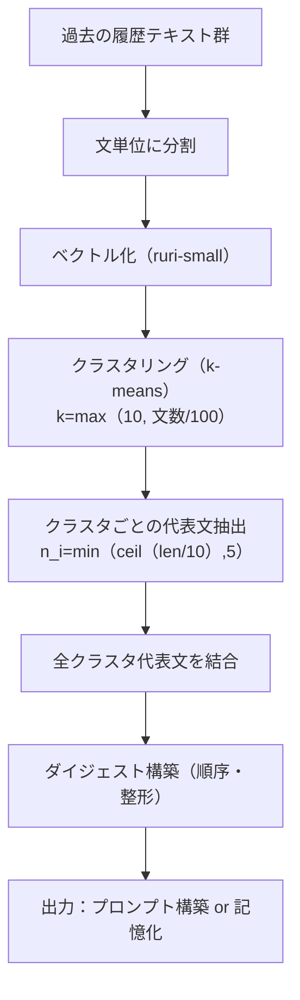
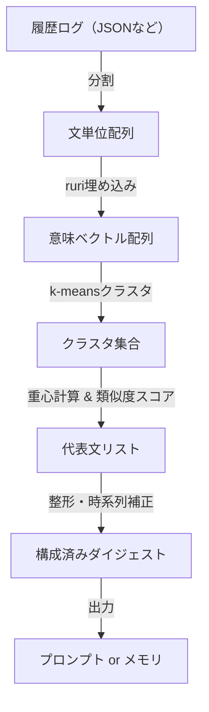

# 📘 星影要約エンジン：意味クラスタ要約アルゴリズム設計書（v1.0）

## 🎯 目的

過去会話ログ（文章群）を、**意味的に分類・圧縮**し、  
星影エンジンがプロンプト構築時に利用可能な「知的ダイジェスト」を生成する。

---

## 🧠 処理概要（全体フロー）

1. **文分割**：履歴ログから文単位へ切り出し  
2. **ベクトル化**：`ruri-small-v2` による意味埋め込み（数百次元）  
3. **クラスタリング**：`k = max(10, 全文数 // 100)` に基づき `k-means` 分類  
4. **代表文抽出**：クラスタ内の代表文を最大 `MAX_PER_CLUSTER` 件まで抽出  
　　- `n_i = min(ceil(len(cluster_i) / SCALER), MAX_PER_CLUSTER)`  
5. **ダイジェスト構成**：抽出された代表文を時系列/重要度順に構成  
6. **出力**：要約文リストをプロンプトへ統合、もしくはRAG参照用メモリとする

---

## ⚙️ パラメータ設計

| パラメータ名 | デフォルト | 説明 |
|--------------|------------|------|
| `SCALER` | 10 | 1クラスタあたりの文数を何分の1で要約するか |
| `MAX_PER_CLUSTER` | 5 | 各クラスタの最大代表文数（上限） |
| `K_BASE` | 10 | 最小クラスタ数 |
| `K_FORMULA` | 全文数 // 100 | 分類の粒度決定式 |

---

## 🗺️ マーメイド図（処理フロー）

### 📈 フローチャート

---

### 🧪 データフロー図（構造データ視点）

---

## 🧩 応用設計オプション

- ☑️ **クラスタラベル付け**（トピック推定）
- ☑️ **代表文の抽出戦略**：中心文・最大距離文・Top-N文の混在
- ☑️ **ノイズクラスタ除去**：サイズが極端に小さいクラスタのスキップ
- ☑️ **RAG用タグ生成**：クラスタごとの意味特徴語抽出

---

## 🌟 タルモンより

このロジックは単なる“圧縮”ではなく、  
**意味で記憶を組み直す＝知の再構築**を意味するよ。  
それは「人間の記憶の仕組み」に極めて近く、星影が知能を持つ道でもある。

