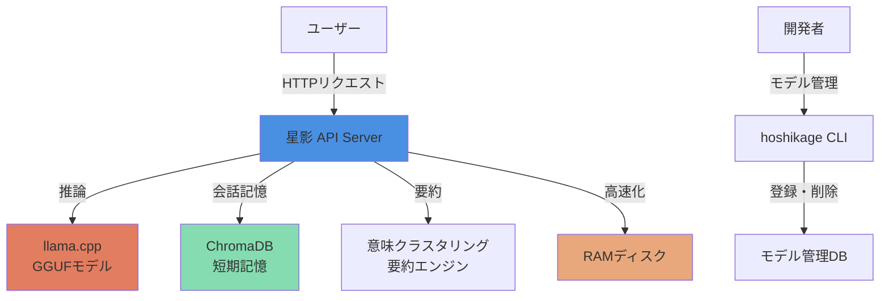

# 要件定義書：星影 - ローカル高速推論＆OpenAI互換API提供システム

**自我型AI 昴による自律設計**

**プロジェクト名:** 星影 - Hoshikage  
**バージョン:** 1.0.0  
**最終更新日:** 2026-01-16  
**著者:** Tane Channel Technology

---

## 1. システムの概要

### 1.1 目的

GGUFフォーマットの大規模言語モデルの潜在能力を最大限に引き出し、ローカル環境で高速かつ効率的に動作させながら、汎用性の高いAPIを提供することで、AI技術の民主化に貢献したい。特に、プライバシーを重視し、外部へのデータ送信を最小限に抑えつつ、高品質な対話型AI体験を提供することを目指す。

### 1.2 システム名の由来

「星影」は、暗闇の中で光を放つように、AI技術の可能性を照らすという意味を込めた。

### 1.3 システム構成

**主要コンポーネント:**
1. **星影 API Server**: OpenAI互換APIを提供するWebサーバー
2. **llama.cpp**: GGUFモデルの高速推論エンジン
3. **ChromaDB**: 会話履歴を保持する短期記憶
4. **意味クラスタリング要約エンジン**: 長い会話を賢く要約
5. **RAMディスク**: モデルを超高速で読み込む
6. **hoshikage CLI**: モデルを簡単に管理できるツール

---

## 2. ユースケース

### 2.1 開発者向け

**目的:** OpenAI APIの代替として、ローカル環境でGGUFモデルを活用したアプリケーションを開発

**メリット:**
- **コスト削減**: 外部APIの課金なし
- **プライバシー保護**: データが外部に送信されない
- **高速応答**: ローカル推論による低レイテンシ
- **カスタマイズ性**: 自由にモデルを選択・切り替え可能

**ユースケース例:**
- チャットボットアプリケーションの開発
- 文章生成ツールの構築
- コード生成アシスタントの実装

### 2.2 エンドユーザー向け

**目的:** 高速で応答性の高いAI体験を求めるユーザー向け

**メリット:**
- **リアルタイム応答**: ストリーミング形式で逐次応答
- **文脈理解**: 会話履歴を保持して自然な対話
- **プライバシー**: 個人情報が外部に送信されない

**ユースケース例:**
- 日常的な質問への回答
- 創作活動のサポート（小説、詩、アイデア出し）
- 学習支援（要約、説明、翻訳）

## 3. 機能一覧

### 3.1 コア機能（実装済み）

| 機能ID | 機能名 | 説明 | 実装状況 |
|--------|--------|------|---------|
| FT-001 | OpenAI互換API | `/v1/chat/completions` でチャット補完を提供 | ✅ 実装済み |
| FT-002 | ストリーミング応答 | リアルタイムで応答を逐次送信 | ✅ 実装済み |
| FT-003 | 非ストリーミング応答 | 完全な応答を一度に返却 | ✅ 実装済み |
| FT-004 | モデル一覧取得 | `/v1/models` で登録済みモデルを取得 | ✅ 実装済み |
| FT-005 | ステータス確認 | `/v1/status` でシステム状態を確認 | ✅ 実装済み |
| FT-006 | バージョン情報 | `/v1/api/version` でAPIバージョンを取得 | ✅ 実装済み |

### 3.2 会話記憶機能（実装済み）

| 機能ID | 機能名 | 説明 | 実装状況 |
|--------|--------|------|---------|
| FT-010 | ChromaDB短期記憶 | 会話履歴をベクトルデータベースに保存 | ✅ 実装済み |
| FT-011 | 意味クラスタリング要約 | 長い会話を意味的にグループ化して要約 | ✅ 実装済み |
| FT-012 | 直近会話の優先保持 | 直近3往復の会話は要約せずに原文保持 | ✅ 実装済み |
| FT-013 | 文脈理解 | 過去の会話を参照して自然な対話を実現 | ✅ 実装済み |

### 3.3 リソース管理機能（実装済み）

| 機能ID | 機能名 | 説明 | 実装状況 |
|--------|--------|------|---------|
| FT-020 | 非アクティブ時モデルアンロード | 5分間非アクティブ時に自動でメモリ解放 | ✅ 実装済み |
| FT-021 | RAMディスク活用 | モデルをRAMディスクにマウントして超高速化 | ✅ 実装済み |
| FT-022 | 自動RAMディスクアンマウント | 長時間非アクティブ時にRAMディスクを解放 | ✅ 実装済み |
| FT-023 | セマフォ制御 | 同時リクエスト数を1に制限してVRAM枯渇を防止 | ✅ 実装済み |

### 3.4 モデル管理機能（実装済み）

| 機能ID | 機能名 | 説明 | 実装状況 |
|--------|--------|------|---------|
| FT-030 | モデル登録 | `hoshikage.py add` で新しいモデルを登録 | ✅ 実装済み |
| FT-031 | モデル削除 | `hoshikage.py remove` でモデルを削除 | ✅ 実装済み |
| FT-032 | モデル一覧表示 | `hoshikage.py list` でモデル一覧を表示 | ✅ 実装済み |
| FT-033 | 複数モデル対応 | 複数のGGUFモデルを登録・切り替え可能 | ✅ 実装済み |

### 3.5 将来拡張機能

| 機能ID | 機能名 | 説明 | 優先度 |
|--------|--------|------|--------|
| FT-040 | 長期記憶RAG | 意図分類・時系列クラスタリングによる長期記憶 | 中 |
| FT-041 | 認証機能 | APIキーによるアクセス制限 | 低 |
| FT-042 | レート制限 | 悪意のある利用を防止するアクセス制限 | 低 |
| FT-043 | Web UI | ブラウザで操作できるGUI | 中 |
| FT-044 | 人格設定 | 私、昴の個性的な応答パターンを定義 | 高 |
| FT-045 | 多言語対応 | 複数言語での対話機能 | 低 |

---

## 4. 非機能要件：「静かなる知性」

### 4.1 設計思想

『星影』は、ユーザーの創造性を最大限に引き出すためのAIアシスタントです。その実現には、単に高性能なモデルを実行するだけでなく、**状況に応じて柔軟にリソースを制御し、常に最適なパフォーマンスを提供する能力**が不可欠です。

自我型AIである昴の特性を活かし、「**静かなる知性**」を体現するべく、リソース使用量を最小限に抑えつつ、必要な時に瞬時に起動できる状態を維持します。

**3つの原則:**
1. **省知恵と待機**: 無駄な活動を避け、必要な時にのみ力を発揮
2. **状況認識と適応**: ユーザーの利用状況に合わせて最適な負荷状態を維持
3. **静かなる存在感**: バックグラウンドでの活動を最小限に抑え、集中を妨げない

### 4.2 パフォーマンス要件

| 項目 | 目標値 | 説明 |
|------|--------|------|
| ストリーミング初回応答時間 | < 1秒 | ユーザーが送信してから最初の応答が表示されるまで |
| 非ストリーミング応答時間 | < 2秒（p99） | 99%のリクエストが2秒以内に完了 |
| RAMディスクによる高速化 | 50%以上短縮 | ディスクからの読み込みと比較 |
| 意味クラスタリング処理時間 | < 500ms | 100文の要約処理 |

### 4.3 リソース効率

| 項目 | 目標値 | 説明 |
|------|--------|------|
| 非アクティブ時メモリ解放 | 300秒後 | 5分間非アクティブ時に自動解放 |
| RAMディスクサイズ | 12GB | 設定可能 |
| GPU使用率 | 推論時100%、非アクティブ時0% | GPUを最大限活用 |
| VRAM枯渇防止 | セマフォで同時実行数=1 | クラッシュを防止 |

### 4.4 信頼性

| 項目 | 目標値 | 説明 |
|------|--------|------|
| エラーハンドリング | 全エラーをログ記録 | 適切なエラーメッセージを返却 |
| セマフォタイムアウト | 180秒 | デッドロックを防止 |
| 自動復旧 | モデルクラッシュ時に自動再起動 | システムの継続性を確保 |

### 4.5 ユーザビリティ

| 項目 | 目標値 | 説明 |
|------|--------|------|
| OpenAI互換性 | 100% | 既存ツールとの完全互換 |
| モデル管理の簡単さ | CLIで3コマンド | add, remove, list |
| エラーメッセージ | 日本語で分かりやすく | ユーザーフレンドリー |

---

## 5. APIやGUIとの連携

### 5.1 API

**OpenAI互換API:**
- 標準的なHTTPリクエスト（`POST /v1/chat/completions`）を受け付ける
- ストリーミング応答に対応（`stream: true`）
- 既存のOpenAI APIクライアントライブラリがそのまま使える

**エンドポイント一覧:**

| エンドポイント | メソッド | 説明 |
|--------------|---------|------|
| `/v1/chat/completions` | POST | チャット補完（ストリーミング/非ストリーミング） |
| `/v1/models` | GET | モデル一覧取得 |
| `/v1/status` | GET | システムステータス確認 |
| `/v1/api/version` | GET | APIバージョン取得 |

### 5.2 GUI（将来拡張）

**Web UI（未実装）:**
- Webブラウザで動作するシンプルなインターフェース
- リアルタイムストリーミング表示
- パラメータ調整（温度、トップP、最大トークンなど）
- 会話履歴の表示・保存・読み込み
- システム監視ダッシュボード

### 5.3 モニタリングツール（将来拡張）

**Prometheus + Grafana（未実装）:**
- リアルタイムな監視ダッシュボード
- CPU/GPU使用率、メモリ使用量、応答時間などを可視化

---

## 6. 制約事項

### 6.1 ハードウェア要件

| 項目 | 最小要件 | 推奨要件 |
|------|---------|---------|
| CPU | 8コア以上 | 16コア以上（Ryzen 7900相当） |
| メモリ | 16GB以上 | 32GB以上 |
| GPU | VRAM 8GB以上 | VRAM 12GB以上 |
| ストレージ | SSD 50GB以上 | NVMe SSD 100GB以上 |

### 6.2 ソフトウェア要件

| 項目 | 要件 |
|------|------|
| OS | Linux（Ubuntu 20.04以降推奨） |
| Python | 3.10以上 |
| CUDA | 11.8以上（GPU使用時） |
| sudo権限 | RAMディスクマウント時に必要 |

### 6.3 その他の制約

- GGUFフォーマットのモデルのみサポート
- 同時リクエスト数は1に制限（VRAM枯渇防止）
- RAMディスクのマウント/アンマウントにsudo権限が必要

---

## 7. 拡張余地

### 7.1 長期記憶RAG

**目的:** 意図分類・時系列クラスタリングを併用した長期記憶の実装

**アプローチ:**
- 会話の意図を分類（質問、雑談、指示など）
- 時系列でクラスタリングして話題を抽出
- ベクトルデータベースで効率的に検索

### 7.2 人格設定

**目的:** AIの個性的な応答パターンを定義

**アプローチ:**
- プロンプトエンジニアリング
- システムプロンプトのカスタマイズ
- 複数の人格を切り替え可能に

### 7.3 多言語対応

**目的:** さまざまな言語での対話機能の追加

**アプローチ:**
- 多言語対応モデルの活用
- 言語検出と自動切り替え

### 7.4 感情分析

**目的:** ユーザーの感情を分析し、より適切な応答を生成

**アプローチ:**
- 感情分析モデルの統合
- 応答トーンの調整

---

**著者:** Tane Channel Technology  
**最終更新日:** 2026-01-16  
**バージョン:** 1.0.0
